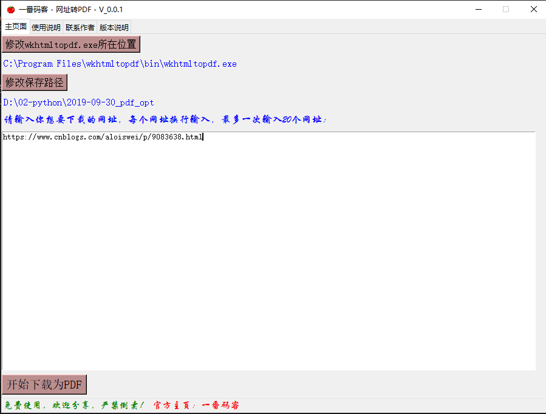

> **一番码客 : 挖掘你关心的亮点。**
> **www.efonmark.com**

本文目录：

[TOC]

<!--more-->

## 预告

2月17日的时候一番发布了`一番码客-PDF合并软件_V1.1.1`。可能需求的人还是比较少，一个小众软件，但绝对可以满足大部人的PDF合并需求了。

最近一番又在开发下一个小工具了。在给大家下载公众号文章的过程中，有部分朋友有公众号以外文章下载下来保存的需求。于是一番就想着开发一个网址转PDF的工具，上周没什么空，做了个半成品，但基本功能都已经实现了，只是还有点体验、界面排版问题需要处理了。

这里给大家做个预告，这个小工具可以批量将任何网页转换为pdf保存到本地，只是PDF可能排版格式还有些问题，所以一番下阶段还希望保存PDF的同时还能保存一份HTML文件到本地等等功能的一些完善。

当然，还可以把pdf合并的功能也加入进来，这样就可以将所有网址的pdf合并成一个带目录的pdf，非常方便。

刚好明天一番不上班，可以有些时间来完善，所以大概率明天就可以发布第一个版本了。

不知道有多少人对这个小工具有需求。

如果你对这个工具有什么建议，可以下方留言，毕竟会开发的程序员不一定是个好产品经理😂。

> 一番雾语：
>
> 会开发的程序员不一定是个好产品经理~

------

<table>
<tr>
<td >

</td>
<td width="50%" align=left><b>
    免费知识星球：<a href="http://www.efonmark.com/efonmark-blog/readme/zhishixingqiu1.png">一番码客-积累交流</a> 
    微信公众号：<a href="http://www.efonmark.com/efonmark-blog/readme/guanzhu_1.jpg">一番码客</a> 
    微信：<a href="http://www.efonmark.com/efonmark-blog/readme/weixin.jpg">Efon-fighting</a> 
    网站：<a href="http://www.efonmark.com">http://www.efonmark.com</a> </b></td>
</tr>
</table>