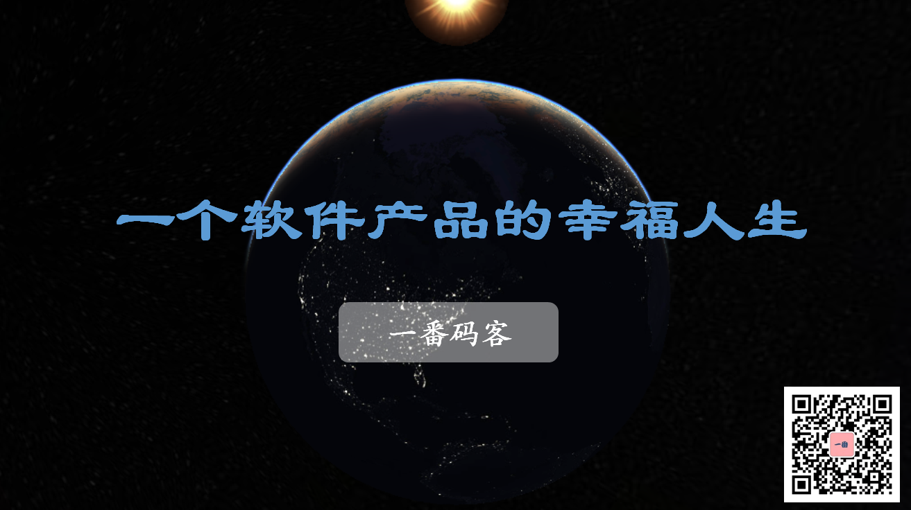

> **一番码客 : 挖掘你关心的亮点。**
> **www.efonmark.com**

本文目录：

[TOC]

<!--more-->

## 前言

昨天一番发布了一个桌面软件小工具，整个产品从无到有，从粗糙到完善，也算是经历了整个从概念到产品的完整周期。虽然有几个环节做得还有欠缺，这里也算是做一个复盘，回顾总结整个流程，希望在下个迭代流程走得更好。

## 需求整理

一番发布了两个面向普通用户的软件，都是带有图形交互界面的。

这两个软件面向的需求的主要来源有两个，一个是一番自身的功能需求，一个是跟大家交流中得到的需求。

对需求的理解深度，会影响产品的功能、交互、体验等等，可以说是一个软件产品的灵魂。

一番其实一年前就有这两个产品的需求，也能做出这样轻量级的应用，但过于纠结产品的外观，因此过多的纠结在设计方案选型的过程中，最终不得成型。

其实从产品初期的需求来看，功能需求大于外观需求。而且最后一番做出来的界面交互其实也不是太差。得到这个启发的也是看到WeChatDownload小工具得到的。虽然界面不是那么炫，但只要市面上还没有这样的工具，其实市场对功能的需求、与使用者的交互友好、大于对外观的追求。

总结出来就是，**功能 > 交互 > 外观**。

当然，一个优秀的软件产品，这三个点都很重要。

## 方案设计

有了上面产品需求的理解，那么就需要找实现方案了。大概包括这几点：

* 编程语言选择：这个需要结合功能的技术方案、开发者的技术栈和学习成本综合考虑。

* 功能模块设计：从需求出发，一个大需求需要分解成哪些子需求，需要实现哪些功能。还有一些软件通用需求，比如升级、问题反馈、使用说明、联系方式等等。
* 界面交互设计：主要从小白用户角度出发，尽量减少用户的学习成本和使用难度。

## 编码设计

编码阶段主要注意几点：

* 编程规范
* 模块化
* 可复用性
* 可扩展性
* 代码管理

## 开发测试

编码开发完之后需要有基本的功能测试，这里需要设计一些测试用例，才能避免因为在开发一个模块而影响到其他功能了却不知道。

测试用例的设计也是需要结合方案设计、用户需求来做。

整个自测用例跑完一遍后，就会对当前版本的状态有一个大概的认知了。

最后，评估下当前版本状态，如果可以，就可以打包了。

## 发版测试

打包后，理论上来讲这个就是我们准备发布的版本了。但打包版本和我们开发调试版本是有差异的，所以一定要做一次发版测试。

发版测试大概包括这几点：

* 功能测试：基本就是将整个开发测试的测试用例再跑一遍，这是最基本要求。
* 稳定性测试：找一些特殊使用场景，看下功能的稳定性。
* 用户体验测试：非法操作、交互体验、任何可能的操作。

以上如果测出来严重问题，需要重新做开发，然后重新进行发版测试。

## 版本发布

这一步就是最开心的了，终于可以发版本了。也包括怎么告知用户，软件功能展示。需要让用户简单明了的清楚软件功能、使用方式和可能的用户体验。

如果可能，还需要有运营、推广。

## 产品迭代

以上所有环节完成后，根据用户反馈，就需要考虑是否有下一个产品迭代周期了。如果有，那就进入下一个同样的周期了。

## 总结

有了上面这些所有的环节，一个软件产品才算是有一个完整的人生，健康的一生。根据软件的规模，以上每个环节的投入都可大可小。

> 一番雾语：
>
> 麻雀虽小，但需要五脏俱全。

------

<table>
<tr>
<td >

</td>
<td width="50%" align=left><b>
    免费知识星球：<a href="http://www.efonmark.com/efonmark-blog/readme/zhishixingqiu1.png">一番码客-积累交流</a> 
    微信公众号：<a href="http://www.efonmark.com/efonmark-blog/readme/guanzhu_1.jpg">一番码客</a> 
    微信：<a href="http://www.efonmark.com/efonmark-blog/readme/weixin.jpg">Efon-fighting</a> 
    网站：<a href="http://www.efonmark.com">http://www.efonmark.com</a> </b></td>
</tr>
</table>