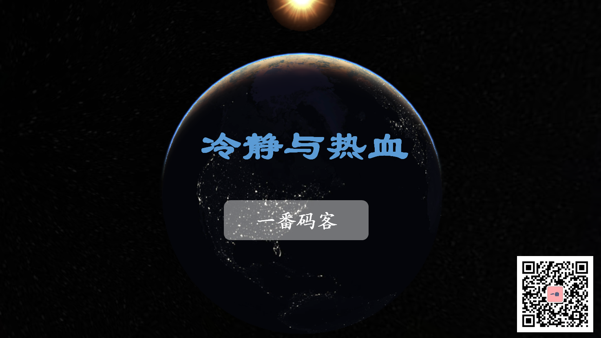

> **一番码客 : 挖掘你关心的亮点。**
> **www.efonmark.com**

本文目录：

[TOC]

<!--more-->

## 前言

今天是周日，一番今天好好休息了下，放下工作与学习。吃饭的时候和家人一起看了一部电影，《叶问4》，很是满足。电影里叶问正义包容，沉着冷静的气质中流淌着热血。对事业努力，对行业担当，对子女父爱如山，这一切有一脉热血支撑，这一切有冷静承载。

努力精进，不逞无畏之能，而为真理不倒。

## 总结

有了上面这些所有的环节，一个软件产品才算是有一个完整的人生，健康的一生。根据软件的规模，以上每个环节的投入都可大可小。

> 一番雾语：
>
> 麻雀虽小，但需要五脏俱全。

------

<table>
<tr>
<td >

</td>
<td width="50%" align=left><b>
    免费知识星球：<a href="http://www.efonmark.com/efonmark-blog/readme/zhishixingqiu1.png">一番码客-积累交流</a> 
    微信公众号：<a href="http://www.efonmark.com/efonmark-blog/readme/guanzhu_1.jpg">一番码客</a> 
    微信：<a href="http://www.efonmark.com/efonmark-blog/readme/weixin.jpg">Efon-fighting</a> 
    网站：<a href="http://www.efonmark.com">http://www.efonmark.com</a> </b></td>
</tr>
</table>