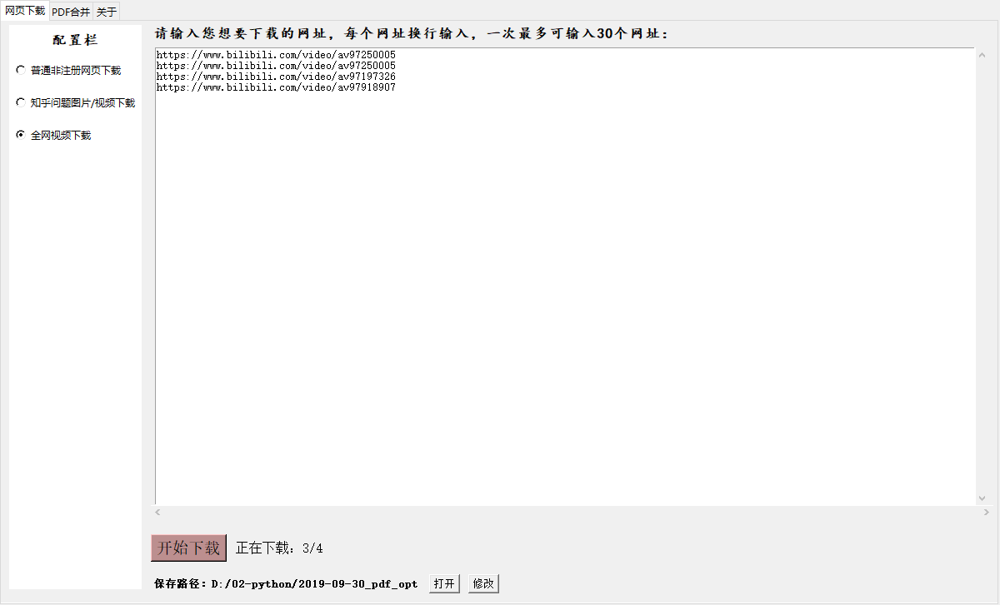

> **一番码客 : 挖掘你关心的亮点。**
> **www.efonmark.com**

本文目录：

[TOC]

<!--more-->

## 产品经理的重要性

今天七点就起来开始做工具了，但因为睡晚了，起早了，头脑不是很清晰，效率比较低，进展不是很大。

真希望快点把一个版本发出去，但做产品还是比较艰难，特别是在工作紧张，业余时间不多的情况下想尽己所能做一款对自己来讲算是极致的产品。

也许用户并不会满意，也是理所应当的，因为第一次独立尝试做这样的产品，除了技术能力限制，也有产品能力限制，但如果能坚持做下去，长期坐冷板凳、坚持兴趣不变、在物质有保障、生活稳定无变故的条件下持续做下去，应该会不断完善，也会是一个长久的、为用户产生价值、有持续生命力的产品。

产品和技术本是一体，需求催生了技术，技术催生了产品。

产品设计是面向用户场景，构建友善的产品形态。用户一般只有一个模糊的需求，怎么将需求转换为使用友善，体验良好的产品，这是产品经理需要思考的。

这里透露下今日的进展，目前产品大概长这个样，下个版本会有一些改善。

但发布日期还不确定，大概在最近一两周。希望工作生活一切顺利，这个小产品才会一切顺利。

> 一番雾语：
>
> 累了就歇息下，慢慢来，只要不放弃，慢便是快。

------

<table>
<tr>
<td >

</td>
<td width="50%" align=left><b>
    免费知识星球：<a href="http://www.efonmark.com/efonmark-blog/readme/zhishixingqiu1.png">一番码客-积累交流</a> 
    微信公众号：<a href="http://www.efonmark.com/efonmark-blog/readme/guanzhu_1.jpg">一番码客</a> 
    微信：<a href="http://www.efonmark.com/efonmark-blog/readme/weixin.jpg">Efon-fighting</a> 
    网站：<a href="http://www.efonmark.com">http://www.efonmark.com</a> </b></td>
</tr>
</table>