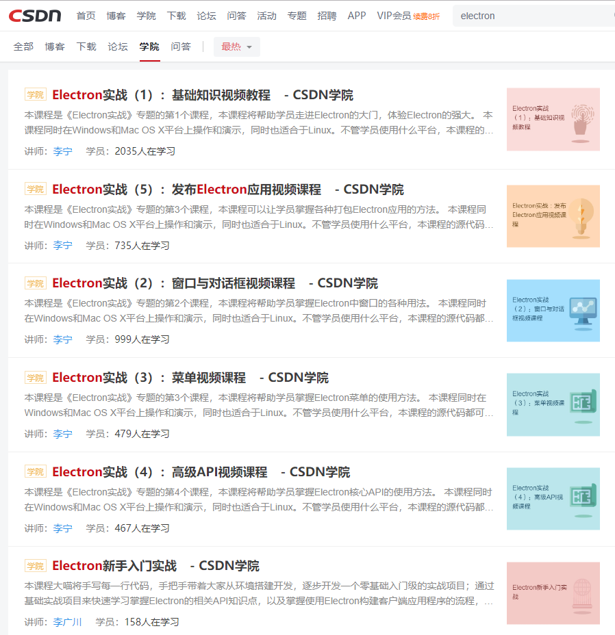
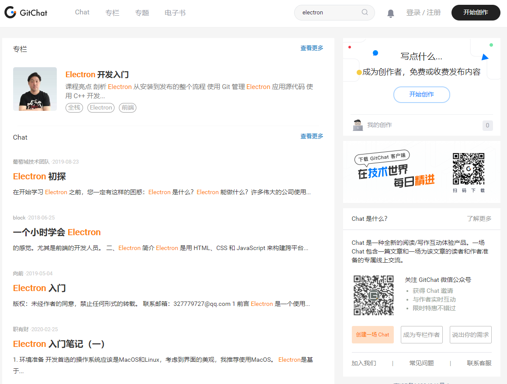
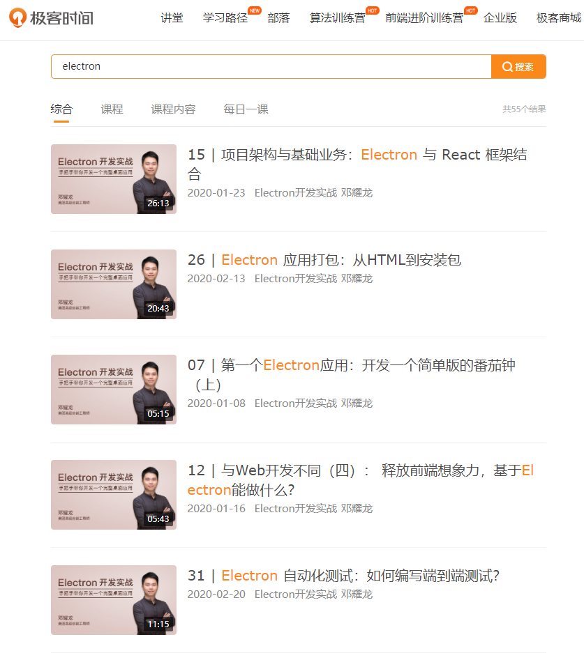
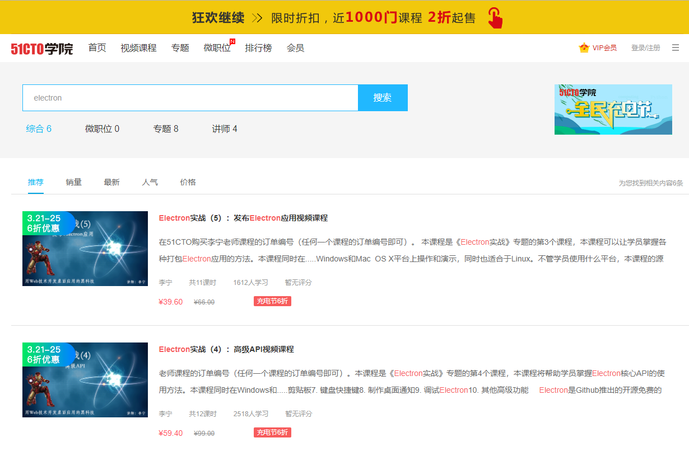
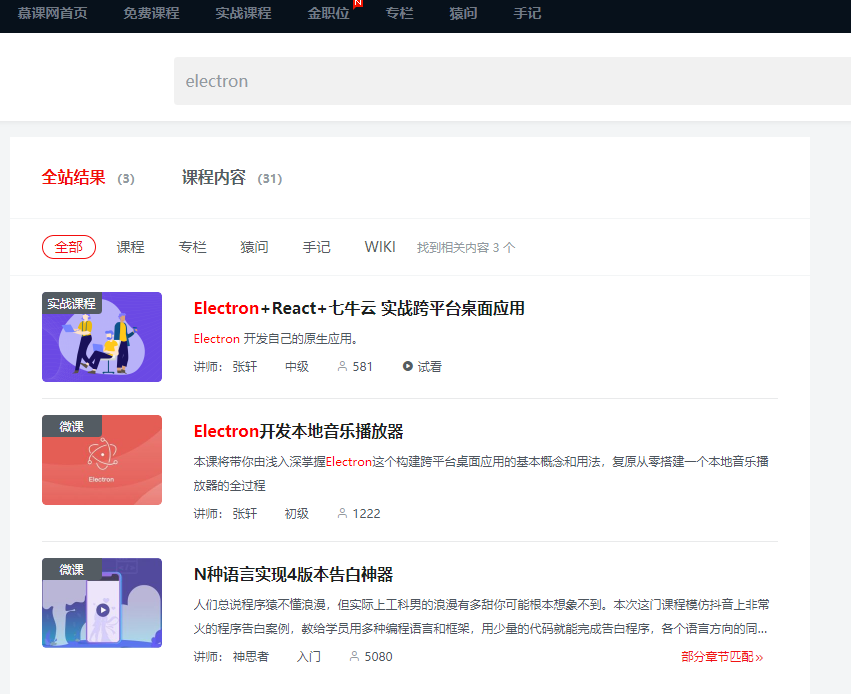

> **一番码客 : 挖掘你关心的亮点。**
> **www.efonmark.com**

本文目录：

[TOC]

<!--more-->

## 前言

虽然很多程序员加班比较多，但要想提升技术能力，还是不能沉迷于业务交付上，还要抽出时间来学习充电，从更宏观更成体系的知识来巩固我们的技术能力。没有整天的时间，只能利用零星的业余时间来充电了。在线视频、技术文章是很好的学习方式。现在随着线上教育、知识付费的普及和大众的接受度增强，线上有越来越多的优质资源供我们选择。今天一番也遇到同样的学习需求，所以这里总结下，获取线上提升的网站。

## 网站

### csdn学院

* https://edu.csdn.net/

作为老牌it博客网站，csdn是比较早的做线上学院的，但从使用体验来看，里面的内容很丰富，但课程质量不是非常高。这里我们都以搜索”electron“相关技术为例。

### GitChat

* https://gitbook.cn/

gitchat主要是付费技术文章，我们也可以自己发起一场付费或者免费chat。

### 极客时间

* https://time.geekbang.org/

极客时间是近两年异军突起的一个平台，特别是拉拢了一批博主、技术公众号主推广。但里面的内容相对确实质量较高，也基本都是付费课程。

### 万门大学

* https://www.wanmen.org/

万门大学也是一路看着发展起来的，现在更像是一个综合性学院，涉及知识方方面面。所以相对而言，不是属于计算机线上教育的垂直领域，搜索"electron"没有搜索结果。

### 51CTO学院

* https://edu.51cto.com/

51cto学院也是近两年凭借论坛博客优势发展了线上课程，目前来看还是非常全面。

### 慕课网

* https://www.imooc.com/

慕课网是新手自学的一个知名度较高的网站，里面的课程也非常不错。

> 一番雾语：
>
> 保持充电状态。

------

<table>
<tr>
<td >

</td>
<td width="50%" align=left><b>
    免费知识星球：<a href="http://www.efonmark.com/efonmark-blog/readme/zhishixingqiu1.png">一番码客-积累交流</a> 
    微信公众号：<a href="http://www.efonmark.com/efonmark-blog/readme/guanzhu_1.jpg">一番码客</a> 
    微信：<a href="http://www.efonmark.com/efonmark-blog/readme/weixin.jpg">Efon-fighting</a> 
    网站：<a href="http://www.efonmark.com">http://www.efonmark.com</a> </b></td>
</tr>
</table>