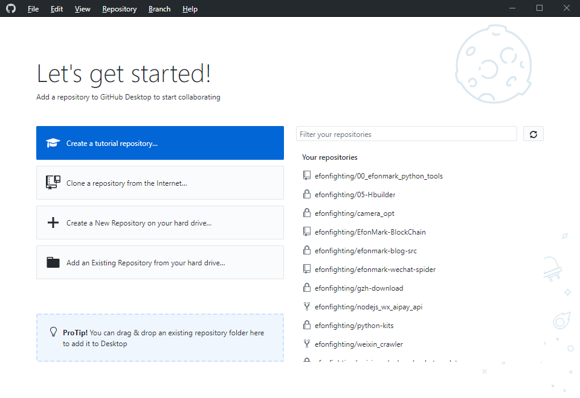

> **一番码客 : 挖掘你关心的亮点。**
> **www.efonmark.com**

本文目录：

[TOC]

<!--more-->

## 前言

github是程序员最常用的技术社区和代码托管工具，里面有大量的可用轮子。面对庞大的开源宝库，我们怎么有效的管理我们的这些项目，实时获取项目的状态，一个有效的管理工具是非常有必要的。一番甚至有时候都想自己开发一个这样的工具。作为一个商业化的公司，当然会推出方便用户使用其产品的工具，那么今天我们来看看官方的这些客户端。

## PC客户端

访问github首页，可以看到最下方有客户端的入口，点进去，直接下载在就可以了。但一番发现如果想要下载还需要翻墙。如果不能翻墙，我们也可以去开源项目的release中下载。官方提供了windows和mac的两个版本。

github官方PC客户端用了自家的electron技术来开发的，作为开源社区，当然要将自己的项目开源啦。

* 开源地址：https://github.com/desktop/desktop

安装完成后我们用自己的GitHub账号登录后就可以使用了。

但现在的功能其实比较有限，主要是提供一些git的操作。除了可以一眼看到远端、本地有哪些仓库外，似乎没有太大的作用。

## mobile客户端

同时，去年github推出了手机端的客户端，现在已经有了android和iphone两个版本。当然，需要从app store里去下载。

如果小伙伴需要，一番已经下载好了windows和android的客户端。可以后台回复“github”获取。

> 一番雾语：
>
> 如果随时使用GitHub。

------

<table>
<tr>
<td >

</td>
<td width="50%" align=left><b>
    免费知识星球：<a href="http://www.efonmark.com/efonmark-blog/readme/zhishixingqiu1.png">一番码客-积累交流</a> 
    微信公众号：<a href="http://www.efonmark.com/efonmark-blog/readme/guanzhu_1.jpg">一番码客</a> 
    微信：<a href="http://www.efonmark.com/efonmark-blog/readme/weixin.jpg">Efon-fighting</a> 
    网站：<a href="http://www.efonmark.com">http://www.efonmark.com</a> </b></td>
</tr>
</table>