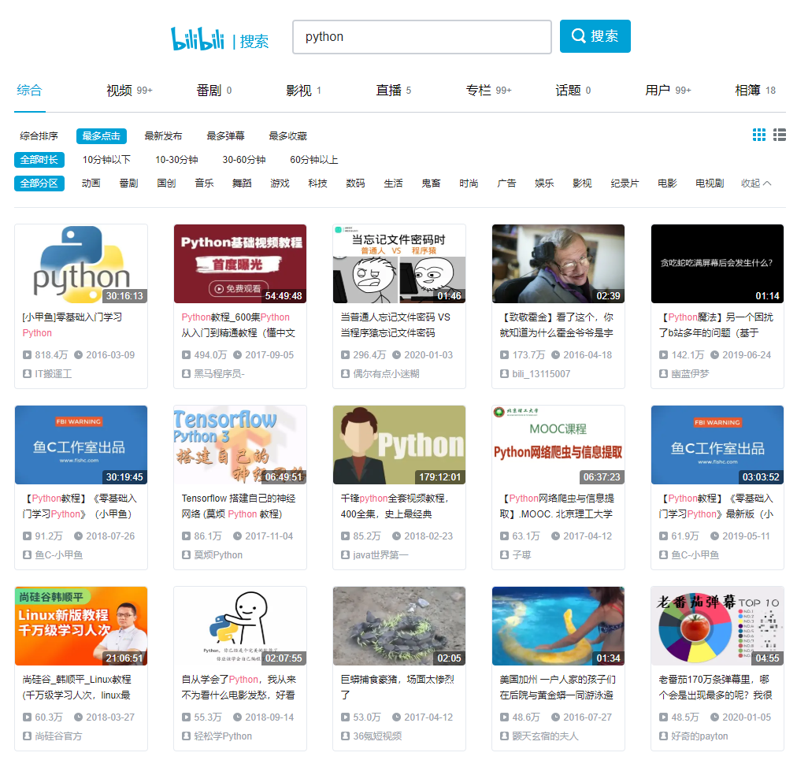

> **一番码客 : 挖掘你关心的亮点。**
> **www.efonmark.com**

本文目录：

[TOC]


<!--more-->

## 前言

最近时不时都会想，想要深入学习一门脚本语言，作为傍身的操控计算机的技能，python还是可以持续深入学习。环境单纯、开源功能众多、使用简单、功能也强大，唯一不足的可能是前端展示稍微弱了点。

在这个互联网时代，高质量、免费的python教程还是非常多的，今天一番就来跟大家一起看看B站上有哪些适合初学者的python教程。

## B站探索

B站上搜索一下关键字“python”，并以“最多点击”为排序，可以看到如下结果。



首先可以看到，小甲鱼的是播放最多的，这个之前一番也在文章中推荐过，一番也看过一段时间，确实非常适合初学者，甚至是编程小白。

### [小甲鱼]零基础入门学习Python

> 网址：https://www.bilibili.com/video/BV1Fs411A7HZ?p=1

这个系列一共97节，总共时长也就30来个小时。可以说花两天时间就可以搞定了。

包括了python的基础语法知识，讲解也非常浅显易懂，学完后可以对python有个基本的掌握了。

### 黑马程序员-600集Python从入门到精通教程

> https://www.bilibili.com/video/BV1ex411x7Em?p=1

一共536集，总共时长约55个小时。黑马的教程质量都还是比较高的。

### 千锋python全套视频教程

> https://www.bilibili.com/video/BV15J411T7WQ?p=1

总共430节，总共时长179个小时，里面不仅有python，还有前端的一整套教程。

### Python 数据分析与展示（北京理工大学 ）

> https://www.bilibili.com/video/BV1Sx411U7R9?p=1

总共46节，接近6小时的课程，主要是数据的分析和图形化展示。

### Python网络爬虫与信息提取（北京理工大学 ）

> 网址：https://www.bilibili.com/video/BV1kx411S7Fh?p=1

北京理工大学的python爬虫课，一共65节，6小时多点。

### Python 数据结构与算法系列课程

> https://www.bilibili.com/video/BV18W411T7Vv?p=1

总共44节，15个小时的课程，希望学习数据结构和算法的可以看看。

## 总结

其实抓取这些里面的所有视频还是比较好的，下载保存到本地，基本就可以实现python知识的全覆盖了，无聊的时候拿出来看看解解乏还是很不错的，比刷抖音什么的好看多啦~

所有一番觉得有必要把上面的所有视频都用一番的工具一次性下载下来保存到本地，时机成熟的时候可以分享给大家。

下面就是《Python 数据结构与算法系列课程》的列表，大家可以感受下。

```txt
2-01 内存、类型本质、连续存储 recv
2-02 基本顺序表与元素外围顺序表 recv
2-03 顺序表的一体式结构与分离式结构 recv
2-04 顺序表数据区替换与扩充 recv
3-01 栈与队列的概念
3-02 栈的实现
3-03 队列与双端队列的实现
4-01 链表的提出
4-02 单链表的ADT模型
4-03 Python中变量标识的本质
4-04 单链表及结点的定义代码
4-05 单链表的判空、长度、遍历与尾部添加结点的代码实现
4-06 单链表尾部添加和在指定位置添加
4-07 单链表查找和删除元素
4-08 单链表与顺序表的对比
4-09 单向循环链表遍历和求长度
4-10 单向循环链表添加元素
4-11 单向循环链表删除元素
4-12 单向循环链表删除元素复习及链表扩展
4-13 双向链表及添加元素
4-14 双向链表删除元素
5-01 排序算法的稳定性
5-02 冒泡排序及实现
5-03 选择排序算法及实现
5-04 插入算法
5-05 插入排序1
5-06 插入排序2
5-07 希尔排序
5-08 希尔排序实现
5-09 快速排序
5-10 快速排序实现1 (1)
5-10 快速排序实现1
5-11 快速排序实现2
5-12 归并排序
5-13 归并排序 代码执行流程
5-14 归并排序时间复杂度及排序算法复杂度对比
5-15 二分查找
5-16 二分查找时间复杂度
6-01 树的概念
6-02 二叉树的概念
6-03 二叉树的广度优先遍历
6-04 二叉树的实现
6-05 二叉树的先序、中序、后序遍历
6-06 二叉树由遍历确定一棵树
```


> 一番雾语：
>
> 互联网时代，我们缺的不是信息，而是整理信息的能力。

------

<table>
<tr>
<td ><center></center></td>
<td width="50%" align=left><b>
    免费知识星球：<a href="http://www.efonmark.com/efonmark-blog/readme/zhishixingqiu1.png">一番码客-积累交流</a><br>
    微信公众号：<a href="http://www.efonmark.com/efonmark-blog/readme/guanzhu_1.jpg">一番码客</a><br>
    微信：<a href="http://www.efonmark.com/efonmark-blog/readme/weixin.jpg">Efon-fighting</a><br>
    网站：<a href="http://www.efonmark.com">http://www.efonmark.com</a><br></b></td>
</tr>
</table>