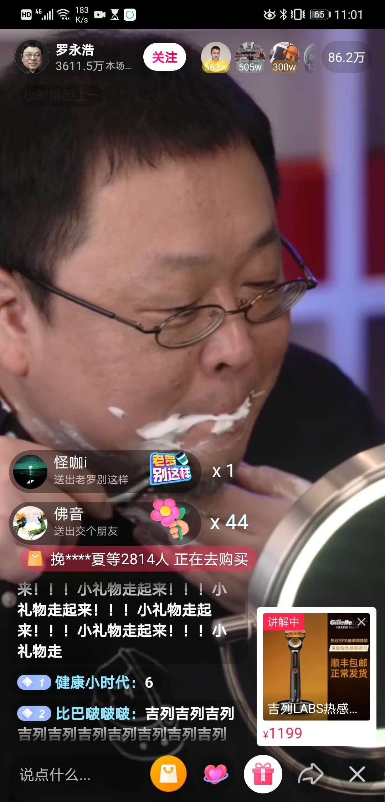
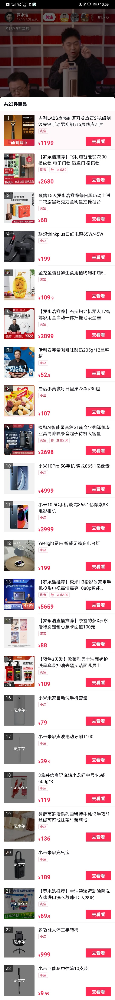

> **一番码客 : 挖掘你关心的亮点。**
> **www.efonmark.com**

本文目录：

[TOC]

<!--more-->

## 今日一番

今天在看直播，全网少有人不知道的老罗抖音直播卖货。作为在科技圈有一定知名度的前科技公司CEO，直播带货了。就像是一个杂货铺，卖了很多东西。一番现在都还在边看直播边写日更。

作为专业选手，混迹互联网多年，第一代网红，确实自带流量，一上来观看直播的人数蹭蹭的网上涨。一番刚打开的时候40w人，几分钟就直接涨到了250w+。

可以看出来，这场直播老罗准备的非常充分，有一个专业团队在做，毕竟是上亿的生意。专业选手入场了，业余选手确实比不了，有文化有口才。虽然有口误，甚至把推广品牌说成了其竞争品牌，老罗也当场道歉了，说话也很严谨，整体感觉带货还是非常专业的。一举一动都有商业上的策划。

朱萧木也是很专业的一个捧哏了，今晚听的最多的是：“这个很好”、“这个东西特别好”、“这个也非常好”、“好”、“很好”，“来，上架”，“感谢xxx，感谢”。

最后，老罗直接把留了很多年的胡子当场刮了~~~老罗为了还债，还是拼了。说明老罗还是一个有担当的男人，还在努力赚钱拼命。

看下，老罗三个小时的直播里，都带了哪些货。

> 一番雾语：
>
> 专业选手上来了~

------

<table>
<tr>
<td >

</td>
<td width="50%" align=left><b>
    免费知识星球：<a href="http://www.efonmark.com/efonmark-blog/readme/zhishixingqiu1.png">一番码客-积累交流</a> 
    微信公众号：<a href="http://www.efonmark.com/efonmark-blog/readme/guanzhu_1.jpg">一番码客</a> 
    微信：<a href="http://www.efonmark.com/efonmark-blog/readme/weixin.jpg">Efon-fighting</a> 
    网站：<a href="http://www.efonmark.com">http://www.efonmark.com</a> </b></td>
</tr>
</table>