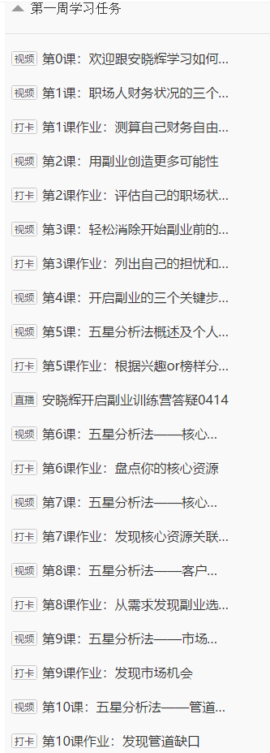
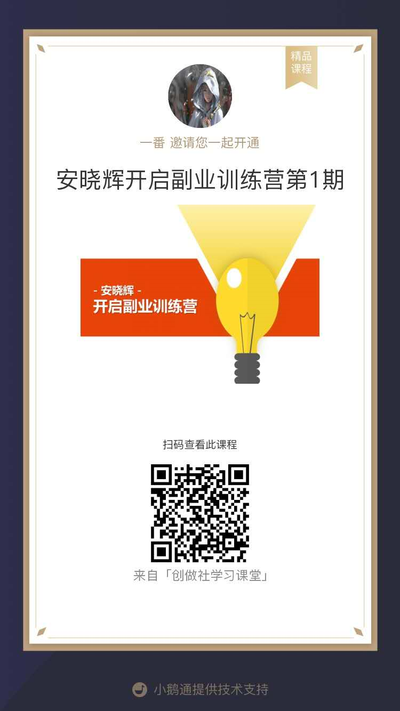

> **一番码客 : 挖掘你关心的亮点。**
> **www.efonmark.com**

本文目录：

[TOC]

<!--more-->

三周前，一番跟大家说了一番报了个安晓辉老师的副业规划的培训班，转眼间三周就过去了，今天培训班结营了。

而这三周里，一番的工作其实非常忙，忙到凌晨一两点是常有的事，而且有些事没做完，早上六七点就起来去上班，所以一番其实在课程里的参与度不是很高。但一番还是完成了所有的一共15次作业。

整体下来，一番收获还是蛮大的，不仅仅是在认识、规划副业上，还学到了一套职业规划、做事态度、网课运营的方式，这些都是课程之外的附加收获。

## 关于副业规划

今年来副业热度随着知识付费、网络电商等的兴起也有所上升。网上越来越多的关于副业的讨论，越来越多通过分享行业内部信息、教人赚钱来售卖知识付费。对安老师的副业规划课程，安老师的价值观是非常正的，没有过度的推销副业的收入和作用，而是从职业规划、主副业相互促进的角度分析自己的业余时间规划。

个人在主业的时间久了，限于视野和认知，会有一定的发展瓶颈，这个时候我们需要在做好主业的基础上了解些其他行业的信息，拓展主业的认识边界。所以我们会看到有一些非常成功的人，一定不只是主业做的很好。除了主业做的好，其他方方面面都有较高的认知，转行也非常容易，突破了职业的边境，做到了很好的跨领域成功。

副业不是荒废主业，而是探索人生、职业、主业更多的可能性。所以，这一切，都需要我们做好主业的基础之上。

不管是开起来乘风而起、日进斗金的网红，还是年入百万的微商，抑或是风生水起的企业。任何看似轻松的成功背后，一定有一套方法和逻辑，所谓要让自己的成功看起来云淡风轻，背后一定有艰辛的努力，“你必须非常努力，才能看起来毫不费力”。

这个课程里安老师结合职业规划的一些方法论和自己设计的专业工具，让副业的目标和路线逐渐清晰，会给在迷茫中的我们提供非常有力的工具，不仅是在短暂的课程中学习，副业的整个认知、分解、落实规划中，都是可以持续迭代、不断修正的方法论。不至于课上热血沸汤，课后迷茫依旧，课上想想千条路，课后下来走原路。

学习的过程中还有除了线上视频课程、作业，还有直播答疑、个人会诊。自己没有提问，只是旁听下直播答疑、会诊，都非常的有收获。

总的来讲，低端的打法论套路，进阶的打法讲方法论，高端的打法讲心法。要想规划长久的、可持续发展的事业，一定要有方法和心法，套路不会得人心，人心才能得人心。整个课程下来，一番得到了一套完整的副业分析工具和方法论，感觉非常的物超所值。

后面一番的职业规划会不断的运用、复盘里面的工具和方法。

> 一番雾语：
>
> 低端的打法论套路，进阶的打法讲方法论，高端的打法讲心法。

------

<table>
<tr>
<td >

</td>
<td width="50%" align=left><b>
    免费知识星球：<a href="http://www.efonmark.com/efonmark-blog/readme/zhishixingqiu1.png">一番码客-积累交流</a> 
    微信公众号：<a href="http://www.efonmark.com/efonmark-blog/readme/guanzhu_1.jpg">一番码客</a> 
    微信：<a href="http://www.efonmark.com/efonmark-blog/readme/weixin.jpg">Efon-fighting</a> 
    网站：<a href="http://www.efonmark.com">http://www.efonmark.com</a> </b></td>
</tr>
</table>