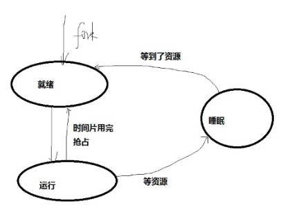
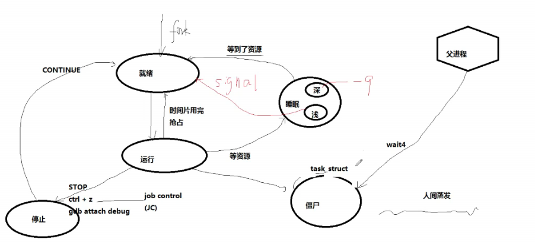

# 打通Linux脉络系列：进程、线程和调度

> [**练习源码地址**](https://github.com/efonmark/process-courses)  
> [**课程讲义**](./assert/打通Linux脉络系列：进程、线程和调度Linux的进程、线程以及调度.pdf)

## 进程是一个资源分配单位

进程控制块PCB (task_struct)  
资源：pid 身份证号；mm 内存资源；fs 文件系统资源；files 文件资源（fd）；signal 信号 信号函数；  
pid数量有限  /proc/sys/kernal/pid_max  
内核对进程的管理：链表、树、哈希  

## 进程生命周期

> linux任务管理：宏观并行，微观串行  

  
  

僵尸是一个非常短的过渡状态。  

子死父清理(waitfor)，防止内存泄漏；进程结束，内存泄漏消失，内存泄漏是指：进程活着，运行越久，耗费内存越多。  

作业控制：暂停：ctrl + z； fg（前台） bg（background后台）  cpulimit实现原理就是如此（stop->continue->stop...)。  
> cpulimit -l 40 -p 12296  

深度睡眠：不响应信号，”kill -9“都杀不掉，必须等到资源。只有内核态进行，应用层不能进入。如mkdir命令  
浅度睡眠：信号、等到资源  

睡眠（就是一种阻塞）：主动，暂停：被动（作业控制）  

linux操作系统原理书籍推荐：Operating Systems: Three Easy Pieces  