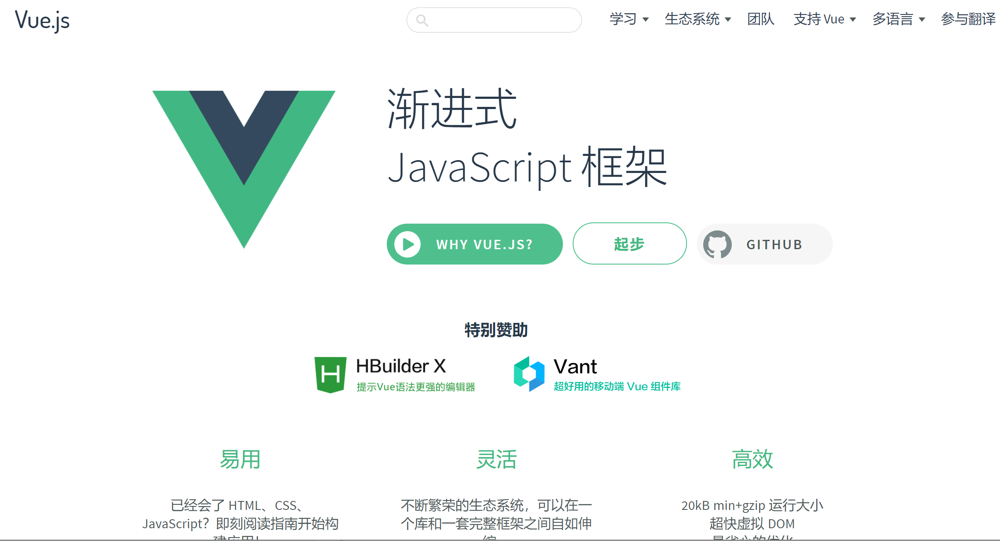
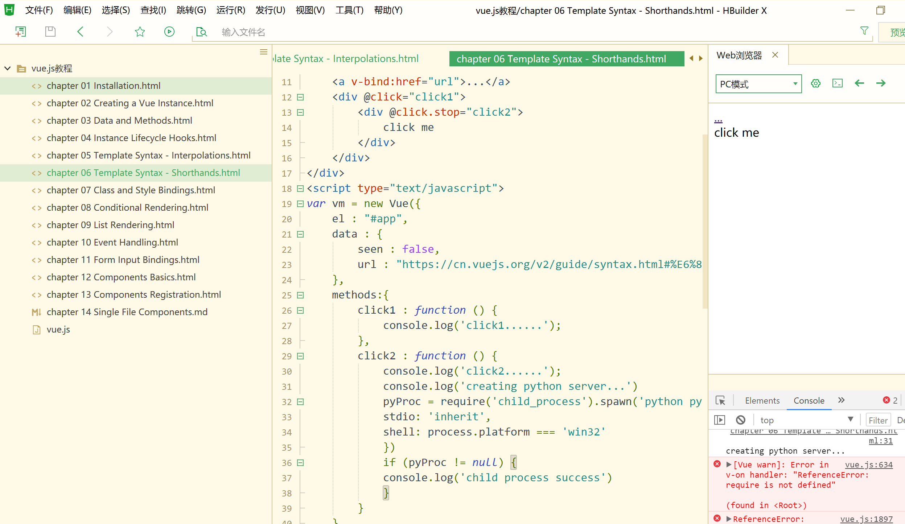

> **一番码客 : 挖掘你关心的亮点。**
> **http://efonfighting.imwork.net**

本文目录：

[TOC]

## 前言

之前尝试用electron做一些项目的时候，因为完全没有前端开发经验，做起来还是有点找不到头绪，思路非常乱，想到什么功能便搜什么，这样导致没有全局观，不找到整体的框架甚至基本语法。显然这样效率非常低下。虽然是以项目为驱动，但基础知识还是非常重要。

开始用一个新工具、新语言做项目之前，还是应该快速掌握它最基础的用法和语法，然后在项目中的实际运用中去深入理解和学习更多高阶和常用知识。

意识到这点后，一番开始着手学习`vue.js`的一些基础知识。

<!-- more -->

## 学习途径

### vue.js官网

>  https://cn.vuejs.org/ 

**文档+视频+示例代码**

Vue.js的官网非常全面，特别是在文档和教学这块非常友善，都是免费的。这让新手更容易学习上手。

特别是教学这块，除了有详尽完善的学习文档，还有非常短小、易懂的视频教程，还提供实验代码和运行环境。

视频教学一共14节，每节长度在10分钟以内，但里面涵盖的知识点非常全。今天一番花了差不多一个小时便看了7节，从之前对vue的一无所知到现在有了一些初步的概念，所以不深，但基本语法还是有了概念，在看代码的时候不至于摸黑。

具体的学习总结待明天一番学习完之后在下一篇里总结。

## 一番今日

天气已入秋，下雨便冷飕飕，感觉里过年越来越近了，哈哈。

昨晚一番差不多12点睡觉，早上5点准时起床学习、写文章，果然精神状态和身体状态比晚睡睡7个小时还要好。但昨晚还是睡太晚了，今天继续早睡早起，日更放到早上。

> 一番雾语：初秋正是奋斗好时节。

> **免费知识星球： [一番码客-积累交流]([wwww](https://t.zsxq.com/NRVBURr))**
> **微信公众号：一番码客**
> **微信：Efon-fighting**
> **网站： http://efonfighting.imwork.net**