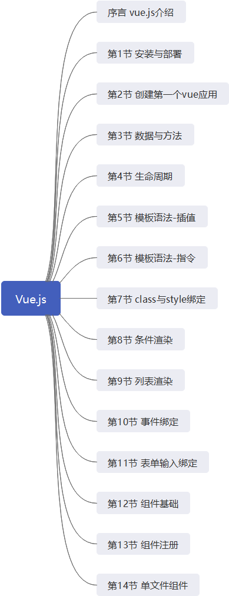

> **一番码客 : 挖掘你关心的亮点。**
> **http://efonfighting.imwork.net**

本文目录：

[TOC]

## 前言

今天将vue.js官网的所有看完了，一共15个视频，看完也就差不多一个小时，便将所有vue.js的基本用法都看完了。基本可以满足基础知识的学习。

<!-- more -->

## 基础知识

### 视频教程大纲



最终我们要达到的效果就是创建单文件组件，在单文件组件中完成组件的布局、渲染和事件处理。

视频教程还是比较新录制的，看时间在今年9月份，视频的内容与网页的介绍不完全一样，相辅相成，看视频能忙我们快速上手实验，网页教程则便于实时查看。

### 新建工程

最后一节视频里介绍了通过安装vue-cli和wepack工具后，通过vue ui命令通过图形界面来快速搭建一个vue的工程。

* 安装 `npm`

`npm` 全称为 `Node Package Manager`，是一个基于`Node.js`的包管理器，也是整个`Node.js`社区最流行、支持的第三方模块最多的包管理器。
```
npm -v
```

* 由于网络原因 安装 `cnpm`

```
npm install -g cnpm --registry=https://registry.npm.taobao.org
```

* 安装 `vue-cli`

```
cnpm install -g @vue/cli
```

* 安装 `webpack`

`webpack` 是  `JavaScript` 打包器(module bundler)
```
cnpm install -g webpack
```

* `vue ui`

在终端运行`vue ui`运行vue的管理界面，可以创建、导入项目


## 参考

* vuejs

  > https://cn.vuejs.org/ 


## 一番今日

昨天尝试了12点前睡，5点起，加上中午的午休，整体来讲比晚睡的状态要好，今天继续。今天写文章有点匆忙了，马上就7点了。

> 一番雾语：程序员大师之路，从菜鸟到老鸟，到秃鸟


> **免费知识星球： [一番码客-积累交流]([wwww](https://t.zsxq.com/NRVBURr))**
> **微信公众号：一番码客**
> **微信：Efon-fighting**
> **网站： http://efonfighting.imwork.net**