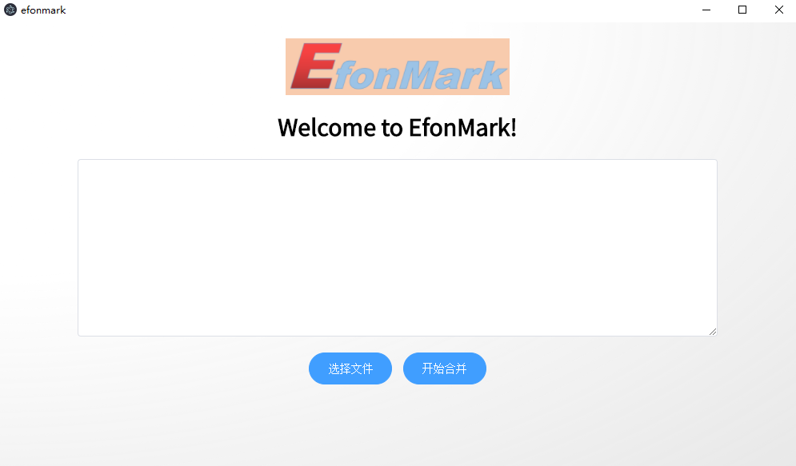

> **一番码客 : 挖掘你关心的亮点。**
> **http://www.efonmark.com**

本文目录：

[TOC]

## 前言

昨天一番解了很久想解这个electron打包python可执行文件为一体的方法，因为要发布我们的小工具，必须要打包为一个安装包啊，不然对于计算机小白来讲太不友好了。今天一番发挥**极客精神**，必须要将这个问题解决啊，至少。。。。暂时在某种程度上解决这个问题吧。

看来要学习一样技能，还是要成体系的学习才行，但现在这个技术日新月异的时代，等有完整教程或书籍出来时，你已经落后了，或许这个技术已经成熟了。很多技术问题在互联网上才是最新最全的，所以最好的方式，便是结合互联网上的这些最新最全的资料，在自己学习爬坑的过程中，随时整理、记录出一套自己的学习笔记、知识体系，最终当我们对这们技能掌握到一定程度后，也许我们自己的学习笔记，便是一本最新最全的技术指导书，哈哈。

<!--more-->

## 继续爬坑

经历了昨天爬坑四步曲，一番今天继续爬坑，誓要解决这个问题。一番继续专研`electron-package`的打包方式。当一番执行如下打包脚本时。

>  "pack-app": "./node_modules/.bin/electron-packager.cmd . --overwrite --ignore=py$ --ignore=\\.env --ignore=\\.vscode --ignore=old-post-backup"

报错如下：

```
> electron-packager.cmd . --overwrite --ignore=py$ --ignore=\.env --ignore=\.vscode --ignore=old-post-backup

EPERM: operation not permitted, lstat 'C:\Users\efonf\AppData\Local\Temp\electron-download-apHr3h\electron-v2.0.18-win32-x64.zip'
npm ERR! code ELIFECYCLE
npm ERR! errno 1
npm ERR! efonmark@0.0.1 pack-app: `electron-packager.cmd . --overwrite --ignore=py$ --ignore=\.env --ignore=\.vscode --ignore=old-post-backup`
npm ERR! Exit status 1
npm ERR! 
npm ERR! Failed at the efonmark@0.0.1 pack-app script.
npm ERR! This is probably not a problem with npm. There is likely additional logging output above.

npm ERR! A complete log of this run can be found in:
npm ERR!     C:\Users\efonf\AppData\Roaming\npm-cache\_logs\2019-10-27T14_46_54_520Z-debug.log
The terminal process terminated with exit code: 1
```

以此报错信息来正面分析。

仔细看了下，`operation not permitted`似乎在说是访问后面这个文件时没有权限。

* 本能想到是不是要使用管理员权限。于是使用管理员权限运行vscode，再次执行该命令，扑街~~
* 还是上网搜吧，这次用google（不要问我怎么上的谷歌🧐），搜出来的效果确实还是比百度好一点，什么`npm cache clean --force`清理npm缓存，管理员权限运行vscode，关闭vscode命令行运行。最终结果姐u是还是不行。
* 深入一下打包脚本源码，追了一下，算了，一时半会儿是看不懂了。
* 还是Google一下python怎么打包吧，除了搜到一两篇零星讲用electron-packge之外，用了同样的打包脚本，但一番用不了啊，怀疑electron建立工程时的环境问题，那就只有重新建工程了。暂时先不考虑了。

## 出坑

之前一番用建立工程时的build脚本有打包出可electron的可执行文件，只是这个里面没有打包入python的可执行文件，即使再package.json脚本中的files字段中加入pydist这个目录，依然没有效果，估计只有后面更多经验积累之后才能解决了。

一番再次执行这个脚本，想看下它做了哪些动作。研究了下这个成功的打印。

```
  • electron-builder version=20.44.4
  • loaded configuration file=package.json ("build" field)
  • writing effective config file=build\builder-effective-config.yaml
  • no native production dependencies
  • packaging       platform=win32 arch=x64 electron=2.0.18 appOutDir=build\win-unpacked
  • default Electron icon is used reason=application icon is not set
  • building        target=nsis file=build\efonmark Setup 0.0.1.exe archs=x64 oneClick=true perMachine=false
  • building block map blockMapFile=build\efonmark Setup 0.0.1.exe.blockmap
```

发现在build下面会生成一个win-upacked目录，一看刚开始理解为了卸载目录，仔细一想，不是解压目录吗，进去一看，果然时解压后的目录，和安装完的目录很像。但如果通过安装方式安装，直接把解压后的目录移植到其他电脑是不可行的，也就是说不能作为绿色软件。

柳暗花明，一番把这win-packed个目录拷贝到另一台电脑，发现可以正常运行，也就是说把它压缩打包之后就可以直接发布了，还可以是绿色软件，正好。

于是一番把生成的pyhton可执行文件也一起放到这个目录并打包，成功，出坑~

小伙伴如果感兴趣，一番也很想让小伙伴们先用起来，今天先发布一个V0.0.1的版本，一番将它发布到了一番的免费知识星球"一番码客-积累交流"，需要的小伙伴可以前往获取。

基本功能都是ok的，可以直接在解压目录下找到efonmark.exe文件运行，在该目录下会生成一个out.pdf的文档，即可完成pdf的合并。



## 一番今日

今天开车路上听音频，学习到两句话。

* 写文最重要的是要有同理心。

* 不要明天再努力，只有努力过完今天才有明天！

想到了一些事，一番码客我是不是要改名字为一番极客，想了下，还是没必要改了，一番码客即码代码也码文字，只是一番码客的极客精神要作为核心精神。

> 一番雾语：如果反感口号，那理解下它的含义，是真的只是强加于人的口号，还是我们为自己的懒惰找借口。


> **免费知识星球： [一番码客-积累交流]([wwww](https://t.zsxq.com/NRVBURr))**
> **微信公众号：一番码客**
> **微信：Efon-fighting**
> **网站： http://www.efonmark.com**