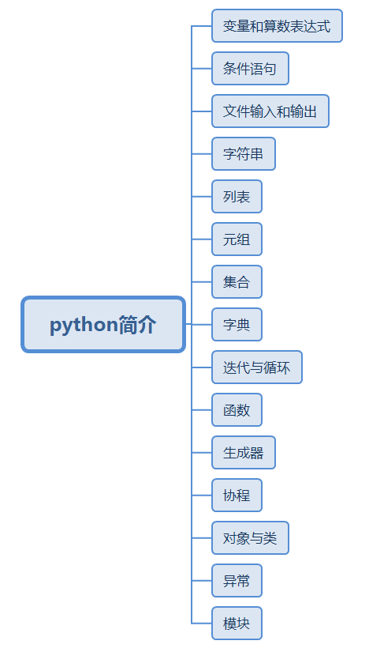
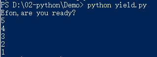

> **一番码客 : 挖掘你关心的亮点。**
> **http://www.efonmark.com**

本文目录：

[TOC]


<!-- more -->

## 前言

上一篇一番简单介绍了下`scrapy`工具的使用，深入时一番发现，yield这个关键字在很多scrapy的例子和教程里用的特别多。所以今天我们来研究下yield到底是个什么东西。

## python简介

首先我们先总体看下python涉及到的基础数据格式。



## 生成器

* 任何使用`yield`的函数都称为**`生成器`**。
* 调用生成器函数将创建一个**对象**，该对象通过连续调用`next()`方法（在Python3中是`__next__()`）生成**结果序列**。
* `next()`调用时生成器函数一直运行到下一条`yield`语句为止，此时`next()`将返回值传递给yield，而且函数将暂时中止执行。
* 再次调用`next()`时，函数执行`yield`之后的语句，直到函数返回为止。
* 通常不会在生成器上直接调用`next()`方法，而是在`for`语句、`sum()`或一些使用序列的其他操作中使用它。

```python
# file: yield.py
def countdown(n):
	print("Efon,are you ready?")
	while n > 0:
		yield n
		n -= 1
		
for i in countdown(5):
	print(i)
```



## scrapy中的yield

```python
    def parse(self, response):
        items = response.css("#r_content section")

        for item in items:
            host = "https://m.zhaopin.com"
            url  =  host + item.xpath('//a/@data-link').extract_first()
            print(url)
            yield Request(url,callback=self.parse_item)
        pass
    def parse_item(self,response):
            item = TutorialItem()
            q = response.css
            item['address'] = q('.add::text').extract_first()
            yield  item
```

* 回顾下：

> 当我们执行`scrapy crawl 51job`时：
>
> * scrapy为Spider的 `start_urls` 属性中的每个URL创建了 `scrapy.Request`对象，并将 `parse` 方法作为**回调函数(callback)**赋值给了Request。
> * Request对象经过调度，执行生成 `scrapy.http.Response`对象并送回给spider `parse()`方法。
> * 也即，`parse`函数中`respose`便是`start_urls`中请求回来的结果。

* 每次从`parse()`中取一个返回值时便可以取出一个`item`序列。而这些`item`会被设定的`pipeline`规则处理。


> 一番雾语：生成器，scrapy框架中经常用到的一种类型。

------------------

> **免费知识星球： [一番码客-积累交流](http://www.efonmark.com/efonmark-blog/readme/zhishixingqiu1.png)**
> **微信公众号：[一番码客](http://www.efonmark.com/efonmark-blog/readme/guanzhu_1.jpg)**
> **微信：[Efon-fighting](http://www.efonmark.com/efonmark-blog/readme/weixin.jpg)**
> **网站： [http://www.efonmark.com](http://www.efonmark.com)**