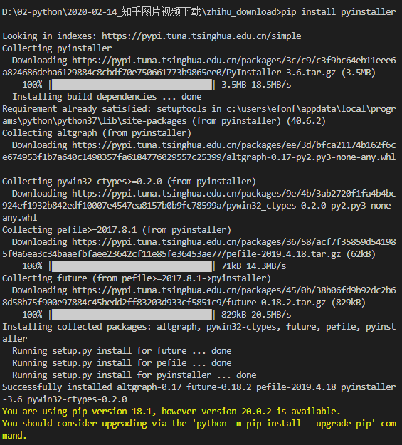
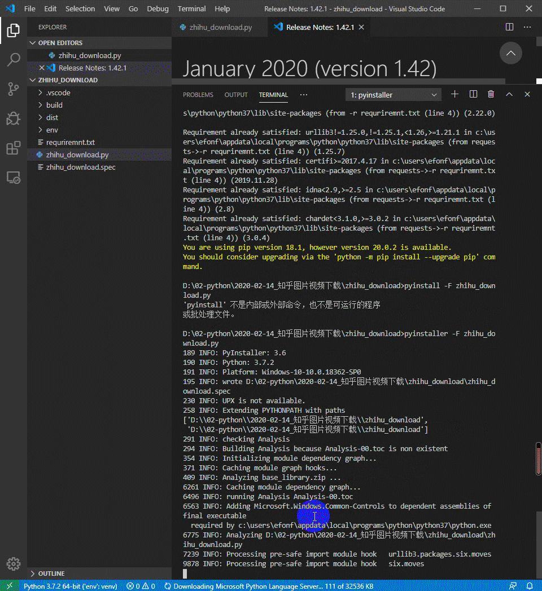

> **一番码客 : 挖掘你关心的亮点。**
> **http://www.efonmark.com**

本文目录：

[TOC]

<!-- more -->

## 前言

虽然这个是个很基础的问题，网上也有很多文章，但自己动手和网上有文章是两回事，自己动了手，有没有记录、下次是否还能解决又是另外一回事。

一番为什么这段时间要学习nodejs呢，很大一个原因，就是因为python的可以用的界面库实在是不怎么美观，有点跟不上时代，想要转战elelctron。

但python也不能落下，毕竟很多代码就是python写的，全部用nodejs复写成本太高了，所以掌握一下python的可执行程序打包方法还是有一定必要，至少先可以把python用起来，把有的功能打包给读者小伙伴的，即使是界面丑了点。先求生存，再求发展吧。

## 环境准备

* `windows10` + `python3.7`

* python虚拟环境`virtualenv`：安装脚本`pip install virtualenv`。

    > 安装虚拟环境的目的是为了减少打包的依赖的包，减小打包程序大小。

* python打包工具`pyinstaller`：安装脚本`pip install pyinstaller`。

## 打包步骤

* 在要打包的python工程根目录下，创建虚拟运行环境：`virtualenv env`；

* cd到env/Script下，执行`activate`，使虚拟环境生效；

    > 如果想要解除虚拟环境，应用系统环境，可以在env/Script目录下执行上一步的方向操作`deactivate`;

* 然后当前的所有pip install操作都只是在当前工程了，我们就可以安装python文件的依赖库了。

* 安装完依赖库后，我们就可以打包了，很简单，执行`pyinstaller -F demo.py`就可以了，其中demo是我们要打包的主程序。

* 这时会在工程目录的dist目录下，我们就可以看到打包好的可执行程序了。
* 用上面命令打包出来的可执行程序在启动运行时，会出现后台终端窗口，这时我们如果想要去掉这个终端，只需要在打包命令后面加上参数`-w`就可以了，即`pyinstaller -F demo.py -w`。具体参数作用，可以参考下面一节内容。

## PyInstaller常用选项

| -h，--help   | 查看该模块的帮助信息            |
| ------- | ------------- |
| -F，-onefile| 产生单个的可执行文件  |
| -D，--onedir | 产生一个目录（包含多个文件）作为可执行程序    |
| -a，--ascii                 | 不包含 Unicode 字符集支持 |
| -d，--debug                 | 产生 debug 版本的可执行文件|
| -w，--windowed，--noconsolc | 指定程序运行时不显示命令行窗口（仅对 Windows 有效）|
| -c，--nowindowed，--console | 指定使用命令行窗口运行程序（仅对 Windows 有效）|
| -o DIR，--out=DIR | 指定 spec 文件的生成目录。如果没有指定，则默认使用当前目录来生成 spec 文件 |
| -p DIR，--path=DIR | 设置 Python 导入模块的路径（和设置 PYTHONPATH 环境变量的作用相似）。也可使用路径分隔符（Windows 使用分号，[Linux](http://c.biancheng.net/linux_tutorial/) 使用冒号）来分隔多个路径 |
| -n NAME，--name=NAME | 指定项目（产生的 spec）名字。如果省略该选项，那么第一个脚本的主文件名将作为 spec 的名字 |

## 其他

好了，今天就这样。记得一番之前给大家做了一个pdf合并的小工具，就是用这个原理打包出来的。这个结合tkinter库，基本也能打包出一个对小白用户比较友善的程序了。看来一番可以整理下以前用python写的小工具了，可以做个原创工具资源小合集了😁。

> 一番雾语：做对小白友善的小工具。

<table>
<tr>
<td >

</td>
<td width="50%" align=left><b>
    免费知识星球：<a href="http://www.efonmark.com/efonmark-blog/readme/zhishixingqiu1.png">一番码客-积累交流</a> 
    微信公众号：<a href="http://www.efonmark.com/efonmark-blog/readme/guanzhu_1.jpg">一番码客</a> 
    微信：<a href="http://www.efonmark.com/efonmark-blog/readme/weixin.jpg">Efon-fighting</a> 
    网站：<a href="http://www.efonmark.com">http://www.efonmark.com</a> </b></td>
</tr>
</table>