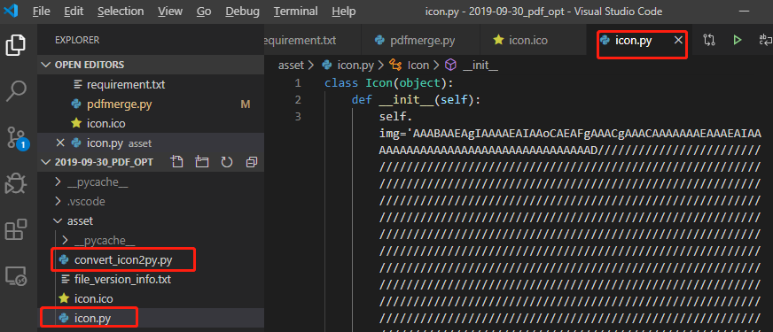

> **一番码客 : 挖掘你关心的亮点。**
> **http://www.efonmark.com**

本文目录：

[TOC]


<!-- more -->

## 前言

因为昨天重新研究了下python的打包方法，今天一番准备把之前写的一个pdf合并软件重新整理一下，打包出来。

但在打包的过程中仍然遇到了一些问题，半年前一番做打包的时候也遇到了一些问题，现在来看，解决这些问题思路清晰多了，这里记录下。

## 问题

> 打包成功，但运行时提示`Failed to execute script xxx`。这里又分很多种原因，这时不要用`-w`打包，然后在终端`.\xxx.exe`的方式运行，就可以看到输出日志了。

### 原因一

```powershell
D:\02-python\2019-09-30_pdf_opt\dist>.\pdfmerge.exe
Traceback (most recent call last):
  File "pdfmerge.py", line 5, in <module>
ModuleNotFoundError: No module named 'PyPDF2'
[47572] Failed to execute script pdfmerge
```

这个是因为我们打包的时候用的是系统的`pyinstaller`命令，而系统的python库里没有安装相应的依赖包，这时要么用退出当前的虚拟环境，要么在进入虚拟环境并给虚拟环境在Scripts下面安装`pyinstaller`命令。

### 原因二

```powershell
D:\02-python\2019-09-30_pdf_opt\dist>.\pdfmerge.exe
Traceback (most recent call last):
  File "pdfmerge.py", line 97, in <module>
  File "tkinter\__init__.py", line 1871, in wm_iconbitmap
_tkinter.TclError: bitmap ".\assert\efon.ico" not defined
[95216] Failed to execute script pdfmerge
```

这个是因为我们在py代码里指定了程序图标，但`pyinstaller`不能将依赖文件打包到一个exe里，所以需要我们把图标文件拷贝到当前exe目录下。当然，然后另外的解决办法，就是下面我们要讲的把图标打包到代码里的方法。

## 把图标打包到代码里

* 首先，编写一个py程序，来自动生成一个包含图标内容的类

```python
import base64
with open("icon.py","w") as f:
    f.write('class Icon(object):\n')
    f.write('\tdef __init__(self):\n')
    f.write("\t\tself.img='")
with open("icon.ico","rb") as i:
    b64str = base64.b64encode(i.read())
    with open("icon.py","ab+") as f:
        f.write(b64str)
with open("icon.py","a") as f:
    f.write("'")
```

然后执行它，结果是这样的：



* 然后我们在我们要打包的py程序里去指定这个图标：

```python
    with open('tmp.ico','wb') as tmp:
        tmp.write(base64.b64decode(Icon().img))
    window.iconbitmap('tmp.ico')
    os.remove('tmp.ico')
```

原理就是先把Icon类的里ico数据读出来，转换为二进制再写到当前目录生成一个临时ico，然后指定程序图标，最后删除这个临时图标。

这样就能保证我们的程序一定能在当前目录加载图标。一气呵成，速度非常快，并不会看到有生成临时文件。

如果程序里还有其他外部依赖文件，可以按照同样的道理处理。

这样我们的打包过程就完成啦，最终就只有一个exe文件，然后就可以发布了！

## 参考

* 《一种使用pyinstaller时图标问题解决方案》：https://www.cnblogs.com/it-tsz/p/10534688.html

> 一番雾语：等日更完了一番一定好好发软件版本~

<table>
<tr>
<td ><center></center></td>
<td width="50%" align=left><b>
    免费知识星球：<a href="http://www.efonmark.com/efonmark-blog/readme/zhishixingqiu1.png">一番码客-积累交流</a><br>
    微信公众号：<a href="http://www.efonmark.com/efonmark-blog/readme/guanzhu_1.jpg">一番码客</a><br>
    微信：<a href="http://www.efonmark.com/efonmark-blog/readme/weixin.jpg">Efon-fighting</a><br>
    网站：<a href="http://www.efonmark.com">http://www.efonmark.com</a><br></b></td>
</tr>
</table>