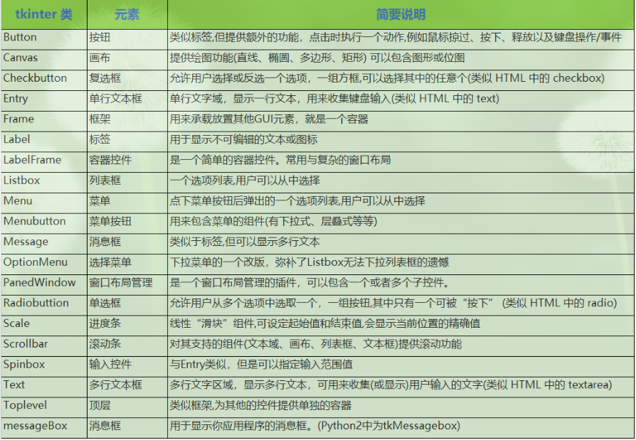

> **一番码客 : 挖掘你关心的亮点。**
> **http://www.efonmark.com**

本文目录：

[TOC]

<!-- more -->

## 前言

如果想要使用纯python来构建界面的化，这里一共有13个Python GUI库，包括`CEF Python、Dabo、Flexx、Kivy、libavg、、Tkinter、Pyforms、PyGObject、PyQt、PySide、PyAutoGUI、wxPython、PyGTK`。

其中比较常用的就是`Tkinter、PyQt、wxPython`。关于这13种GUI库的简单介绍，可以参看下面这篇文章：

<table>
<tr>
<td width="70%" align=left>
   <a href="https://zhuanlan.zhihu.com/p/94801874">Python开发者必知的13个Python GUI库，哪个是你的最爱？</a>
</td>
<td align=center></td>
</tr>
</table>

## Tkinter

Tkinter可以说是一个非常古老的python界面编程库了，而且已经是python自带的一个库了。对于封装一些小型的工具类程序，还是比较适用的，而且学习成本非常低。

* Tkinter模块元素：

具体可以看这三篇文章，比较详细，而且有详细的代码示例：

<table>
<tr>
<td width="70%" align=left>
   <a href="https://www.cnblogs.com/shwee/p/9427975.html">Python GUI之tkinter窗口视窗教程大集合</a>
</td>
<td align=center>
    
</td>
</tr>
<tr>
<td width="70%" align=left>
   <a href="https://www.cnblogs.com/hhh5460/tag/tkinter/">罗兵の水库</a>
</td>
<td align=center>
    
</td>
</tr>
<tr>
<td width="70%" align=left>
   <a href="https://blog.csdn.net/yeshankuangrenaaaaa/article/details/85703572">python tkinter实现界面切换_code</a>
</td>
<td align=center>
    
</td>
</tr>
</table>

## web做python程序界面

web做界面的好处就是美观。但涉及到前后端的通信。具体可以参看以下两篇文章：

<table>
<tr>
<td width="70%" align=left>
   <a href="https://zhuanlan.zhihu.com/p/36432672">使用 web 技术构建 python 的 GUI 界面</a>
</td>
<td align=center>
    
</td>
</tr>
<tr>
<td width="70%" align=left>
   <a href="https://zhuanlan.zhihu.com/p/37999476">Electron+Python界面开发（通过zerorpc）</a>
</td>
<td align=center>
    
</td>
</tr>

</table>

## python日志解决方案

日志是程序调试、错误分析的重要手段，python有一些库是专门实现日志方案的，可以参考下面文章：

<table>
<tr>
<td width="70%" align=left>
   <a href="https://mp.weixin.qq.com/s/CgmfVqogqKBzezmIR7ZfsQ">Python中完美的日志解决方案</a>
</td>
<td align=center>
    
</td>
</tr>
</table>

> 一番雾语：总有一款适合我们。

<table>
<tr>
<td >

</td>
<td width="50%" align=left><b>
    免费知识星球：<a href="http://www.efonmark.com/efonmark-blog/readme/zhishixingqiu1.png">一番码客-积累交流</a> 
    微信公众号：<a href="http://www.efonmark.com/efonmark-blog/readme/guanzhu_1.jpg">一番码客</a> 
    微信：<a href="http://www.efonmark.com/efonmark-blog/readme/weixin.jpg">Efon-fighting</a> 
    网站：<a href="http://www.efonmark.com">http://www.efonmark.com</a> </b></td>
</tr>
</table>