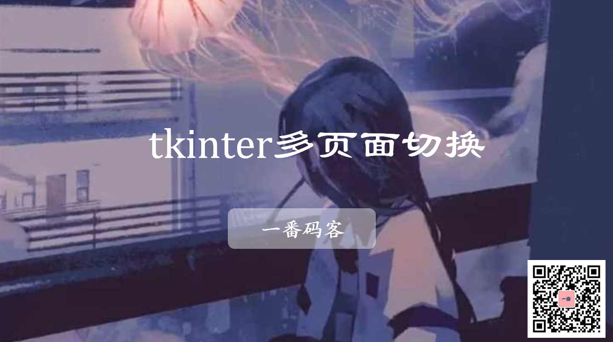
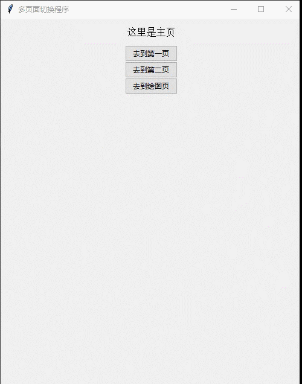

> **一番码客 : 挖掘你关心的亮点。**
> **http://www.efonmark.com**

本文目录：

[TOC]



<!-- more -->

## 前言

软件设计很重要的一点就是模块化、功能代码的复用性。虽然之前开发小工具的时候功能都实现了，但代码结构很差，导致可扩展性和可维护性较差。今天我们需要将界面和功能代码模块化。

## 多页面切换的实现

先看看效果：



代码实现：

```python
import matplotlib

from matplotlib.backends.backend_tkagg import FigureCanvasTkAgg, NavigationToolbar2Tk
from matplotlib.figure import Figure

import tkinter as tk
from tkinter import ttk

LARGE_FONT= ("Verdana", 12)

class Application(tk.Tk):
    '''
    多页面测试程序
        界面与逻辑分离
    '''
    def __init__(self):
        
        super().__init__()

        #self.iconbitmap(default="efon.ico")
        self.wm_title("多页面切换程序")
        
        container = tk.Frame(self)
        container.pack(side="top", fill="both", expand = True)
        container.grid_rowconfigure(0, weight=1)
        container.grid_columnconfigure(0, weight=1)

        self.frames = {}
        for F in (StartPage, PageOne, PageTwo, PageThree):
            frame = F(container, self)
            self.frames[F] = frame
            frame.grid(row=0, column=0, sticky="nsew")  # 四个页面的位置都是 grid(row=0, column=0), 位置重叠，只有最上面的可见！！

        self.show_frame(StartPage)
        
    def show_frame(self, cont):
        frame = self.frames[cont]
        frame.tkraise() # 切换，将指定画布对象移动到显示列表的顶部

class StartPage(tk.Frame):
    '''主页'''
    def __init__(self, parent, root):
        super().__init__(parent)
        label = tk.Label(self, text="这里是主页", font=LARGE_FONT)
        label.pack(pady=10,padx=10)

        button1 = ttk.Button(self, text="去到第一页", command=lambda: root.show_frame(PageOne)).pack()
        button2 = ttk.Button(self, text="去到第二页", command=lambda: root.show_frame(PageTwo)).pack()
        button3 = ttk.Button(self, text="去到绘图页", command=lambda: root.show_frame(PageThree)).pack()

class PageOne(tk.Frame):
    '''第一页'''
    def __init__(self, parent, root):
        super().__init__(parent)
        label = tk.Label(self, text="这是第一页", font=LARGE_FONT)
        label.pack(pady=10,padx=10)

        button1 = ttk.Button(self, text="回到主页", command=lambda: root.show_frame(StartPage)).pack()
        button2 = ttk.Button(self, text="去到第二页", command=lambda: root.show_frame(PageTwo)).pack()

class PageTwo(tk.Frame):
    '''第二页'''
    def __init__(self, parent, root):
        super().__init__(parent)
        label = tk.Label(self, text="这是第二页", font=LARGE_FONT)
        label.pack(pady=10,padx=10)

        button1 = ttk.Button(self, text="回到主页", command=lambda: root.show_frame(StartPage)).pack()
        button2 = ttk.Button(self, text="去到第一页", command=lambda: root.show_frame(PageOne)).pack()

class PageThree(tk.Frame):
    '''第三页'''
    def __init__(self, parent, root):
        super().__init__(parent)
        tk.Label(self, text="这是绘图页", font=LARGE_FONT).pack(pady=10,padx=10)

        button1 = ttk.Button(self, text="回到主页", command=lambda: root.show_frame(StartPage)).pack()

        fig = Figure(figsize=(5,5), dpi=100)
        a = fig.add_subplot(111)
        a.plot([1,2,3,4,5,6,7,8],[5,6,1,3,8,9,3,5])

        
        canvas = FigureCanvasTkAgg(fig, self)
        canvas.draw()
        canvas.get_tk_widget().pack(side=tk.BOTTOM, fill=tk.BOTH, expand=True)

        toolbar = NavigationToolbar2Tk(canvas, self)
        toolbar.update()
        canvas._tkcanvas.pack(side=tk.TOP, fill=tk.BOTH, expand=True)

if __name__ == '__main__':
    # 实例化Application
    app = Application()
    # 主消息循环:
    app.mainloop()
```


<table>
    <td>
    <font size="2" color="gray">参考：</font><br>
    <font size="2" color="gray">
        <a>tkinter的GUI设计：界面与逻辑分离（三）-- 多页面 : https://www.cnblogs.com/hhh5460/p/5170744.html
        </a>
    </font><br>
    <font size="2" color="gray">
    	<a>Tkinter 学习-Canvas : https://blog.csdn.net/tianmuha/article/details/80959004
        </a>
    </font><br>
    </td>
</table>


> 一番雾语：功能代码与界面解耦。

<table>
<tr>
<td ><center></center></td>
<td width="50%" align=left><b>
    免费知识星球：<a href="http://www.efonmark.com/efonmark-blog/readme/zhishixingqiu1.png">一番码客-积累交流</a><br>
    微信公众号：<a href="http://www.efonmark.com/efonmark-blog/readme/guanzhu_1.jpg">一番码客</a><br>
    微信：<a href="http://www.efonmark.com/efonmark-blog/readme/weixin.jpg">Efon-fighting</a><br>
    网站：<a href="http://www.efonmark.com">http://www.efonmark.com</a><br></b></td>
</tr>
</table>