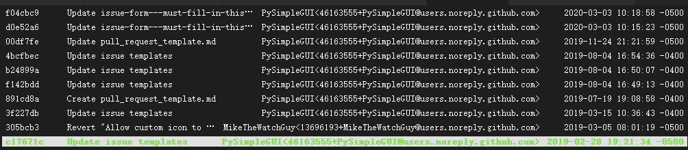

> **一番码客 : 挖掘你关心的亮点。**
> **http://www.efonmark.com**

本文目录：

[TOC]


<!-- more -->

## 前言

昨天一番推荐了两个python写图形界面的开源项目，其中的pySimpleGUI其实是一个非常强大的python图形界面工具，今天我们来仔细看看。

## 项目描述

该项目在2018年发起，持续开发、支持，支持tkinter、Qt、wxPython、Remi。用于简单的实现自定义的GUI界面。支持Python2.7和Python3。项目有超过200+的示例代码程序和指导书，可以让新手快速上手。其中的例子用到了及其学习（GUI，OpenCV，Chatterbot），浮动桌面组件，Matplotlib等等。

## 维护时间

从项目的提交记录来看，一共3390笔提交，最新的更新时间是在今年的3月3日，可以说活跃度还是非常高的。



## 目录结构

```txt
.
├── ButtonGraphics
├── CONTRIBUTING.md
├── Chess
├── DemoPrograms
├── DemoPrograms old
├── Demo_Toolbar
├── GIFs
├── HowDoI
├── ProgrammingClassExamples
├── PySimpleGUI.png
├── PySimpleGUI.py
├── PySimpleGUIQt
├── PySimpleGUIWeb
├── PySimpleGUIWx
├── PySimpleGUI_Logo_640.png
├── PySimpleGUIdebugger
├── ThemeMaker
├── UserCreatedPrograms
├── YoloObjectDetection
├── default_icon.ico
├── dochtml
├── docs
├── exemaker
├── license.txt
├── mkdocs.yml
├── readme.md
├── readme_creator
├── readthedocs.yml
└── setup.py
```

可以看到，里面除了文档，就是代码例程，里面例子非常丰富，而且都可以直接运行，看到实际效果。

里面东西太多了，以后有什么页面需要实现的，直接进来找源码就可以了。


> 一番雾语：以后python界面就靠它了。

<table>
<tr>
<td ><center></center></td>
<td width="50%" align=left><b>
    免费知识星球：<a href="http://www.efonmark.com/efonmark-blog/readme/zhishixingqiu1.png">一番码客-积累交流</a><br>
    微信公众号：<a href="http://www.efonmark.com/efonmark-blog/readme/guanzhu_1.jpg">一番码客</a><br>
    微信：<a href="http://www.efonmark.com/efonmark-blog/readme/weixin.jpg">Efon-fighting</a><br>
    网站：<a href="http://www.efonmark.com">http://www.efonmark.com</a><br></b></td>
</tr>
</table>