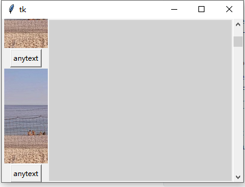

> **一番码客 : 挖掘你关心的亮点。**
> **http://www.efonmark.com**

本文目录：

[TOC]


<!-- more -->

## 前言

昨天完成了在canvas上放图片的效果，但由于图片比较大，可能一个窗口放不下，那我们就需要实现滚动条的方式拉取更多内容，今天一番实现了下。不得不说，stack overflow确实好用，不过还是需要懂一些英语。

## 代码

直接上代码：

```python
import tkinter as tk
from PIL import Image, ImageTk

vscrollbar = tk.Scrollbar(root)

self.canvas= tk.Canvas(root,background = "#D2D2D2",yscrollcommand=vscrollbar.set)

vscrollbar.config(command=self.canvas.yview)
vscrollbar.pack(side=tk.RIGHT, fill=tk.Y) 

f=tk.Frame(self.canvas) #Create the frame which will hold the widgets

self.canvas.pack(side="top", fill="both", expand=True)

self.canvas.create_window(0,0,window=f, anchor='nw')

im = Image.open('1.jpg')
tk_im = ImageTk.PhotoImage(im)

#Added more content here to activate the scroll
for i in range(100):
    tk.Label(f,image=tk_im).pack()
    tk.Button(f,text="anytext").pack()

    root.update()
    self.canvas.config(scrollregion=self.canvas.bbox("all"))

    root.mainloop()
```

效果图：



这里需要实现一个容器(frame)来放我们的组件，然后用canvas来实现滚动条。效果还是不错的。

所以，只要灵活应用、封装、组合，tkinter还是能实现不错的视图效果的。


> 一番雾语：任何复杂事务都是简单动作的组合。

<table>
<tr>
<td ><center></center></td>
<td width="50%" align=left><b>
    免费知识星球：<a href="http://www.efonmark.com/efonmark-blog/readme/zhishixingqiu1.png">一番码客-积累交流</a><br>
    微信公众号：<a href="http://www.efonmark.com/efonmark-blog/readme/guanzhu_1.jpg">一番码客</a><br>
    微信：<a href="http://www.efonmark.com/efonmark-blog/readme/weixin.jpg">Efon-fighting</a><br>
    网站：<a href="http://www.efonmark.com">http://www.efonmark.com</a><br></b></td>
</tr>
</table>