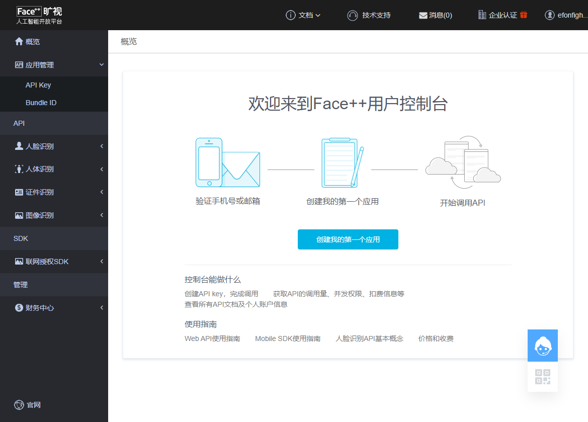
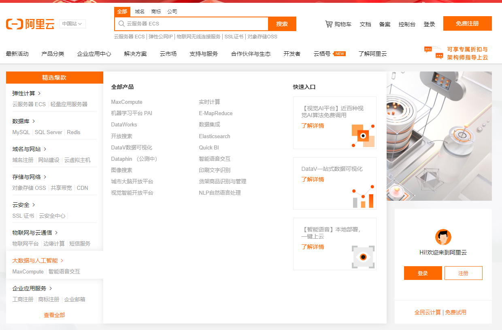

> **一番码客 : 挖掘你关心的亮点。**
> **http://www.efonmark.com**

本文目录：

[TOC]

<!-- more -->

## 概述

作为一个技术开发人员、软件开发者，有时会缺乏一些合作头脑，总认为自己要掌握了一切技术心里才有底，其实每个人的精力都是有限的，良好的合作，才能使我们做出功能更强大的产品。比如我们常常局限于技术，人工智能火了就学人工智能，区块链火了，就学区块链，h5火了学h5，学来学去，发现总也学不完，工资也没见有涨多少。其实我们只需要深耕一个领域，与其他领域协作共赢，就能把各个领域之间打通联系，进而创造出更伟大的产品。当然，核心技术还是非常重要。联想偏向商务合作，而华为除了重商务合作，也重自主研发，都很重要，有能力的情况下都要抓。

今天我们粗略来看看，两棵可以背靠的大树，以此引导出发，其他大树也可以看看。

## Face++旷视

自己与旷视也算有些微弱联系，旷视作为中国人工智能技术的领头企业之一，依靠自己的人工智能的技术积累，开放了旷视的人工智能开发平台。

上面提供了一些人工智能服务，有免费的，有付费的，包括人脸识别、人体识别、证件识别、图像识别。开发者可以注册之后获取自己的开发密钥，进而在自己的程序里调用相关功能API，实现自己的应用。我看到的有朋友就用这个做换脸的程序。

> 网址：https://console.faceplusplus.com.cn

## 阿里云

你们以为阿里只有淘宝，卖货的，但阿里活很全，互联网的各个领域都有服务。弹性计算、数据库、域名与网站、云安全、物联网与云通信、大数据与人工智能、企业应用服务，可以说一站式全套齐活，想买的物联网开发服务，这上面都有。所以，我们不需要自己学习人工智能高深的公众公式原理，也可以通过调用阿里云的API，在自己的程序里完成人工智能的功能。

> 网址：https://www.aliyun.com/

## 结语

其他百度云啊腾讯云啊都是类似的。不要担心三方公司不可靠，一般我们写的程序没人用了，也许阿里云都还在，即使阿里云不在了，有市场就有服务商，换一家就可以了。当然，这里有一些经济成本，但我们用我们的经济成本换取了时间成本。只有当我们自己规模够大的时候，才需要考虑通过自主研发的方式降低成本。

所以，作为开发人员，要学会背靠大树，站在巨人的肩膀上才能做出功能更强大的产品。

> 一番雾语：人类的进步是因我们一直不断站在巨人的肩膀之上。

<table>
<tr>
<td >

</td>
<td width="50%" align=left><b>
    免费知识星球：<a href="http://www.efonmark.com/efonmark-blog/readme/zhishixingqiu1.png">一番码客-积累交流</a> 
    微信公众号：<a href="http://www.efonmark.com/efonmark-blog/readme/guanzhu_1.jpg">一番码客</a> 
    微信：<a href="http://www.efonmark.com/efonmark-blog/readme/weixin.jpg">Efon-fighting</a> 
    网站：<a href="http://www.efonmark.com">http://www.efonmark.com</a> </b></td>
</tr>
</table>