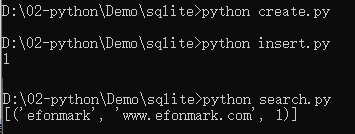

> **一番码客 : 挖掘你关心的亮点。**
> **http://www.efonmark.com**

本文目录：

[TOC]


<!-- more -->

## 为什么用sqlite

* SQLite是一种**嵌入式数据库**，它的数据库就是一个文件。
* 不需要一个单独的服务器进程或操作的系统（无服务器的）。这点比MogoDB、MySQL要方便。
* SQLite 不需要配置，这意味着不需要安装或管理。
* 一个完整的 SQLite 数据库是存储在一个单一的跨平台的磁盘文件。
* SQLite 是非常小的，是轻量级的，完全配置时小于 400KiB，省略可选功能配置时小于250KiB。
* SQLite 是自给自足的，这意味着不需要任何外部的依赖。

因为以上这些特点，是的sqlite特别适合小应用程序的数据存储。


## sqlite数据类型

| 数据类型 | 说明                     | 示例                       |
| -------- | ------------------------ | -------------------------- |
| Null     | 空值，就像python里的none | NULL                       |
| Integer  | 整数                     | 1，-20，234                |
| Real     | 浮点数                   | 1.0，2.34，5.653           |
| Text     | 字符串                   | "," "hello  world", "您好" |
| Blob     | 二进制大对象，如一个文件 | 图片、歌曲、压缩包         |

## 使用sqlite

Python中内置了SQLite3，连接到数据库后，需要打开游标Cursor，通过Cursor执行SQL语句，然后获得执行结果。

在Python中操作数据库时，要先导入数据库对应的驱动，然后，通过Connection对象和Cursor对象操作数据。 

要确保打开的Connection对象和Cursor对象都正确地被关闭，否则，资源就会泄露。

* 创建数据库，创建表

```python
import sqlite3

# '''创建一个数据库，文件名'''
conn = sqlite3.connect('./marktool.db')
# '''创建游标'''
cursor = conn.cursor()

# '''执行语句'''

sql = '''create table urls (
        title text,
        url text,
        id int)'''

cursor.execute(sql)

# '''使用游标关闭数据库的链接'''
cursor.close()
```

* 添加数据

```python
import sqlite3

conn = sqlite3.connect('marktool.db')
cursor = conn.cursor()

title  = "efonmark"
url = "www.efonmark.com"
id_num = 1

# insert语句 把一个新的行插入到表中
sql = ''' insert into urls
              (title, url, id)
              values
              (:st_title, :st_url, :id_num)'''
# 把数据保存到name username和 id_num中
cursor.execute(sql,{'st_title':title, 'st_url':url, 'id_num':id_num})
#通过rowcount获得插入的行数：
print(cursor.rowcount)
cursor.close()
conn.commit()
conn.close()
```

* 查询

```python
#导入SQLite驱动：
import sqlite3
#连接到SQlite数据库
#数据库文件是marktool.db，不存在，则自动创建
conn = sqlite3.connect('marktool.db')
#创建一个cursor：
cursor = conn.cursor()
#执行查询语句：
cursor.execute('select *from url where id=?', ('1',))
#使用fetchall获得结果集（list）
values = cursor.fetchall()
print(values)
#关闭cursor
#关闭conn
cursor.close()
conn.close()
```





> 一番雾语：轻量级的本地数据库。

<table>
<tr>
<td ><center></center></td>
<td width="50%" align=left><b>
    免费知识星球：<a href="http://www.efonmark.com/efonmark-blog/readme/zhishixingqiu1.png">一番码客-积累交流</a><br>
    微信公众号：<a href="http://www.efonmark.com/efonmark-blog/readme/guanzhu_1.jpg">一番码客</a><br>
    微信：<a href="http://www.efonmark.com/efonmark-blog/readme/weixin.jpg">Efon-fighting</a><br>
    网站：<a href="http://www.efonmark.com">http://www.efonmark.com</a><br></b></td>
</tr>
</table>