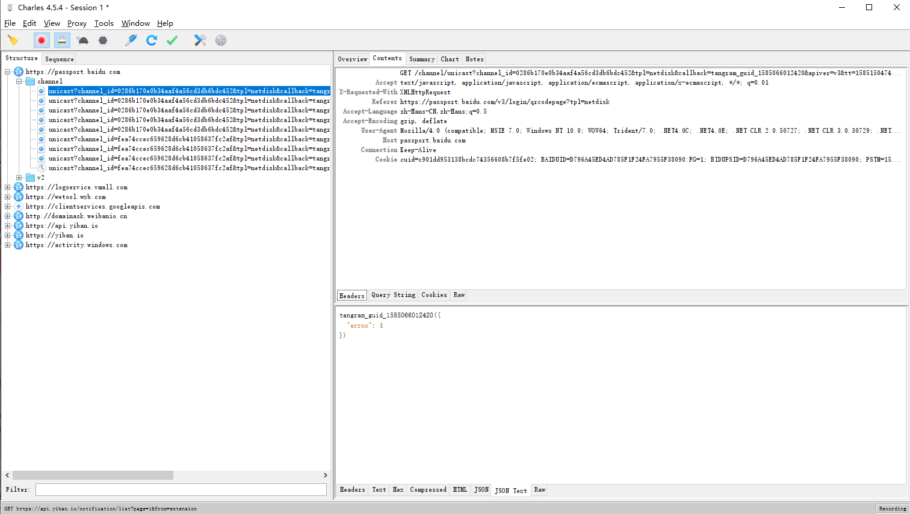

> **一番码客 : 挖掘你关心的亮点。**
> **http://www.efonmark.com**

本文目录：

[TOC]


<!-- more -->

今天简单来看下用charles抓包工具抓到的包是什么样子的。



charles的安装和配置这里就不讲了，网上很多。这里一番配置成了全局，即所有网络访问都会抓取。

随便打开一帧数据，看下内容页。里面就有我们的请求头“Headers”，这里面有cookie信息，如果我们要做爬虫，这个头文件的构建就非常重要，特别是里面的cookie等信息，可以实现模拟网络请求。一个python示例如下。

```python
        self.headers = {
            'Host': 'mp.weixin.qq.com',
            'Connection': 'keep-alive',
            'User-Agent': 'Mozilla/5.0 (Linux; Android 7.0; PRO 5 Build/NRD90M; wv) AppleWebKit/537.36 (KHTML, like Gecko) Version/4.0 Chrome/66.0.3359.126 MQQBrowser/6.2 TBS/044504 Mobile Safari/537.36 MMWEBID/8780 MicroMessenger/7.0.3.1400(0x2700033A) Process/toolsmp NetType/WIFI Language/zh_CN',
            'Accept-Language': 'zh-CN,en-US;q=0.9',
            'X-Requested-With': 'XMLHttpRequest',
            'Cookie': 'wxuin=945482497; devicetype=android-24; lang=zh_CN; version=2700033b; rewardsn=; wxtokenkey=777; pass_ticket=Itlxi3UZ/yQjcM1AjrkyMhun1JGzO75ec9GG/OHjCynzE3xZt7G1PJiMJKz9lx; wap_sid2=CKqnjK8MElxwUGtjVFVMQ2ZIOFJCSEFOWmVRU0EycVludEQtUG9yZHhNYk5UMWxLTFdSQ2RuTUVKakZNOGtoVTFva0JoaV95OXkxLVVYTXM2TUREckxXcHE5RURXQkVFQUFBfjCc0JzwBTgNQJVO',
            'Accept': '*/*',
            'Referer': 'https://mp.weixin.qq.com/mp/profile_ext?action=home&__biz=MzU1NjUwNjM4Ng==&scene=124&uin=MzMxOTk5MzI1OA%3D%3D&key=fe9a1fce50214d3b5ebbdbe602474348d0698b261a0a0dffa7673fed6fbe801389a3b86c787c57779fd44ef62217ac5d434626e106c14b4ee3281fcd3d9140ac881d89a57156d7a0ba376ccf282ec536&devicetype=Windows+10&version=62070152&lang=zh_CN&a8scene=7&pass_ticket=I%2Btlxi3UZ%2FyQjcM1AjrkyMhun1JGzO75ec9GG%2B%2FOHjCynzE3xZt7G1PJiMJKz9lx&winzoom=1'
        }
```

然后我们用requests库去模拟请求的时候直接将headers传入即可：

```python
response = requests.get(current_request_url, headers=self.headers, verify=False)
```

所以，我们写爬虫的时候，如果要模拟浏览器向服务器请求，可以通过chales获取相关头文件信息，然后构造出头文件信息模拟请求。

至于返回的内容格式，我们也可以通过看下面的JSON Text可以看到，然后设置相关的数据解析。

## 


> 一番雾语：爬虫的入门工具。

<table>
<tr>
<td ><center></center></td>
<td width="50%" align=left><b>
    免费知识星球：<a href="http://www.efonmark.com/efonmark-blog/readme/zhishixingqiu1.png">一番码客-积累交流</a><br>
    微信公众号：<a href="http://www.efonmark.com/efonmark-blog/readme/guanzhu_1.jpg">一番码客</a><br>
    微信：<a href="http://www.efonmark.com/efonmark-blog/readme/weixin.jpg">Efon-fighting</a><br>
    网站：<a href="http://www.efonmark.com">http://www.efonmark.com</a><br></b></td>
</tr>
</table>