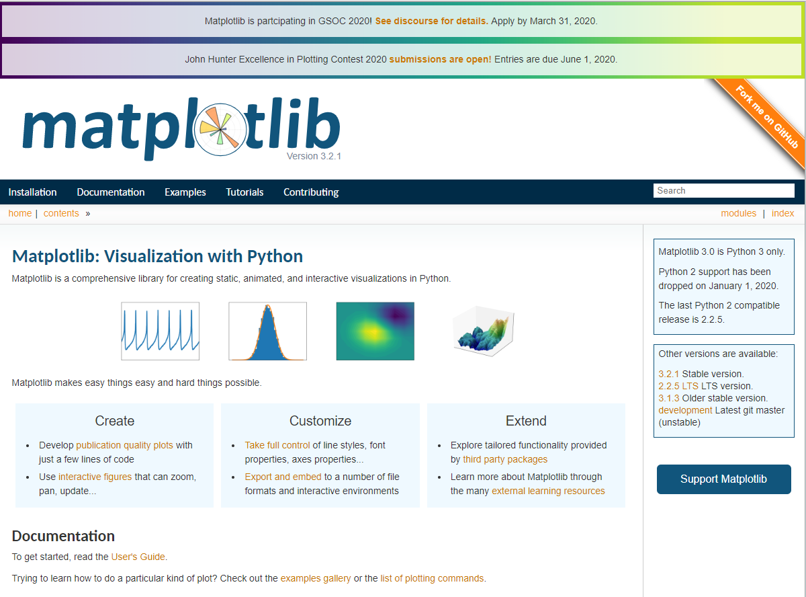
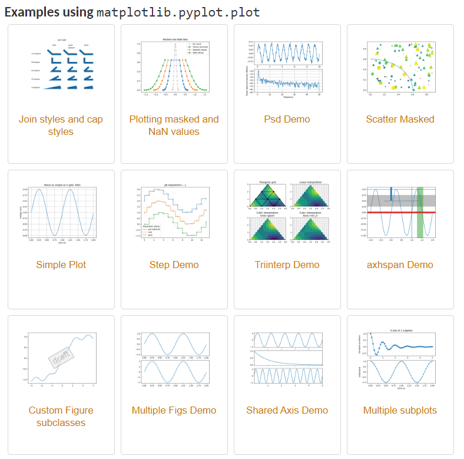
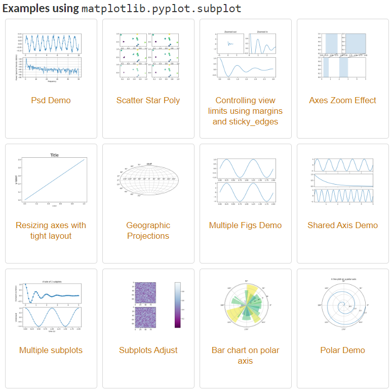
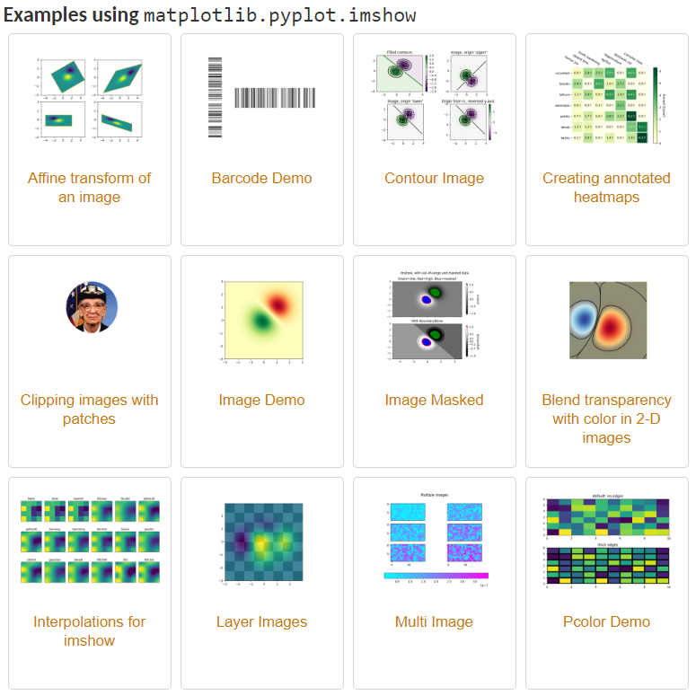
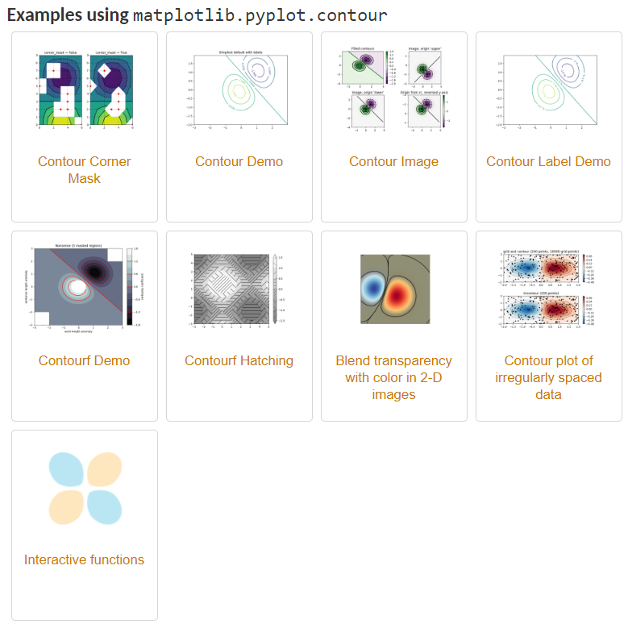
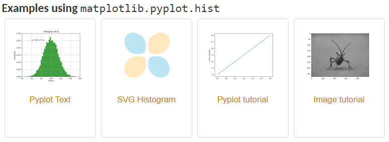

> **一番码客 : 挖掘你关心的亮点。**
> **http://www.efonmark.com**

本文目录：

[TOC]

<!-- more -->

## 前言

作为一门编程语言，有一个酷炫、直观、美观的图形展示界面是非常重要的一件事。在python里，matplotlib是常用的图形库，可以展示数据、仿真建模等等，还可以直接在自己的图形界面工具里展示出来，这样就比较直观和友善了。

那今天我们一起来看看matplotlib可以画出些什么样的图形。

## 功能

直接在百度搜matplotlib，就可以找得到它的官网，上面有比较详细的功能介绍和例程。

> matplotlib官网：https://matplotlib.org/tutorials/introductory/sample_plots.html
>
> 官方github：https://github.com/matplotlib/matplotlib

看官方对matplotlib的描述：

> Matplotlib是一个综合库，用于在Python中创建静态，动画和交互式的可视化。

所以，我们可以用这个库完成除了静态展示以外的动画和互交式的可视化。那么基本也可以做到和网页展示相同甚至更专业的展示效果。

官方针对每种图形都提供了充足的例子，可以说不需要到其他地方去找了，有需要直接去官网找合适的例子就可以了。

* [线图](https://matplotlib.org/tutorials/introductory/sample_plots.html#line-plot)

* [一个图中有多个子图](https://matplotlib.org/tutorials/introductory/sample_plots.html#multiple-subplots-in-one-figure)

* [图片](https://matplotlib.org/tutorials/introductory/sample_plots.html#images)

* [轮廓和伪色](https://matplotlib.org/tutorials/introductory/sample_plots.html#contouring-and-pseudocolor)

* [直方图](https://matplotlib.org/tutorials/introductory/sample_plots.html#histograms)

还有路径、三维绘图、流图、椭圆形、条形图、饼状图、桌子、散点图、GUI小部件、填充曲线、日期处理、对数图、极地图、传说、文本对象的TeX表示法、本机TeX渲染、脑电图、XKCD样式的草图、子图示例等等，就不一一列举了，大家可以亲自去网站上感受感受。

总的感觉就是打开了一个画图的新窗口，各种酷炫的效果。

> 一番雾语：打开了一个神奇的绘图之窗。

<table>
<tr>
<td >

</td>
<td width="50%" align=left><b>
    免费知识星球：<a href="http://www.efonmark.com/efonmark-blog/readme/zhishixingqiu1.png">一番码客-积累交流</a> 
    微信公众号：<a href="http://www.efonmark.com/efonmark-blog/readme/guanzhu_1.jpg">一番码客</a> 
    微信：<a href="http://www.efonmark.com/efonmark-blog/readme/weixin.jpg">Efon-fighting</a> 
    网站：<a href="http://www.efonmark.com">http://www.efonmark.com</a> </b></td>
</tr>
</table>