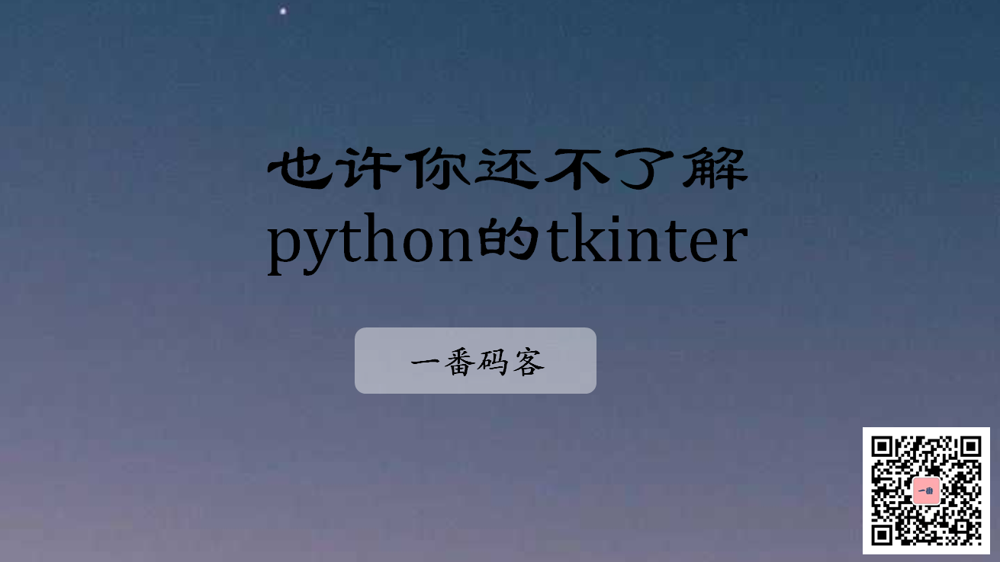
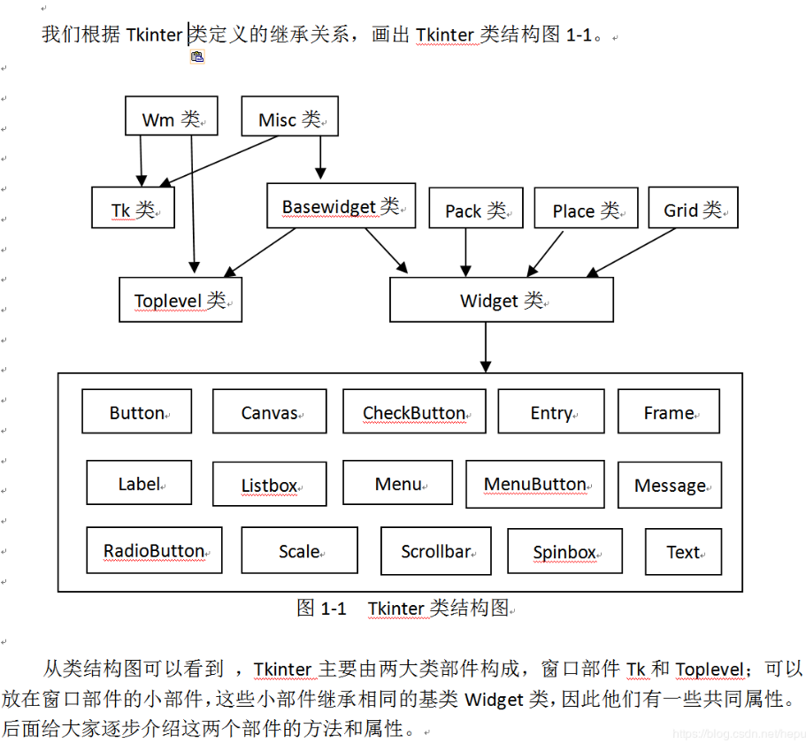
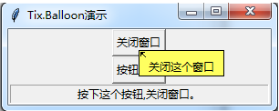

> **一番码客 : 挖掘你关心的亮点。**
> **http://www.efonmark.com**

本文目录：

[TOC]



<!-- more -->

## 前言

现在前端可以做的图形界面那么酷，极少有人会看上tkinter了，所以真正研究的人也就更少了，但今天一番就看到了一个博客，深入研究了tkinter，并用tkinter作为基础库，开发了一些较复杂的功能，自己还封装了一些库。

对一个技术的原理不明白，是很难做出稳定、复杂的功能的。

对于tkinter，选择的原因就是因为一种语言干完所有事情，不需要更多技术栈的扩展，学习成本比较低。

## 推荐博客

> 博客地址：https://blog.csdn.net/hepu8

来看下目前这个博客的所有原创文章：

```text
用Tkinter打造GUI开发工具（31）带滑轨框架SbrFrame组件
用Tkinter打造GUI开发工具（30）控件参数设置窗口及参数获取方法
用Tkinter打造GUI开发工具（29）可视化设计之Pack布局及生成代码
用Tkinter打造GUI开发工具（28）可视化设计之Grid布局及生成代码
用Tkinter打造GUI开发工具（27）可视化设计及生成代码
自己做量化交易软件(19)通达信公式转Python代码的程序
用Tkinter打造GUI开发工具（26）Logo窗口及程序生成文字图形
用Tkinter打造GUI开发工具（25）Table表格控件
用Tkinter打造GUI开发工具（24）Tree树控件
自己做量化交易软件(18)小白量化平台
用Tkinter打造GUI开发工具（23）软件窗口皮肤
零基础搭建量化投资系统—以Python为基础:视频课件及代码(3)
零基础搭建量化投资系统—以Python为基础:视频课件及代码(2)
零基础搭建量化投资系统—以Python为基础:视频课件及代码(1)
用Tkinter打造GUI开发工具（22）文件选择对话框
用Tkinter打造GUI开发工具（21）改进ast模块的分析代码和Python程序标色思路
用Tkinter打造GUI开发工具（20）用ast模块分析代码
小白量化学习（5）建立本地股票数据库
小白量化学习（4）基本面选股与股票池
小白量化学习（3）指标策略回测设计
小白量化学习（2）自创指标设计
小白量化学习（1）准备环境
用Tkinter打造GUI开发工具（19）ttk.Notebook笔记本小部件
用Tkinter打造GUI开发工具（18）tix.ButtonBox按钮框小部件
用Tkinter打造GUI开发工具（17）tix.Balloon气球窗口小部件
用Tkinter打造GUI开发工具（16）Tkinter、Ttk和Tix混合编程
用Tkinter打造GUI开发工具（15）Tkinter小部件的Button按钮部件
用Tkinter打造GUI开发工具（14）Tkinter小部件的Label标签部件
用Tkinter打造GUI开发工具（13）Tkinter小部件的place布局
用Tkinter打造GUI开发工具（12）Tkinter小部件的grid布局
用Tkinter打造GUI开发工具（11）Tkinter小部件的pack布局
用Tkinter打造GUI开发工具（10）Tkinter的Frame框架部件
用Tkinter打造GUI开发工具（9）Tkinter的位图和图片格式
用Tkinter打造GUI开发工具（8）对齐方式和浮雕风格
用Tkinter打造GUI开发工具（7）字体类型
用Tkinter打造GUI开发工具（6）小部件颜色
用Tkinter打造GUI开发工具（5）Toplevel弹出窗口
用Tkinter打造GUI开发工具（4） Tkinter的Tk主窗口
用Tkinter打造GUI开发工具（3） Tkinter的小部件类
用Tkinter打造GUI开发工具（2）Tkinter工作原理
用Tkinter打造GUI开发工具（1）认识Tkinter
自己做量化交易软件(17)通过基本面建立自己的股票池
自己做量化交易软件(16)用小白通通量化AI框架打造自己的量化平台
自己做量化交易软件(15)通通量化AI框架的选股器设计1
自己做量化交易软件(14)通通量化AI框架的用户插件设计指南-通通框架遥控器设计
自己做量化交易软件(13)通通量化AI框架的使用2-功能画面和装载用户插件py程序
自己做量化交易软件(12)通通量化AI框架的使用1-与通通AI对话聊天
自己做量化交易软件(11)通通量化AI框架的核心--框架结构
自己做量化交易软件(10)通通量化AI框架的数据获取与格式
自己做量化交易软件(9通通量化框架的雏形建立
自己做量化交易软件(8)通通量化自编公式-仿通达信大智慧公式指标
自己做量化交易软件(7)通通量化回测设计2-双均线策略回测
自己做量化交易软件(6)通通量化历史交易回测设计1
自己做量化交易软件(5)通通量化中创作的布林指标BOLL线
自己做量化交易软件(4)通通量化分析框架构成2
自己做量化交易软件(3)通通量化分析框架构成1
自己做量化交易软件(2) 通通量化python跨版本环境设置和使用
自己做量化交易软件(1)通通量化分析环境安装使用
```

这里面涉及到一些tkinter的基本原理的介绍，和其他关于tkinter的介绍都不一样，不是浮于应用上的，而是深入tkinter的原理实现。



博客里还介绍了一些实用的tkinter的基础功能介绍。比如按钮浮窗提示，对象销毁。



如果希望对tkinter深入了解，朋友们可以去仔细研究下。后面一番也会继续研究下。

> 一番雾语：对一个技术的原理不明白，是很难做出稳定、复杂的功能的。

<table>
<tr>
<td ><center></center></td>
<td width="50%" align=left><b>
    免费知识星球：<a href="http://www.efonmark.com/efonmark-blog/readme/zhishixingqiu1.png">一番码客-积累交流</a><br>
    微信公众号：<a href="http://www.efonmark.com/efonmark-blog/readme/guanzhu_1.jpg">一番码客</a><br>
    微信：<a href="http://www.efonmark.com/efonmark-blog/readme/weixin.jpg">Efon-fighting</a><br>
    网站：<a href="http://www.efonmark.com">http://www.efonmark.com</a><br></b></td>
</tr>
</table>