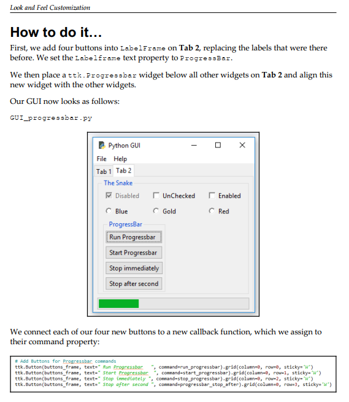
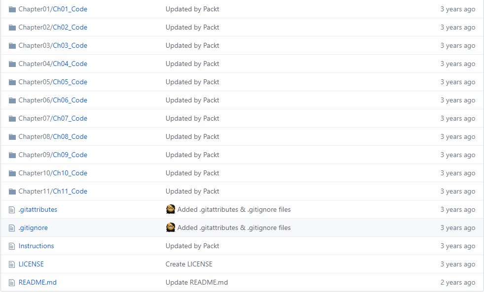

> **一番码客 : 挖掘你关心的亮点。**
> **http://www.efonmark.com**

本文目录：

[TOC]

<!-- more -->

## 前言

今天一番推荐一本比较全的python界面编程的免费电子书籍，本书以python自带的GUI编程模块tkinter为基础，详细讲解了tkinter的各个模块、组件和功能，并且附带各种小实例，并且有对用的开源代码库。在此基础上，还介绍了图表、线程、网络、数据库、wxpython和opengl等。

总之，就是面向界面的编程。

## 免费电子书

> 电子书：后台回复“pythonGUI”获取。

我们来看下书的内容：

* 第1章：创建GUI表单和添加小部件
* 第2章：布局管理
* 第3章：外观定制
* 第4章：数据和类
* 第5章：Matplotlib图表
* 第6章：线程和网络
* 第7章：通过GUI将数据存储在MySQL数据库中
* 第8章：国际化和测试
* 第9章：使用wxPython库扩展我们的GUI
* 第10章：使用PyOpenGL和PyGLet创建惊人的3D GUI
* 第11章：最佳练习

书中图、文、例程并举，质量非常高。当然，都是英文的，不过比较通俗易懂。

## 开源代码库

>  https://github.com/PacktPublishing/Python-GUI-Programming-Cookbook-Second-Edition

> 一番雾语：成体系的学习python的GUI编程。

<table>
<tr>
<td >

</td>
<td width="50%" align=left><b>
    免费知识星球：<a href="http://www.efonmark.com/efonmark-blog/readme/zhishixingqiu1.png">一番码客-积累交流</a> 
    微信公众号：<a href="http://www.efonmark.com/efonmark-blog/readme/guanzhu_1.jpg">一番码客</a> 
    微信：<a href="http://www.efonmark.com/efonmark-blog/readme/weixin.jpg">Efon-fighting</a> 
    网站：<a href="http://www.efonmark.com">http://www.efonmark.com</a> </b></td>
</tr>
</table>