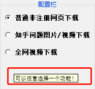

> **一番码客 : 挖掘你关心的亮点。**
> **http://www.efonmark.com**

本文目录：

[TOC]


<!-- more -->

## 前言

今天我们来看下在python的tkinter中，如何要实现一个tooltip的功能，也就是当我们将鼠标移动到一个界面上的元素的时候会有一些相应的文字提示功能。

## 效果



这里以一番正在做的一个小工具为例，当我们将鼠标移至配置栏，就会有文字提示“可以任意选择一个功能！”。

## 实现

tkinter本身是没有这个组件功能的，但我们可以用python封装一个类自己实现，需要用的时候直接调用就可以了。代码实现如下。

```python
import tkinter as tk

class ToolTip(object):
    def __init__(self, widget):
        self.widget = widget
        self.tip_window = None

    def show_tip(self, tip_text):
        "Display text in a tooltip window"
        if self.tip_window or not tip_text:
            return
        x, y, _cx, cy = self.widget.bbox("insert")      # get size of widget
        x = x + self.widget.winfo_rootx() + 25          # calculate to display tooltip 
        y = y + cy + self.widget.winfo_rooty() + 25     # below and to the right
        self.tip_window = tw = tk.Toplevel(self.widget) # create new tooltip window
        tw.wm_overrideredirect(True)                    # remove all Window Manager (wm) decorations
#         tw.wm_overrideredirect(False)                 # uncomment to see the effect
        tw.wm_geometry("+%d+%d" % (x, y))               # create window size

        label = tk.Label(tw, text=tip_text, justify=tk.LEFT,
                      background="#ffffe0", relief=tk.SOLID, borderwidth=1,
                      font=("tahoma", "8", "normal"))
        label.pack(ipadx=1)

    def hide_tip(self):
        tw = self.tip_window
        self.tip_window = None
        if tw:
            tw.destroy()
            
#===================================================================          
def create_ToolTip(widget, text):
    toolTip = ToolTip(widget)       # create instance of class
    def enter(event):
        try: toolTip.show_tip(text)
        except: pass
    def leave(event):
        toolTip.hide_tip()
    widget.bind('<Enter>', enter)   # bind mouse events
    widget.bind('<Leave>', leave)
```

当我们要在某个组件上创建该方法时，直接调用`create_ToolTip`，传入组件对象和提示文本就可以了。

<table>
<tr>
<td ><center></center></td>
<td width="50%" align=left><b>
    免费知识星球：<a href="http://www.efonmark.com/efonmark-blog/readme/zhishixingqiu1.png">一番码客-积累交流</a><br>
    微信公众号：<a href="http://www.efonmark.com/efonmark-blog/readme/guanzhu_1.jpg">一番码客</a><br>
    微信：<a href="http://www.efonmark.com/efonmark-blog/readme/weixin.jpg">Efon-fighting</a><br>
    网站：<a href="http://www.efonmark.com">http://www.efonmark.com</a><br></b></td>
</tr>
</table>