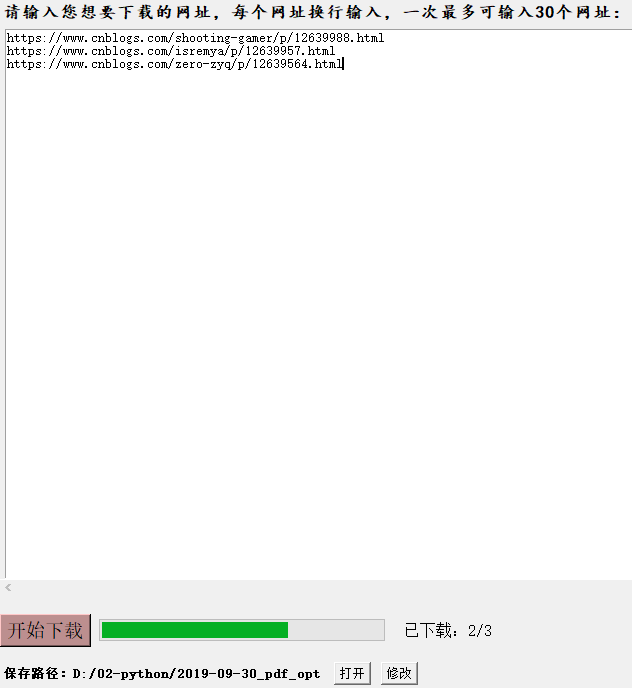

> **一番码客 : 挖掘你关心的亮点。**
> **http://www.efonmark.com**

本文目录：

[TOC]


<!-- more -->

## 前言

python之所以这么流行，其中一个原因便是它的易用性，比如我们想在我们的图形界面上实现一个表征当前状态的进度条，实现起来就非常简单。

## 效果



这里一番还是以正在做的一个小工具为例，这样就可以更加直观的展示我们的下载进度啦。

## 实现

python自带的tkinter本身就是封装了这个方法的，直接调用并设置参数就可以啦，具体代码如下。这里一番直接封装了一个函数来实现。

```python
self.lDldProcess = ttk.Progressbar(subFm02, orient='horizontal', length=286, mode='determinate')

def run_progressbar(self, cur, max):
    self.lDldProcess["maximum"] = max
    self.lDldProcess["value"] = cur   # increment progressbar
    self.lDldProcess.update()       # have to call update() in loop
```

是不是非常简单呀，三行代码就搞定了。

当然，看网上还有另外的使用canvas的方法去实现的，稍微复杂一点，而且也没必要，直接用tkinter自带的Progressbar类就可以啦。

<table>
<tr>
<td ><center></center></td>
<td width="50%" align=left><b>
    免费知识星球：<a href="http://www.efonmark.com/efonmark-blog/readme/zhishixingqiu1.png">一番码客-积累交流</a><br>
    微信公众号：<a href="http://www.efonmark.com/efonmark-blog/readme/guanzhu_1.jpg">一番码客</a><br>
    微信：<a href="http://www.efonmark.com/efonmark-blog/readme/weixin.jpg">Efon-fighting</a><br>
    网站：<a href="http://www.efonmark.com">http://www.efonmark.com</a><br></b></td>
</tr>
</table>