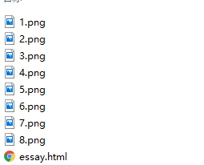

> **一番码客 : 挖掘你关心的亮点。**
> **http://www.efonmark.com**

本文目录：

[TOC]


<!-- more -->

## 前言

很多时候我们看到一篇比较好的网页文章，希望保存到本地，然后分类整理。这时，我们其实没有必要把文章保存为pdf，而只需要保存为一个html文件就可以了，这样能最大程度的保持原文的格式。当然，还要把网页配套的图片也要同html一起保存下来。一番最近在完善的小工具后面就会配有这样的功能。

## 效果



这里是一篇html的样子，单击html文件就可以在浏览器里打开了，即使原文没有了，本地也有备份。

这里的png就是网页里的图片。这样也便也同时实现了下载网页图片的功能了，是不是一举两得。

## 实现

* 保存图片的函数：

```python
def saveUrlPic(self, url, picName):
        '''
        保存url为图片的内容
        :param url : 要保存的url
        :param picName : 保存文件路径
        :return : 获取到的url内容长度
        '''
        contLen = 0
        try:
            urlCont = requests.get(url, timeout=20).content
            contLen = len(urlCont)

            if (contLen == 0): # 第一次失败则再尝试一次
                print("get url failed,try again.")
                urlCont = requests.get(url, timeout=20).content
                contLen = len(urlCont)

            if (contLen != 0):
                open(picName, 'wb').write(urlCont)
                print("get url ok:", contLen)
            else:
                print("get url failed.")
        except Exception:
            print("get url Exception.")
        return contLen
```

* 保存网页的函数：

```python
def url2html(self, url, savePath):
        '''
        url保存为本地html，带图片
        :param url : 要保存的url
        :param savePath : 下载内容保存的绝对路径
        :return True : 下载成功
        '''
        os.chdir(sys.path[0])
        fileDir = os.path.dirname(savePath) #获取目录的绝对路径
        title = savePath.replace(fileDir + '/', '')

        if(os.path.exists(fileDir) == False):
            os.makedirs(fileDir)

        for i in range(10): #防止访问时间过长造成假死
            try:
                html = open_url(url).decode("UTF-8") #read出的是bytes，使用前需要转换为str类型
            except Exception:
                if i >= 9:
                    print("requests failed and return.")
                    return
                else:
                    time.sleep(1)
            else:
                break

        pattern = re.compile(r'data-src=\"http.*?\"')  # 用?来控制正则贪婪和非贪婪匹配;(.*?) 小括号来控制是否包含匹配的关键字
        result = pattern.findall(html)

        picCnt = 0
        for i in result:
            picCnt = picCnt + 1
            url = re.findall(r'\"(.*?)\"', i)[0]
            print(picCnt, " : ", url)
            if (len(re.findall("wx_fmt", url)) == 0): # 有可能是视频，判断是否是图片
                print("url is not a pic")
                continue

            picPath = '{}/{}.png'.format(fileDir, str(picCnt))
            picDir = os.path.dirname(picPath)
            picNameOnly = picPath.replace(picDir+'/', '') # 转换为相对路径
            html = html.replace(url, picNameOnly)
            if(saveUrlPic(url, picPath) == 0):
                continue
        html = html.replace('data-src','src').replace('quotes: none;','')
        fd = open(savePath, 'w', encoding="utf-8")
        fd.write(html)
        fd.close()
        return True

    def open_url(self, url_str):
            html = requests.get(url=url_str, timeout=20, headers = headers).content
        #返回网页内容,动态加载的需要另行处理
        print('返回网页内容长度:',len(html))
        return html
```

这里一番做了长时间请求无响应的假死处理。`open_url`如果想做反扒的代理处理，可以在这个函数里设置代理。

<table>
<tr>
<td ><center></center></td>
<td width="50%" align=left><b>
    免费知识星球：<a href="http://www.efonmark.com/efonmark-blog/readme/zhishixingqiu1.png">一番码客-积累交流</a><br>
    微信公众号：<a href="http://www.efonmark.com/efonmark-blog/readme/guanzhu_1.jpg">一番码客</a><br>
    微信：<a href="http://www.efonmark.com/efonmark-blog/readme/weixin.jpg">Efon-fighting</a><br>
    网站：<a href="http://www.efonmark.com">http://www.efonmark.com</a><br></b></td>
</tr>
</table>