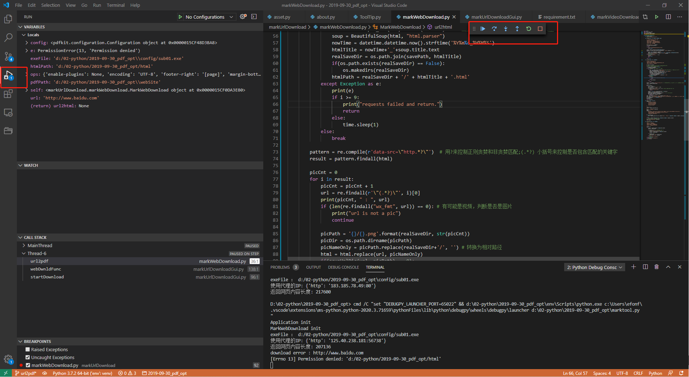
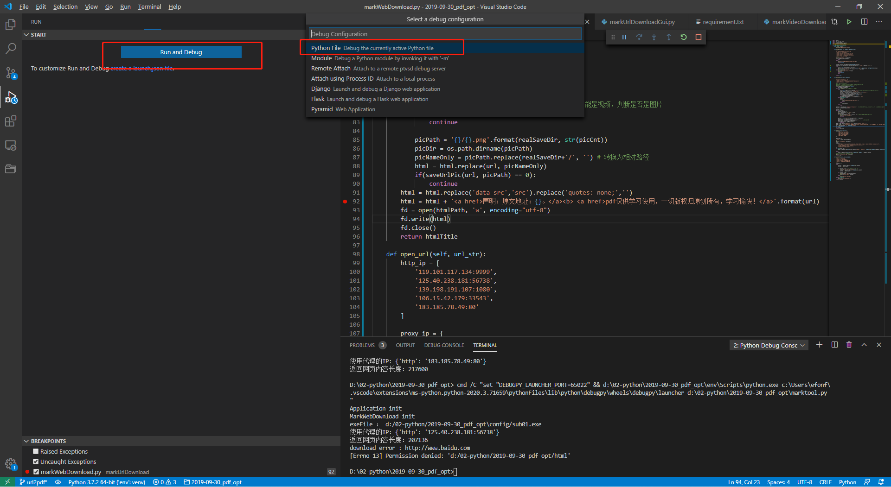

> **一番码客 : 挖掘你关心的亮点。**
> **http://www.efonmark.com**

本文目录：

[TOC]

<!-- more -->

## 前言

当我们开发一个程序的时候，无论或大或小的程序，我们都会遇到或多或少的问题，需要我们不断的debug。作为程序新手的我们，常用的调试方法就是加打印，在各个地方，加入各种打印。这个效率非常低，而且我们往往不知道在哪个地方加入合适的打印。常常是一遍一遍的尝试，经过多次尝试，加入了很多的杂乱打印后才找到问题。

其实，无论是pycharm还是vscode，还是其他python IDE编辑器，都带有debug的功能，可以让我们debug的效率提升数倍。

## 效果

## 调试方法与快捷键

* `continue/pause（F5）`：继续、暂停调试。
* `step over（F10）`：在单步执行时，在函数内遇到子函数时不会进入子函数内单步执行，而是将整个子函数作为一个整体，相当于一条语句，只执行一步。
* `step into（F11）`：进行单步执行，遇到子函数就进入并且继续单步执行。
* `step out（shift + F11）`：在单步执行到子函数内时，用step out就可以执行完子函数余下部分，并返回上一层函数。
* `restart（ctrl + shift + F11）`：重新执行程序。
* `stop（shift + F5）`：停止调试。

<table>
<tr>
<td >

</td>
<td width="50%" align=left><b>
    免费知识星球：<a href="http://www.efonmark.com/efonmark-blog/readme/zhishixingqiu1.png">一番码客-积累交流</a> 
    微信公众号：<a href="http://www.efonmark.com/efonmark-blog/readme/guanzhu_1.jpg">一番码客</a> 
    微信：<a href="http://www.efonmark.com/efonmark-blog/readme/weixin.jpg">Efon-fighting</a> 
    网站：<a href="http://www.efonmark.com">http://www.efonmark.com</a> </b></td>
</tr>
</table>