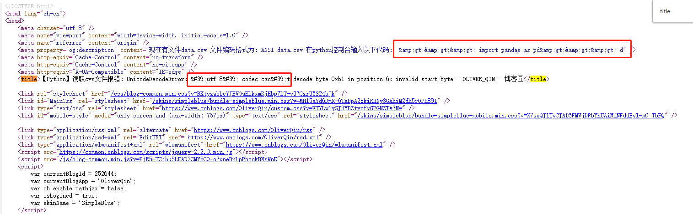
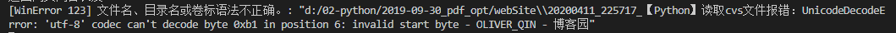
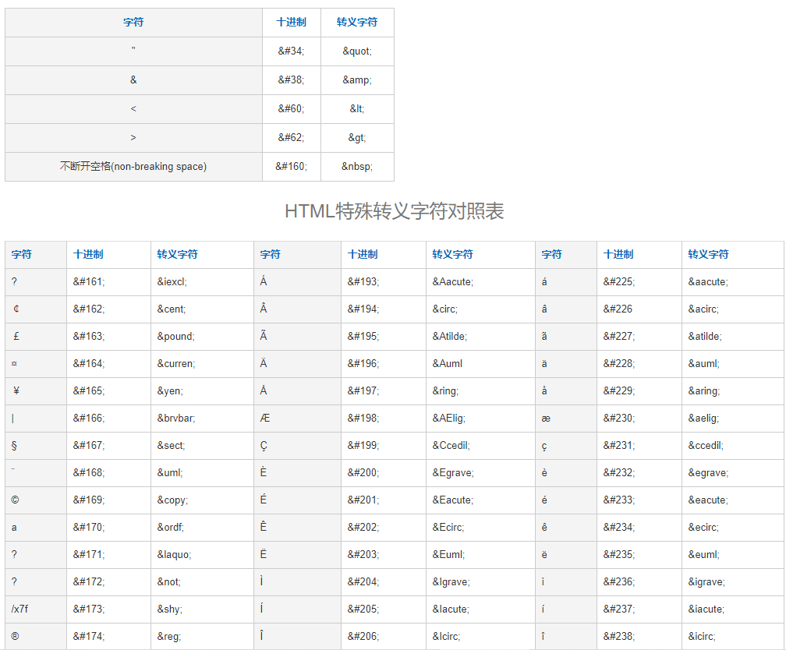

> **一番码客 : 挖掘你关心的亮点。**
> **http://www.efonmark.com**

本文目录：

[TOC]


<!-- more -->

## 前言

当我们用python抓取网页的时候，经常会遇到一些例如`&amp;gt;&amp;gt;&amp;gt;`这种特殊字符，这会给我们的网页解析造成极大的困扰：



## 困扰示例

```python
requests.get(url=url_str, timeout=20, headers = headers).content.decode("utf-8")
```



## 什么是html转义字符

在 HTML 中 `<`、`>`、`&` 等字符有特殊含义（<，> 用于标签中，& 用于转义），他们不能在 HTML 代码中直接使用，如果要在网页中显示这些符号，就需要使用 HTML 的转义字符串（Escape Sequence），例如 `<` 的转义字符是 `<`，浏览器渲染 HTML 页面时，会自动把转移字符串换成真实字符。

转义字符（Escape Sequence）由三部分组成：第一部分是一个 & 符号，第二部分是实体（Entity）名字，第三部分是一个分号。 比如，要显示小于号（<），就可以写`<` 。



## 解决办法

比方说一个从网页中抓到的字符串

```
html = '&lt;abc&gt;'
```

用Python可以这样处理：

```
import HTMLParser
html_parser = HTMLParser.HTMLParser()
txt = html_parser.unescape(html) #这样就得到了txt = '<abc>'
```

如果还想转回去，可以这样：

```
import cgi
html = cgi.escape(txt) # 这样又回到了 html = '&lt;abc&gt'
```


<table>
    <td>
    <font size="2" color="gray">参考：</font><br>
    <font size="2" color="gray">
        - https://www.cnblogs.com/kungfupanda/p/4313903.html
    </font><br>
    </td>
</table>


<table>
<tr>
<td ><center></center></td>
<td width="50%" align=left><b>
    免费知识星球：<a href="http://www.efonmark.com/efonmark-blog/readme/zhishixingqiu1.png">一番码客-积累交流</a><br>
    微信公众号：<a href="http://www.efonmark.com/efonmark-blog/readme/guanzhu_1.jpg">一番码客</a><br>
    微信：<a href="http://www.efonmark.com/efonmark-blog/readme/weixin.jpg">Efon-fighting</a><br>
    网站：<a href="http://www.efonmark.com">http://www.efonmark.com</a><br></b></td>
</tr>
</table>