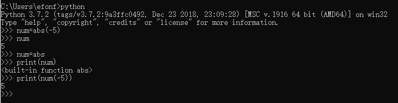

> **一番码客 : 挖掘你关心的亮点。**
> **http://www.efonmark.com**

本文目录：

[TOC]


<!-- more -->


## 函数名作为变量

这里以内置函数abs()为例，可以把abs函数赋值给另一个变量，然后这个变量就等同于abs函数了。

```python
num = abs(-5)
print(num) # 输出结果：5

num = abs
print(num) # 输出结果：<built-in function abs>
print(num(-5)) # 输出结果：5
```



由此可见，python中函数名也是变量，可以赋值。

## 高阶函数

在python里，函数名也是一种变量，类似与C语言里的函数指针。函数有入参为另一个函数， 这样的函数被称为高阶函数  。

这里我们自己构建一个高阶函数`plus`作为例子。

```python
#!/usr/bin/env python
def plus(num1, num2, func):
    return func(num1) + func(num2)

print(plus(-3, -4, abs)) # 输出结果：7
```

这个例子中，`num1`、`num2`作为普通变量传入函数，而`func`变量是一个函数。这里将`abs()`函数作为参数传入。


<table>
    <td>
    <font size="2" color="gray">参考：</font><br>
    <font size="2" color="gray">
        - 《物联网Python开发实战》
    </font><br>
    </td>
</table>


<table>
<tr>
<td ><center></center></td>
<td width="50%" align=left><b>
    免费知识星球：<a href="http://www.efonmark.com/efonmark-blog/readme/zhishixingqiu1.png">一番码客-积累交流</a><br>
    微信公众号：<a href="http://www.efonmark.com/efonmark-blog/readme/guanzhu_1.jpg">一番码客</a><br>
    微信：<a href="http://www.efonmark.com/efonmark-blog/readme/weixin.jpg">Efon-fighting</a><br>
    网站：<a href="http://www.efonmark.com">http://www.efonmark.com</a><br></b></td>
</tr>
</table>