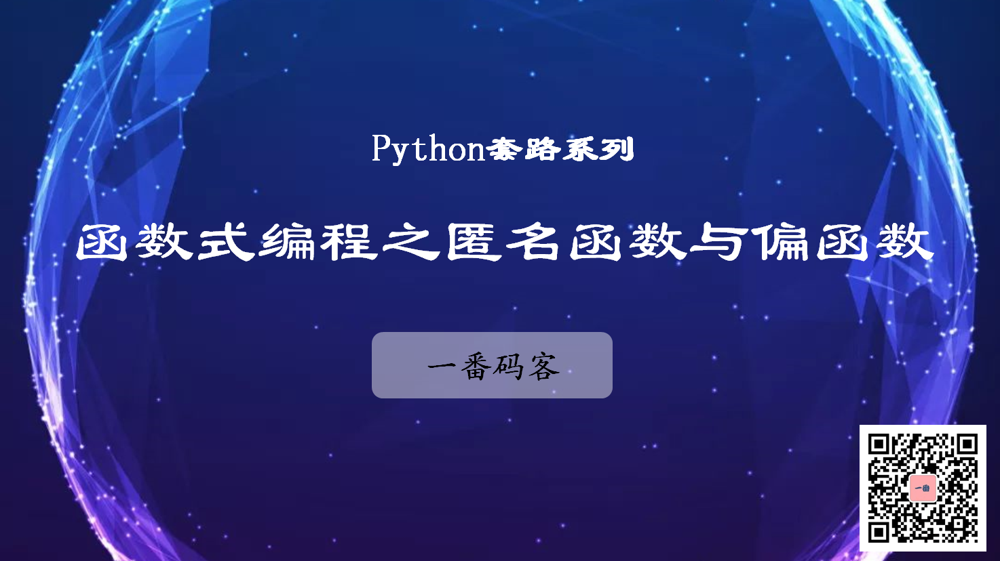

> **一番码客 : 挖掘你关心的亮点。**
> **http://www.efonmark.com**

本文目录：

[TOC]



<!-- more -->

## 匿名函数

当调用函数时， 有时不需要显示定义好一个函数， 直接传入一个匿名函数更为方便。
python可使用`lambda`表达式创建匿名函数。   

```python
lambda 参数1[, 参数2, ...参数n]:表达式
```

`lambda`函数有如下特点：

* `lambda`只是一个表达式，函数体比`def`简单很多；
* `lambda`的主题有且只有一个表达式，而不是代码块；
* `lambda`函数拥有自己的命名空间，不能访问自己参数列表之外或者全局命名空间里的参数。

例子一：使用匿名函数实现两个数字求和功能：

```python
!usr/bin/env python
func = lambda x,y:x+y
print(func(1,2))
```

说明：

* 匿名函数由于没有函数名称，因此可以避免函数名称的冲突。
* 匿名函数同样可以作为返回值返回。

## 偏函数

偏函数是`functools.partial()`函数，将原函数当做第一个参数传入，原函数的各个参数依次作为`partial()`函数后续的参数。

`functools.partial()`的作用是把一个函数其中的一些参数设置为默认值， 返回一个新的函
数， 调用这个新的函数更加简单。

例子一：将`int()`函数封装为默认base为2的偏函数。

```python
import functools
int2 = functools.partial(int,base=2)
print(int2('0011'))
print(int2('1111'))
```

说明：

* int()函数功能时把字符串转换为整数，int()函数的提供了一个参数`base`，其默认值为10，即将字符串转换为10进制。
* 使用`functools.partial()`函数可以通过将`base`设置为2构建一个转换为2进制的偏函数。
* 使用偏函数的好处是当大量需要改变函数的默认值的时候，可以避免重复赋默认值。


<table>
    <td>
    <font size="2" color="gray">参考：</font><br>
    <font size="2" color="gray">
        - 《物联网Python开发实战》
    </font><br>
    </td>
</table>


<table>
<tr>
<td ><center></center></td>
<td width="50%" align=left><b>
    免费知识星球：<a href="http://www.efonmark.com/efonmark-blog/readme/zhishixingqiu1.png">一番码客-积累交流</a><br>
    微信公众号：<a href="http://www.efonmark.com/efonmark-blog/readme/guanzhu_1.jpg">一番码客</a><br>
    微信：<a href="http://www.efonmark.com/efonmark-blog/readme/weixin.jpg">Efon-fighting</a><br>
    网站：<a href="http://www.efonmark.com">http://www.efonmark.com</a><br></b></td>
</tr>
</table>