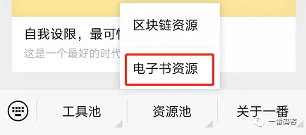
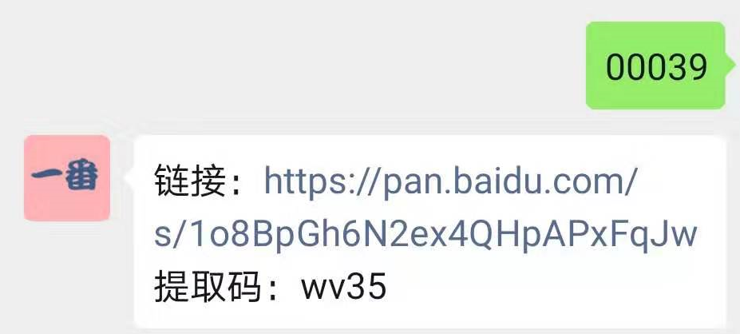

> **原文地址 : www.efonfighting.com**

本文目录：

[TOC]

## 郑重声明

* 电子书只为大家学习交流，禁止商业行为。看完后请自行删除！
* 如有版权冲突，请联系小编删除，感谢！

<!--more-->

## 获取方式

* 最新书单：[『**公众号**』(点击进入)](http://efonfighting.com/efonmark-blog/04-专题/2019-12-29-专题-电子书资源/guanzhu_1.jpg)，首页菜单栏。

* 添加小编微信：[『**Efon-fighting**』(点击添加)](http://efonfighting.com/efonmark-blog/04-专题/2019-12-29-专题-电子书资源/wx_efonfighting.jpg)，发送对应的数字，即可得到对应的电子书下载地址。

* 比如，发送“00039”，即可得到《Python编程初学者指南》的下载地址。
* 如果哪个链接失效了请随时告知一番微信：[『**Efon-fighting**』点击添加](http://efonfighting.com/efonmark-blog/04-专题/2019-12-29-专题-电子书资源/wx_efonfighting.jpg)，一番第一时间更新补发。

## 书单

**书单持续更新中......**

**00001\_Python参考手册(第4版).pdf** 

**00002\_易学python.pdf** 

**00003\_用Python写网络爬虫.pdf** 

**00004\_精通Python设计模式.pdf** 

**00005\_编写高质量代码 改善Python程序的91个建议.pdf** 

**00006\_像计算机科学家一样思考Python.pdf** 

**00007\_Python爬虫开发与项目实战.pdf** 

**00008\_Python技术手册(第2版).pdf** 

**00009\_Python自动化运维\_技术与最佳实践.pdf** 

**00010\_Python游戏编程快速上手.pdf** 

**00011\_Python袖珍指南(第5版).pdf** 

**00012\_Python性能分析与优化.pdf** 

**00013\_Python项目开发实战(第2版).pdf** 

**00014\_Python网络数据采集.pdf** 

**00015\_Python网络编程攻略.pdf** 

**00016\_Python算法教程.pdf** 

**00017\_Python数据挖掘入门与实践.pdf** 

**00018\_Python数据分析与挖掘实战.pdf** 

**00019\_PYTHON面向对象编程指南.pdf** 

**00020\_Python金融大数据分析.pdf** 

**00021\_Python机器学习\_预测分析核心算法.pdf** 

**00022\_Python核心编程(第3版).pdf** 

**00023\_Python高手之路.pdf** 

**00024\_Python程序设计教程.pdf** 

**00025\_树莓派Python编程入门与实战.pdf** 

**00026\_21天学通PYTHON.pdf** 

**00027\_Python密码学编程.pdf** 

**00028\_Python绝技：运用Python成为顶级黑客.pdf** 

**00029\_Python高手之路\_第3版.pdf** 

**00030\_Python黑帽子 黑客与渗透测试编程之道.pdf** 

**00031\_跟老齐学Python\_从入门到精通.pdf** 

**00032\_python科学计算\_第二版.pdf** 

**00033\_PYTHON机器学习及实践\_从零开始通往KAGGLE竞赛之路.pdf** 

**00034\_Effective+Python.编写高质量Python代码的59个有效方法.pdf** 

**00035\_FlaskWeb开发：基于Python的Web应用开发实战.pdf** 

**00036\_Foundations of Python Network Programming\_3rd Edition.pdf** 

**00037\_PYTHON+QT+GUI快速编程+PYQT编程指南.pdf** 

**00038\_Python编程：从入门到实践.pdf** 

**00039\_Python编程初学者指南.pdf** 

**00040\_Python编程实战\_运用设计模式、并发和程序库创建高质量程序.pdf** 

**00041\_量化投资以Python为工具.pdf** 

**00042\_面向ArcGIS的Python脚本编程.pdf** 

----

**00043\_安士全書-萬善先資.pdf** 

**00044\_安士全書-文昌帝君陰騭文廣義節錄.pdf** 

**00045\_安士全書-西歸直指.pdf** 

**00046\_安士全書-欲海回狂.pdf** 

**00047\_安士全書\_打印版.pdf** 

**00048\_安士全書集\_掃描版.pdf** 

**00049\_古文观止选读读本.pdf** 

**00050\_黄帝内经-灵枢\_注解繁体版.pdf** 

**00051\_黄帝内经-素问\_繁体竖排大字粗宋.pdf** 

**00052\_黄帝内经-素问\_注解繁体版.pdf** 

**00053\_群書治要360.pdf** 

**00054\_聖賢的三個根本\_難字漢語拼音.pdf** 

**00055\_袁了凡先生四訓\_蘇州弘化社.pdf** 

**00056\_南怀瑾\_宗镜录略讲\_民族知识出版社\_2005.pdf** 

**00057\_南怀瑾\_庄子讲记.pdf** 

**00058\_南怀瑾\_易经杂说.pdf** 

**00059\_南怀瑾\_易经系传别讲.pdf** 

**00060\_南怀瑾\_小言《黄帝内经》与生命科学.pdf** 

**00061\_南怀瑾\_现代学佛者修证对话.pdf** 

**00062\_南怀瑾\_习禅录影.pdf** 

**00063\_南怀瑾\_人生的起点和终站.pdf** 

**00064\_南怀瑾\_南怀瑾著作诗词辑录.pdf** 

**00065\_南怀瑾\_南怀瑾与彼得·圣吉：关于禅、生命和认知的对话.pdf** 

**00066\_南怀瑾\_南怀瑾讲演录.pdf** 

**00067\_南怀瑾\_漫谈中国文化：金融·企业·国学.pdf** 

**00068\_南怀瑾\_历史人生纵横谈.pdf** 

**00069\_南怀瑾\_花雨满天维摩说法.pdf** 

**00070\_南怀瑾\_答问青壮年参禅者.pdf** 

**00071\_南怀瑾\_禅与生命的认知初讲.pdf** 

**00072\_南怀瑾\_禅观正脉研究.pdf** 

**00073\_南怀瑾\_参禅日记.pdf** 

**00074\_印光大师全集\_第1册\_释印光\_扫描版.pdf** 

**00075\_印光大师全集\_第2册\_释印光\_扫描版.pdf** 

**00076\_印光大师全集\_第3册\_释印光\_扫描版.pdf** 

**00077\_印光大师全集\_第4册\_释印光\_扫描版.pdf** 

**00078\_印光大师全集\_第5册\_释印光\_扫描版.pdf** 

**00079\_印光大师全集\_第6册\_释印光\_扫描版.pdf** 

**00080\_印光大师全集\_第7册\_释印光\_扫描版.pdf** 

---

--------

<table>
<tr>
<td >

</td>
<td width="50%" align=left><b>
    免费知识星球：<a href="http://www.efonmark.com/efonmark-blog/readme/zhishixingqiu1.png">一番码客-积累交流</a> 
    微信公众号：<a href="http://www.efonmark.com/efonmark-blog/readme/guanzhu_1.jpg">一番码客</a> 
    微信：<a href="http://www.efonmark.com/efonmark-blog/readme/weixin.jpg">Efon-fighting</a> 
    网站：<a href="http://www.efonmark.com">http://www.efonmark.com</a> </b></td>
</tr>
</table>