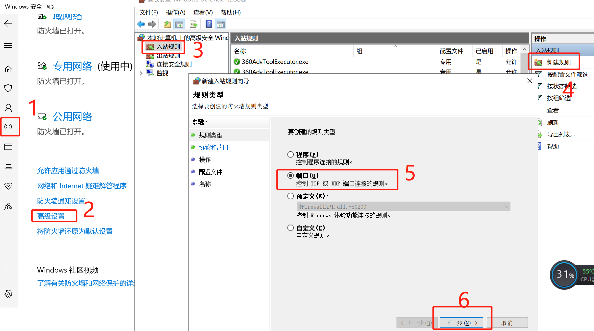
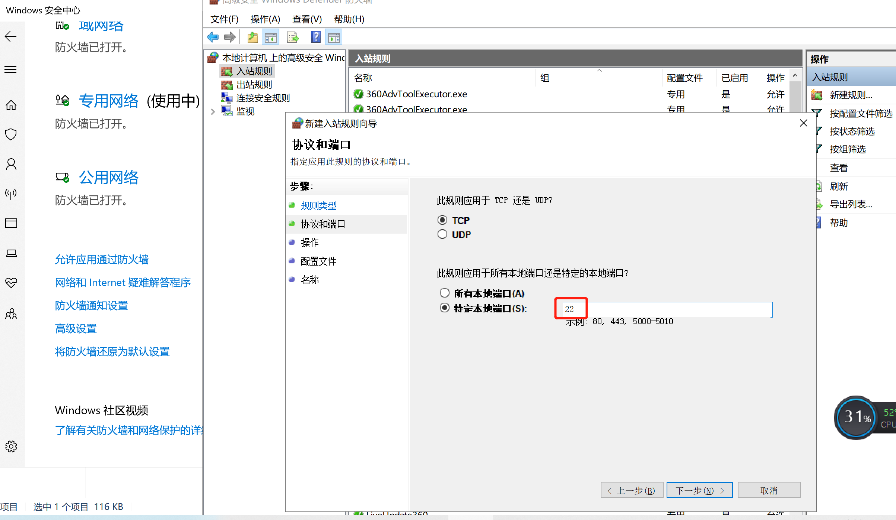
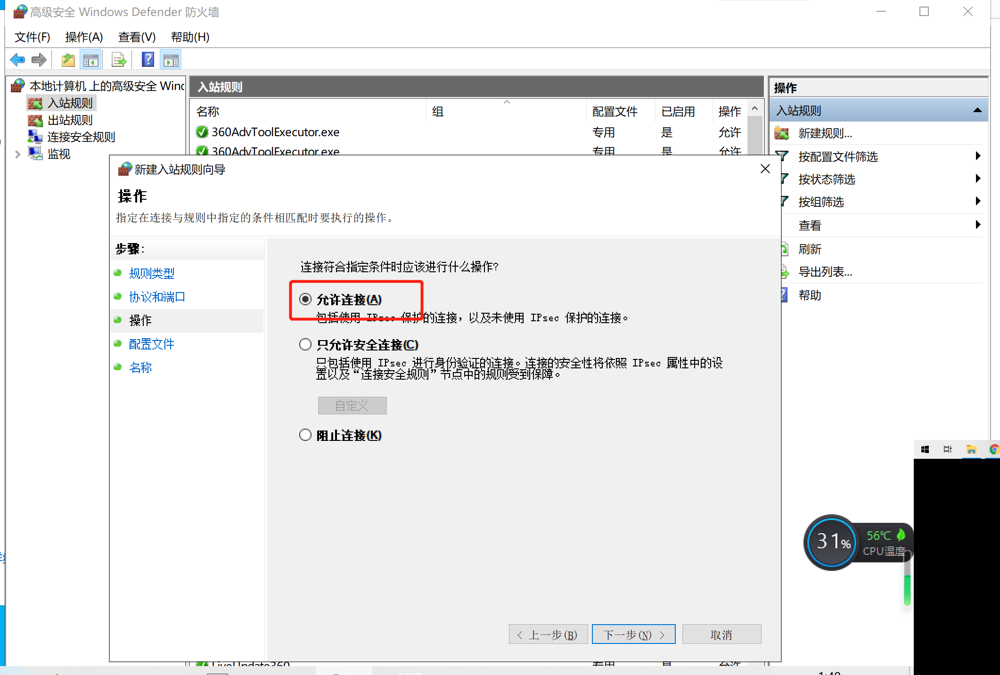
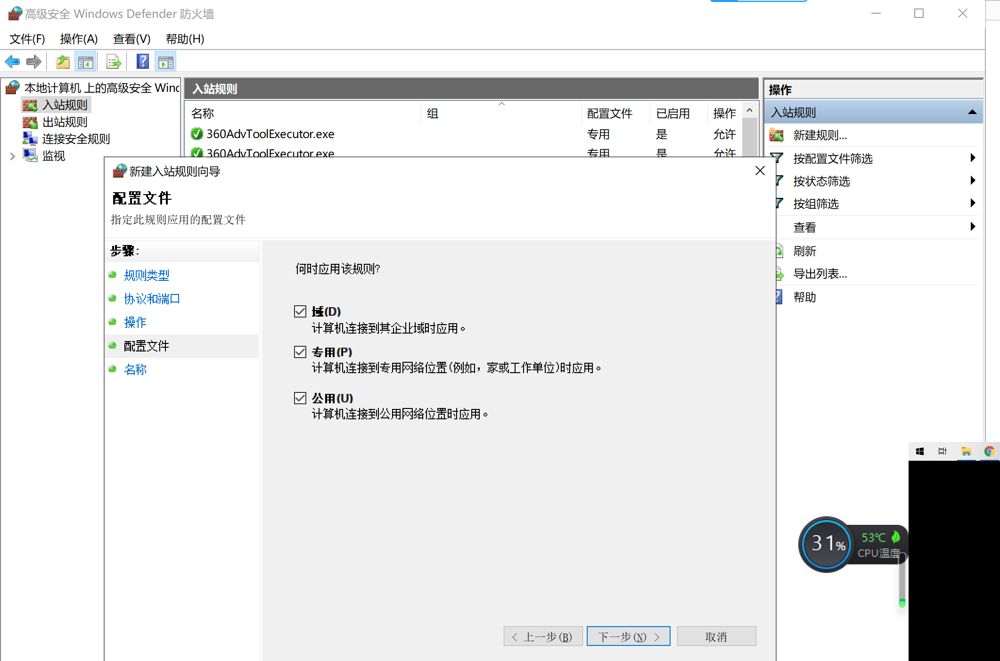
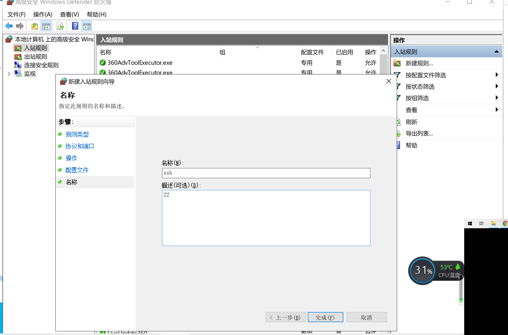
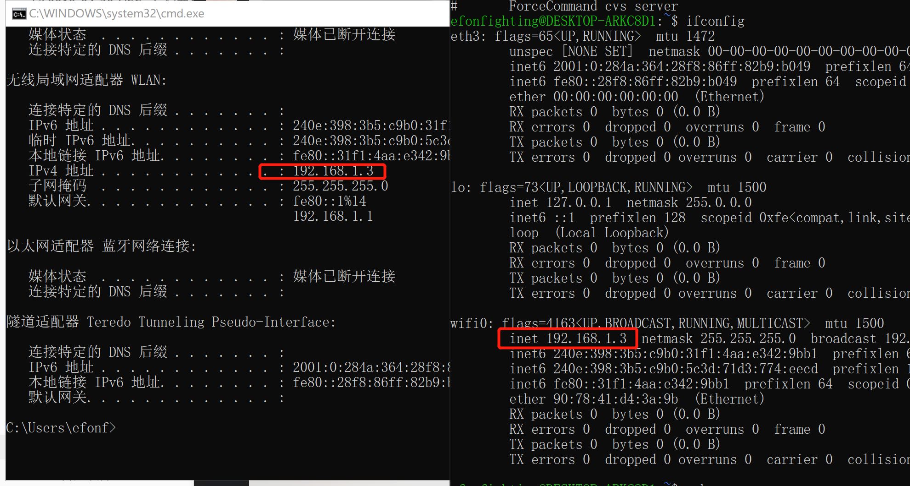

> **一番码客 : 挖掘你关心的亮点。**
> **http://www.efonmark.com**

前面一番写了一篇《2019-09-15-如何打开win10里面的ubuntu系统》，有同学就问一番能不能通过ssh远程控制这个ubuntu。虽然在win10上打开一个ubuntu的窗口很容易，也可以通过打开多个窗口来实现多终端，但如果实现了通过ssh控制ubuntu，就可以更便捷的开多终端，也可以只是把这个ubuntu当一个linux环境的服务器来用，这确实是一个需求。今天一番就写一篇介绍这个需求的实现。

<!-- more -->

## 1.安装ssh server

一番默认安装的是ubuntu18.04的版本，这个版本默认自带了ssh的服务。

查看是否安装了ssh服务：

```shell
ls /etc/ssh/sshd_config
```

如果该文件存在，则已经安装。如果不存在，执行以下这条命令安装：

```shell
sudo apt-get install openssh-server
```

## 2.启动ssh server

* 产看ssh server已经运行

执行如下命令，查看ssh server是否已经启动。

```shell
ps -aux | grep ssh
```

如果有如下`/usr/sbin/sshd`这一行，则说明ssh server已经启动。

```shell
efonfighting@DESKTOP-ARKC8D1:~$ ps -aux | grep sshd
root        64  0.0  0.0  19464   800 ?        Ss   01:03   0:00 /usr/sbin/sshd
efonfig+    68  0.0  0.0  14804  1204 tty1     S    01:04   0:00 grep --color=auto sshd
```

如果只有如下一条打印，则说明没有启动。

```shel
efonfighting@DESKTOP-ARKC8D1:~$ ps -aux | grep sshd
efonfig+    43  0.0  0.0  14804  1204 tty1     S    01:01   0:00 grep --color=auto sshd
```

* 修改sshd配置

  打开`/etc/ssh/sshd_config`，修改如下项

  ```txt
  Port 22
  ListenAddress 0.0.0.0 # 取消注释
  #StrictModes yes # 注释
  PasswordAuthentication yes # 允许密码登录
  ```

* 如果是SecureCRT，遇到`“数据库里没找到防火墙‘无’`的问题

  <div align=center>

  找到“全局选项”→“常规”→“配置文件夹”，在该文件夹下新建`FireWalls`文件夹，并在`FireWalls`文件夹新建`无.ini`空白文件即可。

* 启动ssh server

这时候需要执行如下命令去启动ssh server：

```shell
sudo service ssh start
```

执行后会提示防火墙问题，点击允许即可。这时，我们的ssh server已经成功。

* 打开防火墙的22端口

<div align=center>

<div align=center>

<div align=center>

<div align=center>

<div align=center>
3.通过ssh访问win10里的ubuntu

这时我们分别在ubuntu的窗口和windows cmd窗口，输入`ifconfig`、`ipconfig`，查看IP地址。

<div align=center>

这时我们如果本地想访问win10内置的ubuntu，直接通过用户名、密码访问`127.0.0.1`即可，不必手动点开一个ubuntu窗口也可以。确实方便了许多。

## 可能遇到的问题

### ssh 怎样以root用户登录

>  sudo vim /etc/ssh/sshd_config
>
> 找到并用#注释掉这行：PermitRootLogin prohibit-password
>
> 新建一行 添加：PermitRootLogin yes
>
> 重启服务
>
> #sudo service ssh restart
>
> sudo passwd root   #设置密码
>
> 然后ssh root@192.168.2.21就可以登录了

###  Could not load host key 

```shell
ssh-keygen -t rsa -f /etc/ssh/ssh_host_rsa_key
ssh-keygen -t ecdsa -f /etc/ssh/ssh_host_ecdsa_key
ssh-keygen -t ed25519 -f /etc/ssh/ssh_host_ed25519_key
```

### Win10 wsl linux子系统ssh服务自启动设置

创建并编辑 /etc/init.wsl，加入如下内容：

```shell
#! /bin/sh
/etc/init.d/ssh $1
```


添加执行权限

```shell
sudo chmod +x /etc/init.wsl
```

编辑sudoers，避免输入密码

```shell
sudo visudo
```

或者

```shell
sudo nano /etc/sudoers
```

添加一行

```shell
%sudo ALL=NOPASSWD: /etc/init.wsl
```

创建一个startservice.vbs脚本，内容为：

```
set ws=wscript.createobject("wscript.shell")
ws.run "C:\Windows\System32\bash.exe -c 'sudo /etc/init.wsl start'",0
```


win10的开始-运行里面输入shell:startup打开启动文件夹，把startservice.vbs脚本放进去，重启系统，搞定。

> 一番雾语：我们要选择的不一定是鲜有人知的捷径，而是少有人选择的艰难之路。捷径虽好不常有，终成大路。保持在路上。


<table>
<tr>
<td ><center></center></td>
<td width="60%" align=left><b>
    免费知识星球：<a href="http://www.efonmark.com/efonmark-blog/readme/zhishixingqiu1.png">一番码客-积累交流</a><br>
    微信公众号：<a href="http://www.efonmark.com/efonmark-blog/readme/guanzhu_1.jpg">一番码客</a><br>
    微信：<a href="http://www.efonmark.com/efonmark-blog/readme/weixin.jpg">Efon-fighting</a><br>
    网站：<a href="http://www.efonmark.com">http://www.efonmark.com</a><br></b></td>
</tr>
</table>