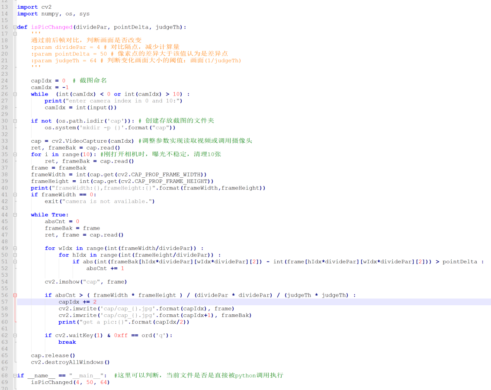

> **一番码客 : 挖掘你关心的亮点。**
> **http://efonfighting.imwork.net**

现在很多网络摄像头都有防盗报警了，简单讲就是家里本来没有人，但摄像头却发现家里有动静，好，发个消息给主人，赶紧打开摄像头app，看下家里是什么在动。当我们想通过摄像头做一个工具，代替人眼的重复劳动，观察一个画面什么时候动了的时候，并且最好动的时候把动的画面抓下来，这时一番想到了操作极简的python。下面我们就来用python和摄像头做一个可以实现监控画面变化的小程序。

<!-- more -->

## 需求分析

这个小程序要做到如下功能：

* 当摄像头拍摄的画面变化时，拍摄变化前后的两张图，以供分析变化前后的状态。
* 极快（肉眼可见的一闪而过，10ms级别）的变化也能捕捉到。

## 功能实现

### 基本思路

1. 打开摄像头，不断读取摄像头图片，对比相邻两张图片对应像素点的RGB颜色数据任意一个颜色的差异；

2. 像素点颜色数据差异大于某一阈值（需要考虑噪点波动），认为是一个有效的变化像素点；
3. 当变化像素点数量大于整幅画面的一定比例（比例大小的设定，可以用来设定检测画面变化的灵敏度）时，认为前后两张画面有变化，保存这两张图片。
4. 为了检测极快的画面变化，需要加快读图、处理数据的速度，因此考虑隔几点取一个点来运算，减少运算量，加快图片处理速度。

### 代码实现

一番看了下，整个功能的实现58行，还包含一些格式的空行，可谓极简。python真香。

当然，语法调试，参数调试，还是要花点时间的。

代码如下（**公众号后台发送 "摄像头" 获取源码文本**）。

> 一番雾语：没什么靠谱的东西是计划出来的，都是总结出来的。

> **免费知识星球： [一番码客-积累交流]([wwww](https://t.zsxq.com/NRVBURr))**
> **微信公众号：一番码客**
> **微信：Efon-fighting**
> **网站： http://efonfighting.imwork.net**