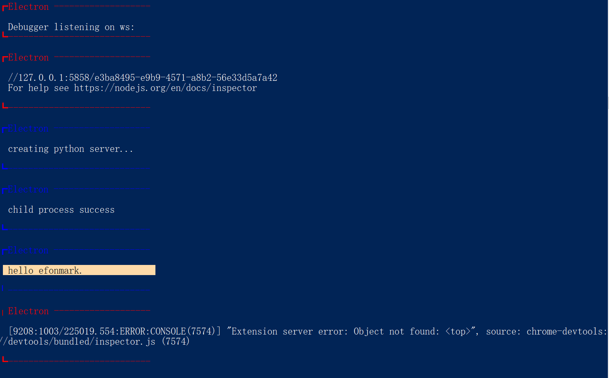
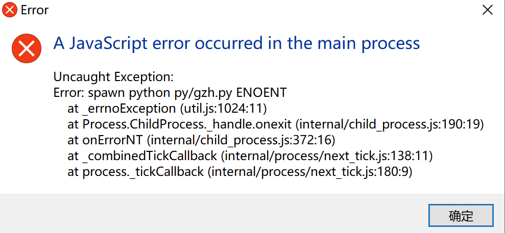

> **一番码客 : 挖掘你关心的亮点。**
> **http://efonfighting.imwork.net**

本文目录：

[TOC]

## 前言

上一篇`electron`的文章我们尝试了用在`js`里调用`python`，虽然一番之前没有接触过`js`，但一番秉着`目标型驱动`的学习理念，今天一番来深入研究下这个`spawn`函数。

<!-- more -->

## js系统命令调用函数spawn

Node.js 的子进程（`child_process`）模块下有一 `
spawn` 函数，可以用于调用系统上的命令。

也就是说无论我们用的是linux、mac还是windows，都可以用`spawn`函数来调用相应系统的命令。

感觉有点类似`python`的`system`函数。

我们在`index.js`的最后添加如下代码，运行后我们查看命令行打印，发现`gzh.py`打印成功。

```js
let pyProc = null
const createPyProc = () => {
  console.log('creating python server...')
  pyProc = require('child_process').spawn('python py/gzh.py', {
    stdio: 'inherit',
    shell: process.platform === 'win32'
  })
  if (pyProc != null) {
    console.log('child process success')
  }
}

const exitPyProc = () => {
  pyProc.kill()
  pyProc = null
}

app.on('ready', createPyProc)
app.on('will-quit', exitPyProc)
```



### 调用`spawn`可能遇到的问题

* 问题：Error:spawn python xxx ENOENT

  解决：改为隐式调用，`shell: process.platform === 'win32'`

  



## require函数

在CommonJS中，全局性方法require()，用于加载模块。假定有一个数学模块math.js，就可以像下面这样加载，然后就可以调用这个模块的方法了。

```js
var math = require('math');
```

## 参考

- [Node.js 编写跨平台 spawn 语句](https://blog.csdn.net/u010144805/article/details/80224697)
- [彻底搞清楚javascript中的require、import和export](https://www.cnblogs.com/libin-1/p/7127481.html)

## 一番今日

山里的空气还是好，没有城市的喧嚣。哪怕是坐着都是放松。

> 一番雾语：国庆节快乐。


> **免费知识星球： [一番码客-积累交流]([wwww](https://t.zsxq.com/NRVBURr))**
> **微信公众号：一番码客**
> **微信：Efon-fighting**
> **网站： http://efonfighting.imwork.net**