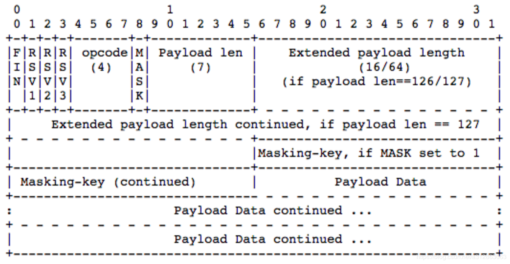
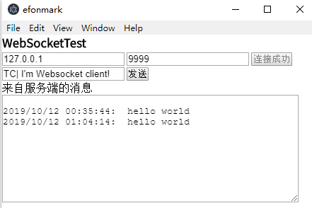

> **一番码客 : 挖掘你关心的亮点。**
> **http://efonfighting.imwork.net**

本文目录：

[TOC]

## 前言

今天该务实了。

上一篇eletron的文章一番学习了用js去调用python。今天继续这个话题。

<!-- more -->

## electron的地位

如果我们在网上搜索electron相关的文章，发现很少。原因其实electron只是提供了一个运行js的框架，基本不用开发。electron的地位就相当于浏览器的地位，electron就是一个封装了的浏览器。因此，我们做electron开发，其实就是做js前端开发。那么要想在eletron中调用python，实际就是用js去调用python，相关的技术可以在网上搜索js调用python的相关方法。

这样一来，视野开阔多了，因为js的生态已经发展多年，有完整的社区生态。

当然，一番以前没有接触过前端开发，electron也没接触过，也许认知有些狭隘，但思路是这样的。

## electron中js通过web socket与python通信

上一篇我们通过js zerorpc模块实现了与python的通信。这次我们通过web socket的方式来做。

一番在网上找了个web demo，并在electron中做了适配。

* `index.ejs`

这个文件其实是我们的html文件入口，我们屏蔽demo自带的界面，加入我们自己的页面和js脚本。

```html
 <body>
    <h3>WebSocketTest</h3>
    <div id="login">
        <div>
            <input id="serverIP" type="text" placeholder="服务器IP" value="127.0.0.1" autofocus="autofocus" />
            <input id="serverPort" type="text" placeholder="服务器端口" value="9999" />
            <input id="btnConnect" type="button" value="连接" onclick="connect()"/>
        </div>
        <div>
            <input id="sendText" type="text" placeholder="发送文本" value="TC| I'm Websocket client!" />
            <input id="btnSend" type="button" value="发送" onclick="send()" disabled=true/>
        </div>
        <div>
            <div>
                来自服务端的消息
            </div>
            <textarea id="txtContent" cols="50" rows="10" readonly="readonly"></textarea>
        </div>
    </div>
  </body>

  <script>
    function sleep(ms) {
            return new Promise(resolve => setTimeout(resolve, ms));
        }

    var socket;
    var current=0;
    var total;
    var beforetime;

    function connect() {
        var host = "ws://" + $("serverIP").value + ":" + $("serverPort").value + "/";
        document.getElementById("btnConnect").value = "连接中";
        document.getElementById("btnConnect").disabled = true;
        socket = new WebSocket(host);
        try {

            socket.onopen = function (msg) {
                document.getElementById("btnConnect").value = "连接成功";
                document.getElementById("btnSend").disabled = "";
                //alert("连接成功！");
            };

            socket.onmessage = function (msg) {
                if (typeof msg.data == "string") {
                    displayContent(msg.data);
                    if(msg.data=="Receive:100%"){
                        current=0;
                        total=0;
                    }
                    else if(msg.data.substr(0,7)=="Receive"){
                        var str1=msg.data.split(':')[1];
                        var str2=str1.split('/')[0];
                        picsend(parseInt(str2))
                    }
                }
                else {
                    alert("非文本消息");
                }
            };

            socket.onerror = function (error) { alert("Error："+ error.name); };

            socket.onclose = function (msg) {
                document.getElementById("btnConnect").value = "连接";
                document.getElementById("btnConnect").disabled = "";
                document.getElementById("btnSend").disabled = true;//alert("连接关闭!");
                 };
        }
        catch (ex) {
            log(ex);
        }
    }

    async function send() {
        var str = document.getElementById("sendText").value;
        socket.send(str);
    }

    async function picsend(pos){
        beforetime=new Date().getTime();
        current=pos;
        socket.close();
        connect();
        while(document.getElementById("btnConnect").value != "连接成功") {await sleep(200);}
        var str = document.getElementById("sendText").value;
        socket.send(str.substring(pos));
    }

    window.onbeforeunload = function () {
        try {
            socket.close();
            socket = null;
        }
        catch (ex) {
        }
    };

    function $(id) { return document.getElementById(id); }

    Date.prototype.Format = function (fmt) { //author: meizz
        var o = {
            "M+": this.getMonth() + 1, //月份
            "d+": this.getDate(), //日
            "h+": this.getHours(), //小时
            "m+": this.getMinutes(), //分
            "s+": this.getSeconds(), //秒
            "q+": Math.floor((this.getMonth() + 3) / 3), //季度
            "S": this.getMilliseconds() //毫秒
        };
        if (/(y+)/.test(fmt)) fmt = fmt.replace(RegExp.$1, (this.getFullYear() + "").substr(4 - RegExp.$1.length));
        for (var k in o)
            if (new RegExp("(" + k + ")").test(fmt)) fmt = fmt.replace(RegExp.$1, (RegExp.$1.length == 1) ? (o[k]) : (("00" + o[k]).substr(("" + o[k]).length)));
        return fmt;
    }

    function displayContent(msg) {
        $("txtContent").value += "\r\n" +new Date().Format("yyyy/MM/dd hh:mm:ss")+ ":  " + msg;
        $("txtContent").scrollTop = $("txtContent").scrollHeight;
    }
    function onkey(event) { if (event.keyCode == 13) { send(); } }
</script>
```


* gzh.py

这里面我们需要对数据通过websocket的协议做解析。



```python
from threading import Thread
import struct
import time
import hashlib
import base64
import socket
import time
import types
import multiprocessing
import os
mode = "initialize"
pic_size = 0
pic_receive = 0
pic = ""
pic_repeat = []

class returnCrossDomain(Thread):
    def __init__(self, connection):
        Thread.__init__(self)
        self.con = connection
        self.isHandleShake = False

    def run(self):
        global mode
        global pic_size
        global pic_receive
        global pic
        global pic_repeat
        while True:
            if not self.isHandleShake:
                # 开始握手阶段
                header = self.analyzeReq()
                secKey = header['Sec-WebSocket-Key'];

                acceptKey = self.generateAcceptKey(secKey)

                response = "HTTP/1.1 101 Switching Protocols\r\n"
                response += "Upgrade: websocket\r\n"
                response += "Connection: Upgrade\r\n"
                response += "Sec-WebSocket-Accept: %s\r\n\r\n" % (acceptKey.decode('utf-8'))
                self.con.send(response.encode())
                self.isHandleShake = True
                if(mode=="initialize"):
                    mode = "get_order"
                print('response:\r\n' + response)
                # 握手阶段结束

                #读取命令阶段
            elif mode == "get_order":
                opcode = self.getOpcode()
                if opcode == 8:
                    self.con.close()
                self.getDataLength()
                clientData = self.readClientData()
                print('客户端数据：' + str(clientData))
                # 处理数据
                ans = self.answer(clientData)
                self.sendDataToClient(ans)
                if (ans != "Unresolvable Command!" and ans != "hello world"):
                    pic_size = int(clientData[3:])
                    pic_receive = 0
                    pic = ""
                    pic_repeat=[]
                    print("需要接收的数据大小：", pic_size)
                    mode = "get_pic"

                #读取图片阶段
            elif mode == "get_pic":
                opcode = self.getOpcode()
                if opcode == 8:
                    self.con.close()
                self.getDataLength()
                clientData = self.readClientData()
                print('客户端数据：' + str(clientData))
                pic_receive += len(clientData)
                pic += clientData
                if pic_receive < pic_size:
                    self.sendDataToClient("Receive:"+str(pic_receive)+"/"+str(pic_size))
                    print("图片接收情况:",pic_receive,"/",pic_size)
                    #print("当前图片数据:",pic)
                else:
                    print("完整图片数据:",pic)
                    self.sendDataToClient("Receive:100%")
                    result = self.process(pic)
                    self.sendDataToClient(result)
                    pic_size = 0
                    pic_receive = 0
                    pic = ""
                    pic_repeat=[]
                    mode = "get_order"
                # 处理数据

                # self.sendDataToClient(clientData)

    def legal(self, string):  # python总会胡乱接收一些数据。。只好过滤掉
        if len(string) == 0:
            return 0
        elif len(string) <= 100:
            if self.loc(string) != len(string):
                return 0
            else:
                if mode != "get_pic":
                    return 1
                elif len(string) + pic_receive == pic_size:
                    return 1
                else:
                    return 0
        else:
            if self.loc(string) > 100:
                if mode != "get_pic":
                    return 1
                elif string[0:100] not in pic_repeat:
                    pic_repeat.append(string[0:100])
                    return 1
                else:
                    return -1  # 收到重复数据，需要重定位
            else:
                return 0

    def loc(self, string):
        i = 0
        while(i<len(string) and self.rightbase64(string[i])):
            i = i+1
        return i

    def rightbase64(self, ch):
        if (ch >= "a") and (ch <= "z"):
            return 1
        elif (ch >= "A") and (ch <= "Z"):
            return 1
        elif (ch >= "0") and (ch <= "9"):
            return 1
        elif ch == '+' or ch == '/' or ch == '|' or ch == '=' or ch == ' ' or ch == "'" or ch == '!' or ch == ':':
            return 1
        else:
            return 0

    def analyzeReq(self):
        reqData = self.con.recv(1024).decode()
        reqList = reqData.split('\r\n')
        headers = {}
        for reqItem in reqList:
            if ': ' in reqItem:
                unit = reqItem.split(': ')
                headers[unit[0]] = unit[1]
        return headers

    def generateAcceptKey(self, secKey):
        sha1 = hashlib.sha1()
        sha1.update((secKey + '258EAFA5-E914-47DA-95CA-C5AB0DC85B11').encode())
        sha1_result = sha1.digest()
        acceptKey = base64.b64encode(sha1_result)
        return acceptKey

    def getOpcode(self):
        first8Bit = self.con.recv(1)
        first8Bit = struct.unpack('B', first8Bit)[0]
        opcode = first8Bit & 0b00001111
        return opcode

    def getDataLength(self):
        second8Bit = self.con.recv(1)
        second8Bit = struct.unpack('B', second8Bit)[0]
        masking = second8Bit >> 7
        dataLength = second8Bit & 0b01111111
        #print("dataLength:",dataLength)
        if dataLength <= 125:
            payDataLength = dataLength
        elif dataLength == 126:
            payDataLength = struct.unpack('H', self.con.recv(2))[0]
        elif dataLength == 127:
            payDataLength = struct.unpack('Q', self.con.recv(8))[0]
        self.masking = masking
        self.payDataLength = payDataLength
        #print("payDataLength:", payDataLength)


    def readClientData(self):

        if self.masking == 1:
            maskingKey = self.con.recv(4)
        data = self.con.recv(self.payDataLength)

        if self.masking == 1:
            i = 0
            trueData = ''
            for d in data:
                trueData += chr(d ^ maskingKey[i % 4])
                i += 1
            return trueData
        else:
            return data

    def sendDataToClient(self, text):
        sendData = ''
        sendData = struct.pack('!B', 0x81)

        length = len(text)
        if length <= 125:
            sendData += struct.pack('!B', length)
        elif length <= 65536:
            sendData += struct.pack('!B', 126)
            sendData += struct.pack('!H', length)
        elif length == 127:
            sendData += struct.pack('!B', 127)
            sendData += struct.pack('!Q', length)

        sendData += struct.pack('!%ds' % (length), text.encode())
        dataSize = self.con.send(sendData)

    def answer(self,data):
        if(data[0:3]=="TC|"):
            return "hello world"
        elif(data[0:3]=="GS|"):
            return "Gaosi Deblur Survice"
        elif (data[0:3] == "DT|"):
            return "DongTai Deblur Survice"
        else:
            return "Unresolvable Command!"

    def padding(self,data):
        missing_padding = 4 - len(data) % 4
        if missing_padding:
            data += '='*missing_padding
        return data

    def process(self,pic):

        #此处是图片处理阶段

        return pic

def main():
    sock = socket.socket(socket.AF_INET, socket.SOCK_STREAM)
    sock.bind(('127.0.0.1', 9999))
    sock.listen(5)
    while True:
        try:
            connection, address = sock.accept()
            returnCrossDomain(connection).start()
        except:
            time.sleep(1)

if __name__ == "__main__":
    main()
```

## 效果图



这里看不到python端的打印，一番想到的是把python的打印重定向到文件里，后面再实现吧。

## 参考

- [如何实现JS前端与Python后台的结合](https://blog.csdn.net/a312863063/article/details/87898349)
- [介绍—Vue.js](https://cn.vuejs.org/v2/guide/)

## 一番今日

今天一番去看了《中国机长》，面对死亡，能保持镇定，非常值得佩服，也是一种难得的气质。成人的世界里从来没有容易，但用从容镇定的心态去面对，才是成熟的表现。我们的现实生活比文艺作品更精彩和让人敬畏。

> 一番雾语：成人的世界里从来没有容易，但用从容镇定的心态去面对，才是成熟的表现。


> **免费知识星球： [一番码客-积累交流]([wwww](https://t.zsxq.com/NRVBURr))**
> **微信公众号：一番码客**
> **微信：Efon-fighting**
> **网站： http://efonfighting.imwork.net**