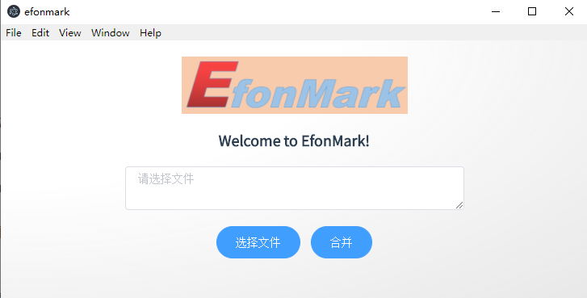

> **一番码客 : 挖掘你关心的亮点。**
> **http://www.efonmark.com**

本文目录：

[TOC]

## 前言

前面我们已经对electron即相关的electron-vue、element-ui等做了一定的了解。

今天一番开始着手去做一个实际的小程序了，还是以战代练。

目前准备先做两个小工具，一个是pdf合并的工具，一个是将网址转化为pdf的工具。

先从pdf合并工具工具开始。

<!-- more -->

## 布局页面

### 组件

组件里我们用vue去做布局，涉及到的组件包括**图片、标题、按钮、可输入文本框**。

这里我们用了element-ui的按钮和自适应文本框，看起来还是比之前的tkinter的界面要好看多了，而且主界面大小可以自适应。

更多的组件可以在参考里的`element-ui`官网中查看。

### 代码

```vue
<template>
  <div id="wrapper" align="center">
    
    <div align="center">
      <span class="title">
        Welcome to EfonMark!
      </span>
    </div>

    <div align="center">
    <el-input id="input01"
      type="textarea"
      :autosize="{ minRows: 2, maxRows: 10}"
      placeholder="请选择文件"
      v-model="textarea">
    </el-input>
    </div>
    <el-button type="primary" round>选择文件</el-button>
    <el-button type="primary" round>合并</el-button>
  </div>
</template>

<script>
export default {
  data() {
    return {
      textarea: ''
    }
  }
}
</script>
```


### 实际效果




## 参考

- [element-ui](https://element.eleme.cn/#/zh-CN)

## 一番今日

国庆后上班的第一周显得特别漫长，还以为上了两周了呢。

好在今天休息了一天，去城里逛了下，休息的还比较好。

明天上班了，早点休息，找回精气神。


> 一番雾语：普通人因为需要更好的生活，而不知道如何去实现，因此人需要被领导，所以需要领导者，这就是领导者的意义。


> **免费知识星球： [一番码客-积累交流]([wwww](https://t.zsxq.com/NRVBURr))**
> **微信公众号：一番码客**
> **微信：Efon-fighting**
> **网站： http://www.efonmark.com**