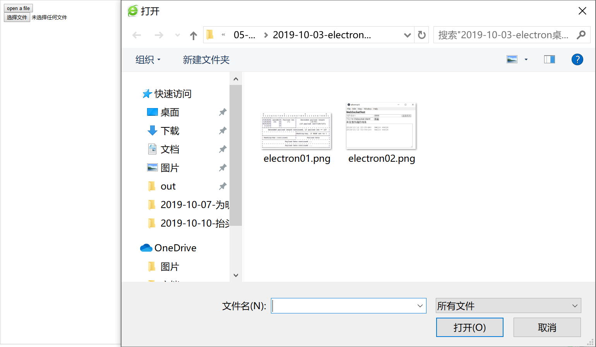

> **一番码客 : 挖掘你关心的亮点。**
> **http://efonfighting.imwork.net**

本文目录：

[TOC]

## 前言

本来今天想用vue做一个button，点击后选择本地文件，并获取文件路径，但只在html下实现了，vue下还要研究下。

<!-- more -->

## html中实现

### 代码

这里`input`里的`multiple="multiple"`可以控制多选还是单选。

```html
<!DOCTYPE html>
<html>
  <head>
    <meta charset="utf-8"/>
    <title>efonmark</title>
	<script type="text/javascript">
	function openfile() {
		document.getElementById('open').click();
	}
	
	function showRealPath(filePath){
      document.getElementsByName("textfield")[0].value = filePath;
	}
	</script>
  </head>
  <body>
  <div>
	<input type="button" value="open a file" onclick="openfile()">
	<input type="file" multiple="multiple" name="filename" id="open" style="display:none"/>
  </div>

  <div>
	<input type="file" multiple="multiple" name="uploadfile" onfocus="showRealPath(this.value);"/>
	<input type="hidden" name="uploadfileRealPath">
  </div>
	</body>
  
</html>
```


### 实际效果



## 一番今日

搞了半天还是没有在vue下搞清楚，看来还要学习下基础知识。

> 一番雾语：目的性学习，也需要有学习基础知识。


> **免费知识星球： [一番码客-积累交流]([wwww](https://t.zsxq.com/NRVBURr))**
> **微信公众号：一番码客**
> **微信：Efon-fighting**
> **网站： http://efonfighting.imwork.net**