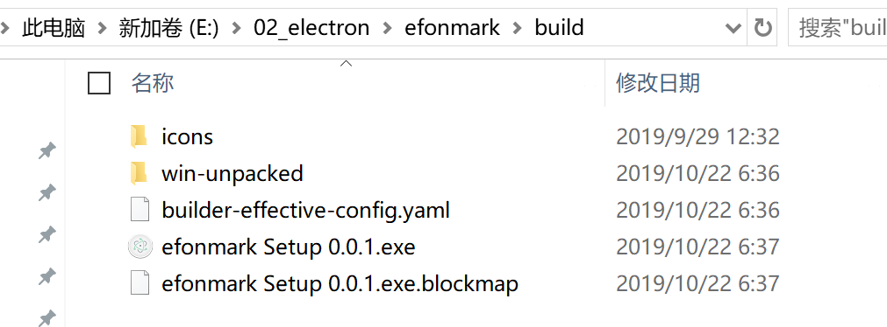
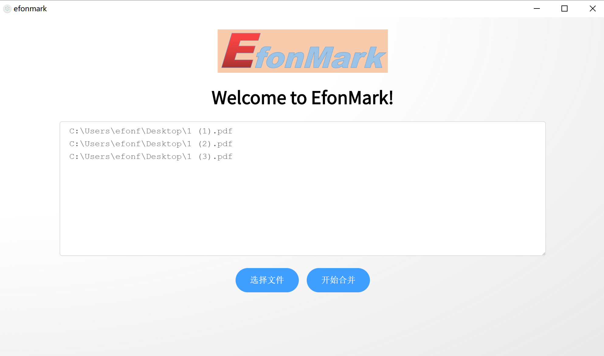

> **一番码客 : 挖掘你关心的亮点。**
> **http://efonfighting.imwork.net**

本文目录：

[TOC]

## 前言

之前我们做了一个简单的界面，但其实并没有什么功能，今天我们基于前段时间一直在学习的vue相关知识，来实现一些后台逻辑。

<!-- more -->

## 代码实现

* nodejs调用python：这里我们在按钮中去调用了python程序。
* 需要注意的是，所有程序运行的主目录都是当前工程的根目录。

```vue
<template>
  <div id="wrapper" align="center">
    
    <div align="center">
      <h1> Welcome to EfonMark!</h1>
    </div>

    <div align="center">
      <el-input id="input01"
        type="textarea"
        :autosize="{ minRows: 10, maxRows: 40}"
        placeholder="请选择文件"
        v-model="textarea">
      </el-input>
    </div>

    <div align="center">
      <el-button type="primary" v-on:click="openFile()" round>选择文件</el-button>
      <el-button type="primary" v-on:click="pdfmerge()" round>开始合并</el-button>
      <input type="file" id="filename" style="display:none" multiple="multiple" @change="showRealPath"/>
    </div>
  </div>
</template>

<script>
export default {
  data() {
    return {
      textarea: '',
      paths: ''
    }
  },
  methods: {
    openFile: function () {
      document.getElementById('filename').click()
    },
    showRealPath: function () {
      var files = document.getElementById('filename').files
      for (var i = 0; i < files.length; i++) {
        this.paths += (files[i].path + '\n')
      }
      document.getElementById('input01').value = this.paths
      // alert(paths)
    },
    pdfmerge: function () {
      const fs = require('fs')
      fs.writeFileSync('filepaths.txt', this.paths)
      require('child_process').spawn('python py/gzh.py', {
        stdio: 'inherit',
        shell: process.platform === 'win32'
      })

      this.$message({
        message: '已完成',
        type: 'success'
      })
    }
  }
}
</script>
```

## 构建打包

我们创建vue-electron工程的时候，有自动生成一个package.json的文件，这个文件是一些构建脚本。

其中`"build": "node .electron-vue/build.js && electron-builder",`这一条便可以实现我们的工程打包成可执行exe文件。

构建完成后，我们在`build`目录下可以找到该可执行文件。双击即可安装。



安装完成后，可以执行文件在`C:\Users\efonf\AppData\Local\Programs\efonmark`目录下。

## 实际效果



## 遗留问题

* python读取pdf失败
* 打包安装后调用python没有成功
* python日志无法查看
* 菜单栏需要添加

## 一番今日

今天又是四点多起来做实验，忘记了实验概念，六点半了发现文章还没有开始写，赶紧把文章写了。

每天这样日更方式还是不能保证充足休息，以后一番打算每周末的时候花一天时间把以周的文章全部准备好，每天只需要写“一番今日”这一栏。这样每天日更会轻松不少，也能保证足够的睡眠。

> 一番雾语：没有挂念的人在风雨中，风雨便是静谧。


> **免费知识星球： [一番码客-积累交流]([wwww](https://t.zsxq.com/NRVBURr))**
> **微信公众号：一番码客**
> **微信：Efon-fighting**
> **网站： http://efonfighting.imwork.net**