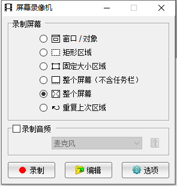
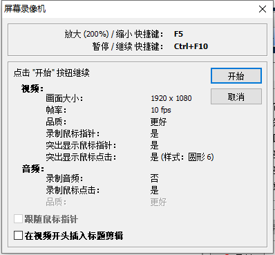
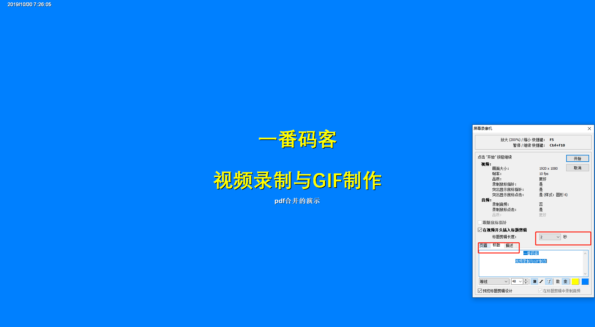
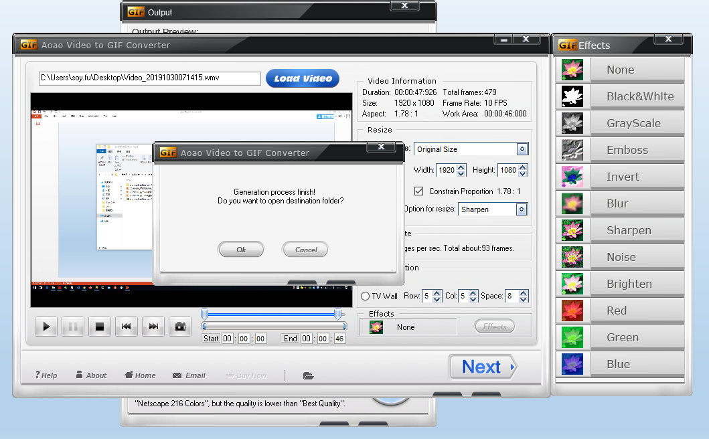
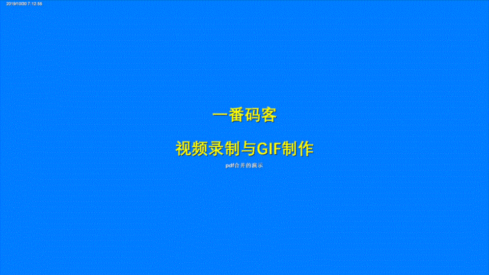

> **一番码客 : 挖掘你关心的亮点。**
> **http://www.efonmark.com**

本文目录：

[TOC]

## 前言

随着移动互联网的发展，最近两年短视频崛起，视频、图片相较于纯文字，让人们获取信息更立体、直观，这也是趋势，比如现在开始流行视频博客Vblog。

今天一番基于pdf合并工具的使用，跟大家分享一个录频和gif制作工具。

<!-- more -->

## 录屏

## gif制作

通过这个软件可以将上面录制的视频转换为gif图片。

## 获取软件

以上软件，一番都分享在了免费知识星球“一番码客-积累交流”里了，需要的小伙伴可以前往下载。

## 一番今日

因为晚上下班晚，加上睡眠时间调整，最近一番基本都是早上日更，因此一番将日更时间从每天早上7点前变更为每天早上8点前。这样的话一番一般6点起来开始日更就可以了，一般能保证睡眠。

今天一番跑步时想到自组织团体，这应该是以后的一个趋势。一个人太狭隘、进步太慢，人们因为共同目的、兴趣爱好等自发形成团体，比如写作打卡群、健身团体、软件开发者团体等。以后人的自由，一定需要包括职业自由，一个人可以有多份自由职业，加入多个自组织型团体，为各自组织团体贡献发展并从中获得收益。但基于互联网的自组织，也需要强调物理空间感，有线下的互动和认知，才能让彼此协作更立体。

> 一番雾语：身体强健，心无旁骛。

> **免费知识星球： [一番码客-积累交流]([wwww](https://t.zsxq.com/NRVBURr))**
> **微信公众号：一番码客**
> **微信：Efon-fighting**
> **网站： http://www.efonmark.com**