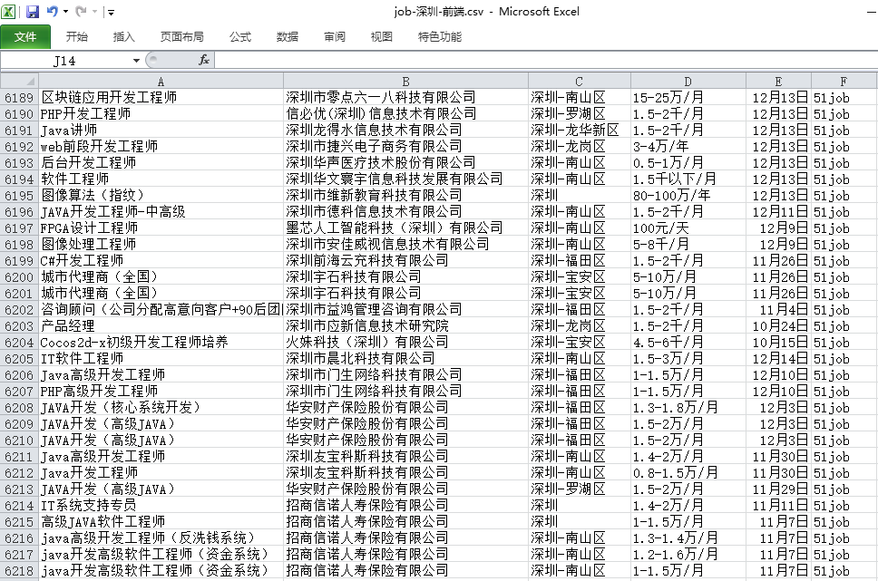
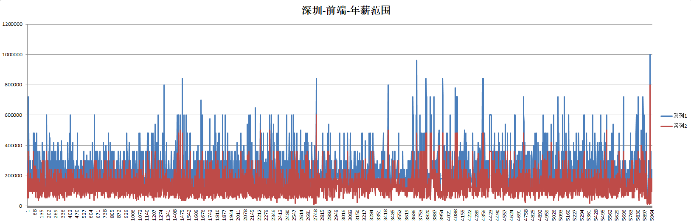
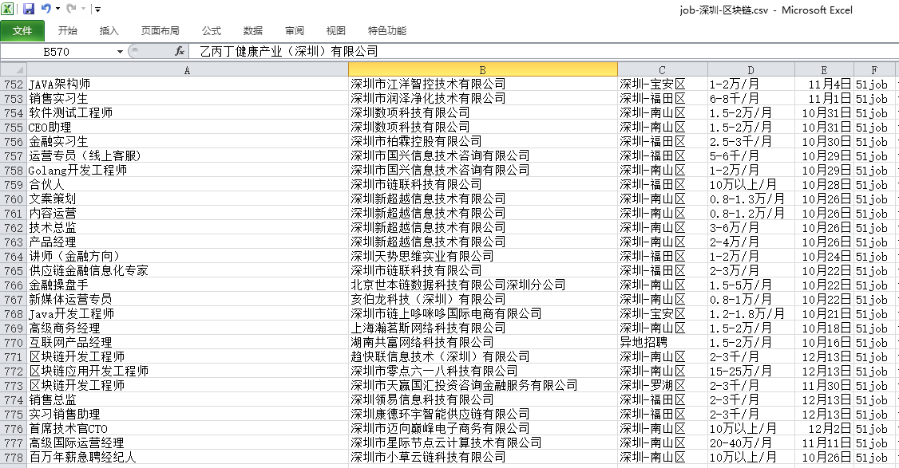
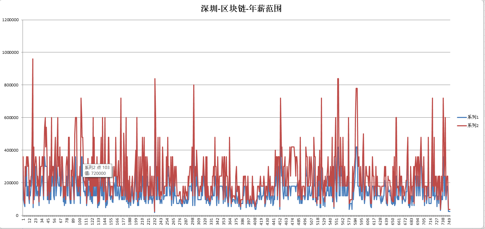

> **一番码客 : 挖掘你关心的亮点。**
> **http://efonfighting.imwork.net**

本文目录：

[TOC]

<!-- more -->

## 前言

一番前段时间不是在学习前端知识吗，学习前端的目的是为了自己做一些小工具积累技能，也是全栈开发的一个必不可少的技能。

因为视频教程是两年前的了，自学没有引导的情况下，如何了解自己学的东西是不是市场上流行的呢？当然是看下市场上现在招聘的需求是个啥，要求的技术栈有哪些。

招聘网站真是一个非常好的工具，提供了那么多公司的真实需求数据。

作为有一些技能的程序员，手动浏览当然不能满足也不直观，于是一番动动脑筋，用点技术手段浏览下招聘网站。

深圳最为科技最前沿的城市，我们就以深圳为代表，今天看看在深圳前端、区块链相关工作的“钱”途差异。

## 前端工作

* 搜”前端“，看到在深圳一共有6000+的职位需求。
* 初步做一个数据分析，年薪范围，可以看到大部分在20W以下3327，少部分在20-40W之间2645，极少数在40W+。

## 区块链工作

* 搜”区块链“，看到在深圳一共有700+的职位需求。
* 年薪20W以下579个，20-40W 155个。

## 总结

乍一看，感觉有点凉了呢。区块链的薪资范围看起来和前端的薪资范围分布差异不大，而且区块链相关的职位只有前端相关职位的十分之一。

一定是哪里出了问题。😂

先这样吧，从写爬虫到数据初步分析，这篇文章花的时间超过8个小时。显然对于一番的日更这是不可持续的。好在这为爬虫技术又打下了一定的基础，以后可以更快的收集数据。

本来是想看看技术栈的分布，先进行到这里吧，技术栈的分布后面再深入。

> 一番雾语：用技术手段分析分析自己的选择方向。

------------------

> **免费知识星球： [一番码客-积累交流](http://efonfighting.imwork.net/efonmark-blog/%E7%AE%80%E4%BB%8B/zhishixingqiu1.png)**
> **微信公众号：[一番码客](http://efonfighting.imwork.net/efonmark-blog/%E7%AE%80%E4%BB%8B/guanzhu_1.jpg)**
> **微信：[Efon-fighting](http://efonfighting.imwork.net/efonmark-blog/%E7%AE%80%E4%BB%8B/weixin.jpg)**
> **网站： [http://efonfighting.imwork.net](http://efonfighting.imwork.net)**