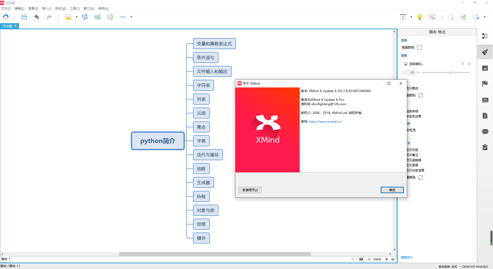

> **一番码客 : 挖掘你关心的亮点。**
> **http://efonfighting.imwork.net**

本文目录：

[TOC]


<!-- more -->

## 前言

思维导图作为一种笔记和整理框架的一种工具，现在已经非常流行了，这篇文章一番介绍一下最流行的思维导图工具xmind的安装与激活。

## 下载安装

直接给出破解版下载链接：

```
链接：https://pan.baidu.com/s/11t2aOX7-bV7pdMpNCfwe_w 
提取码：1pqe 
复制这段内容后打开百度网盘手机App，操作更方便哦
```

下载解压后会看到如下文件。

```shell
├── xmind
│   ├── XMindCrack.jar
│   ├── XMind序列号与激活.txt
│   └── xmind-8-update8-windows.exe
```

点击`xmind-8-update8-windows.exe`后一路默认安装完成。

## 激活

1) 找到 XMind 安装目录, 如: C:\Program Files (x86)\XMind，将下载的破解补丁复制到这个目录中。

2) 以文本格式打开安装目录中 XMind.ini

3) 在 XMind.ini 最后追加一个字段-javaagent，然后加上XMindCrack.jar的绝对路径。
例如: `-javaagent:C:\Program Files (x86)\XMind\XMindCrack.jar`。

4) 打开 XMind, 点击帮助——序列号，然后输入以下序列号 ，邮箱随便填，可以填自己的。

接下来就可以完整使用该工具了。



> 一番雾语：思维导图已经成为office套件之外最常用的工具之一了，找个好用的思维导图工具吧。

------------------

> **免费知识星球： [一番码客-积累交流](http://efonfighting.imwork.net/efonmark-blog/%E7%AE%80%E4%BB%8B/zhishixingqiu1.png)**
> **微信公众号：[一番码客](http://efonfighting.imwork.net/efonmark-blog/%E7%AE%80%E4%BB%8B/guanzhu_1.jpg)**
> **微信：[Efon-fighting](http://efonfighting.imwork.net/efonmark-blog/%E7%AE%80%E4%BB%8B/weixin.jpg)**
> **网站： [http://efonfighting.imwork.net](http://efonfighting.imwork.net)**