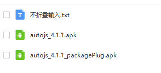

> **一番码客 : 挖掘你关心的亮点。**
> **http://www.efonmark.com**

本文目录：

[TOC]

<!-- more -->

## 前言

现在微信朋友圈为了鼓励原创、限制复制，推出了折叠功能，如果是复制的内容，会被折叠，就像这样。

于是，就有朋友开发了一些不折叠输入法之类的。但大多数都是收费的，一番在网上找了一圈，没有发现免费的。于是一番自己研究了两天天，最终的结果是下图这样子的。

朋友圈文字没办法，微信为了保证朋友圈的简洁，限制了即使是原创，也最多显示6行，但评论没有限制。

## 原理介绍

这里简单介绍下实现原理。

Autojs.app，这个工具是一款可以在Android手机上执行脚本的工具，可以新建多个脚本，实现想要完成的自动化操作。这个工具最开始提供免费下载包，后来收费了，网上不太容易找到。

点击右下角加号，选择新建文件，文件命名，然后输入脚本，保存，点击运行按钮，即可实现自动模拟人工输入剪贴板的内容了。

## 软件获取

* `不折叠输入.txt`：脚本。
* `autojs_4.1.1.apk`：autojs应用。
* `autojs_4.1.1_packagePlug.apk`：脚本打包插件，不打包可以不安装。

右下角点击"在看"，公众号后台回复“不折叠”，即可获得下载链接。

> 一番雾语：自力更生，自制不折叠输入法。

------------------

> **免费知识星球： [一番码客-积累交流](http://www.efonmark.com/efonmark-blog/readme/zhishixingqiu1.png)**
> **微信公众号：[一番码客](http://www.efonmark.com/efonmark-blog/readme/guanzhu_1.jpg)**
> **微信：[Efon-fighting](http://www.efonmark.com/efonmark-blog/readme/weixin.jpg)**
> **网站： [http://www.efonmark.com](http://www.efonmark.com)**