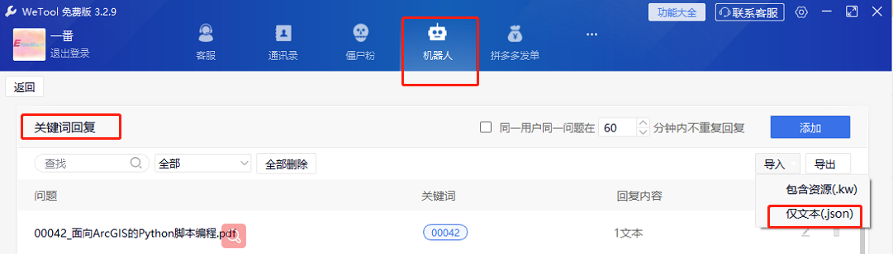
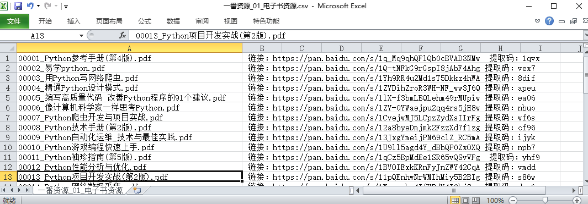
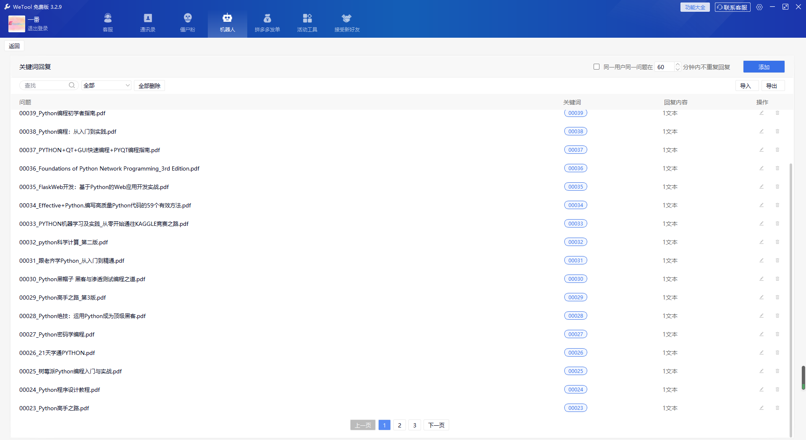
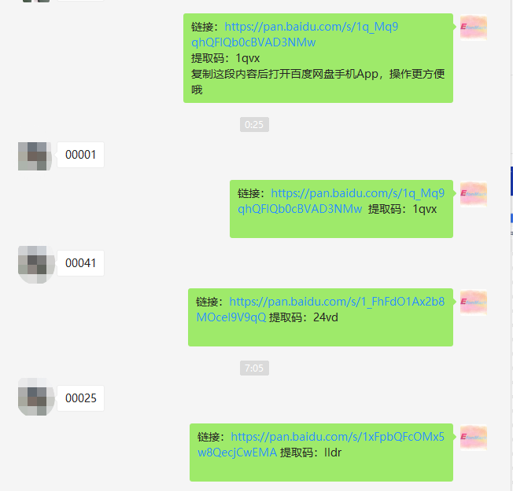

> **一番码客 : 挖掘你关心的亮点。**
> **http://efonfighting.imwork.net**

本文目录：

[TOC]


<!-- more -->

## 缘起


## 准备工作

* 运行环境：windows10 + python3.6。

* WeTool 免费版。




* 关键词自动回复csv文件。



## 代码讲解

```python
import os  
from os.path import join as pjoin
import json,copy

output_json = '一番资源_01_电子书资源.json'
input_csv = '一番资源_01_电子书资源.csv'

# 构建一个新元素
model=[]
ele = {"answer": [{"at_users": [], "delay_secs": 0, "flag": 0, "link_des": "", "link_img": "", "link_title": "", "msg_type": 1, "raw_msg": "-----efonmark------", "wxid_to_send": ""}], "exact_keywords": "00001", "fuzzy_keywords": "", "question": "00001_\u6613\u5b66python.pdf", "question_id": "1"}

for i, line in enumerate(open(input_csv, "r", encoding='utf-8')):
    title = line.split(' , ', 2)[0]
    url = line.split(' , ', 2)[1]
    idx = title.split('_', 2)[0]

    # 添加新元素
    ele_cpy = copy.deepcopy(ele)
    ele_cpy['answer'][0]['raw_msg'] = url
    ele_cpy["exact_keywords"] = idx
    ele_cpy["question"] = title
    ele_cpy["question_id"] = str(i)
    model.append(ele_cpy)

fd = open(pjoin('.', output_json), "w", encoding='utf-8')
fd.write(json.dumps(model))  
fd.close()
```

知识点，运行方式

## 效果展示





> 一番雾语：重复的事？代码化！

------------------

> **免费知识星球： [一番码客-积累交流](http://efonfighting.imwork.net/efonmark-blog/%E7%AE%80%E4%BB%8B/zhishixingqiu1.png)**
> **微信公众号：[一番码客](http://efonfighting.imwork.net/efonmark-blog/%E7%AE%80%E4%BB%8B/guanzhu_1.jpg)**
> **微信：[Efon-fighting](http://efonfighting.imwork.net/efonmark-blog/%E7%AE%80%E4%BB%8B/weixin.jpg)**
> **网站： [http://efonfighting.imwork.net](http://efonfighting.imwork.net)**