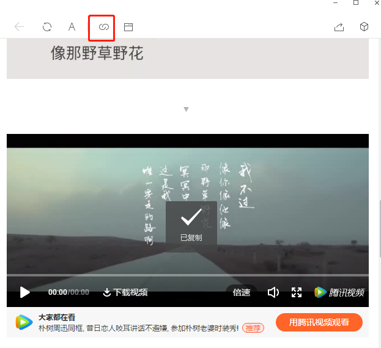
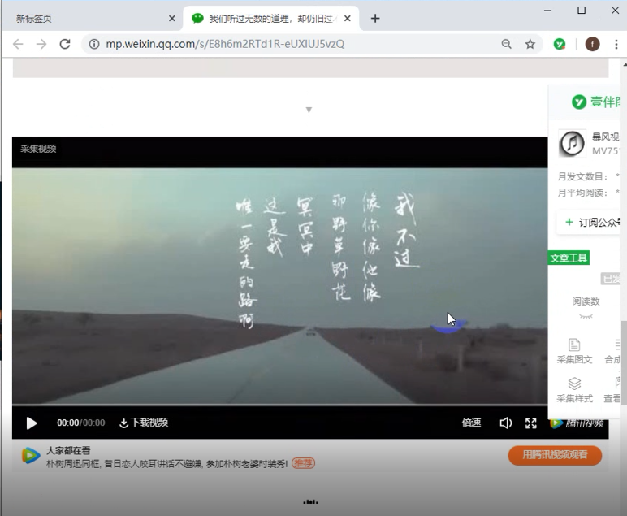
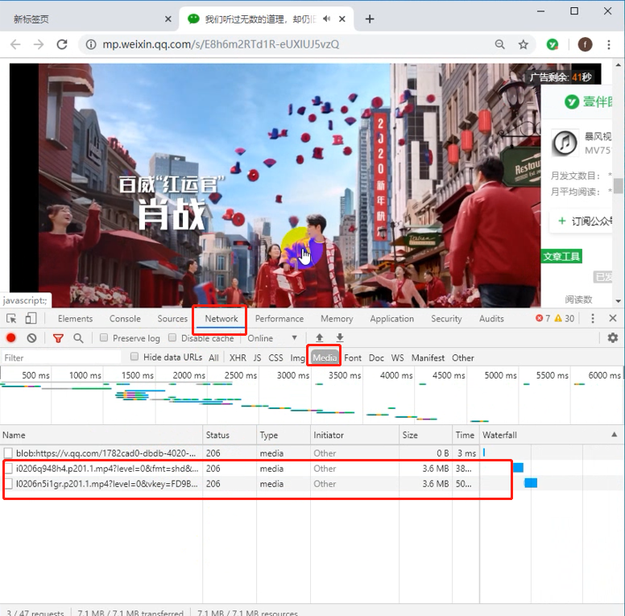
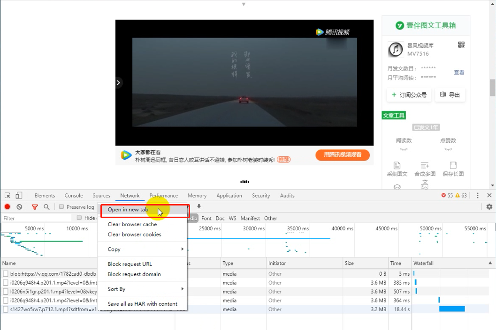
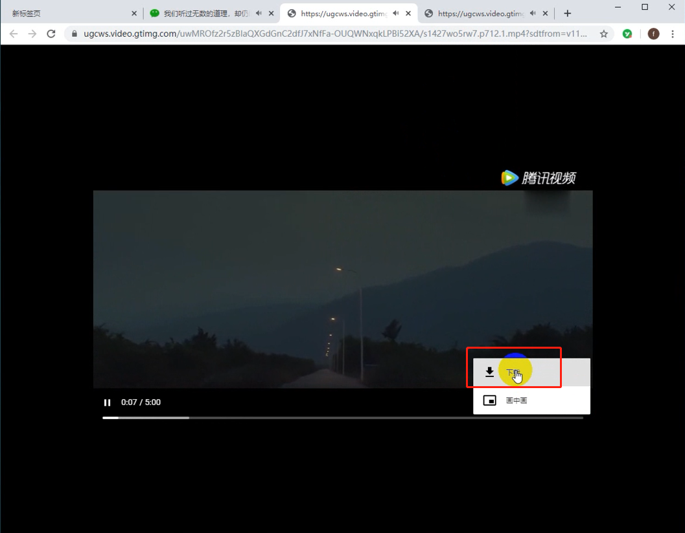

> **一番码客 : 挖掘你关心的亮点。**
> **http://www.efonmark.com**

本文目录：

[TOC]

<!-- more -->

## 前言

今天2号了，明天就是国家规定的上班日了。

很多省市都延迟到9号以后了，但成都还是3号，只是各个公司为了安全起见，很多选择了远程办公。

不管怎么说，今天初九了，也该上班了。明天一番也进入工作状态了，继续早起日更。

很多时候我们看到一个公众号发的视频，不管出于什么目的，想要下载到本地保存。

今天一番给大家介绍一个下载公众号视频的方法。

相对其他视频网站视频的下载，微信公众号视频的下载的方法，简单很多，小白多很容操作。

## 环境准备

* PC
* 手机或电脑微信
* chrome浏览器

## 下载步骤

* 用手机或电脑微信打开文章或视频页面，点击复制链接，并发送到电脑上。

* 在PC上，用chrome浏览器打开该链接。

* 在浏览器页面按下`F12`键（即鼠标右键的`检查`），选择`Network`→`Media`。

* 然后点击播放视频，这时会看到`Media`下方会出现一些链接。
* 找到`Size`不为零的一栏，这些就是视频的链接地址，右键选择`	Open in new tab`。

* 在新打开的页面中点击右下角的菜单按钮，选择`下载`。

* 搞定~，分享给更多需要的朋友吧~

> 一番雾语：弹簧、弹簧，你弱它就强，你强他就弱。

<table>
<tr>
<td >

</td>
<td width="50%" align=left><b>
    免费知识星球：<a href="http://efonfighting.imwork.net/efonmark-blog/%E7%AE%80%E4%BB%8B/zhishixingqiu1.png">一番码客-积累交流</a> 
    微信公众号：<a href="http://efonfighting.imwork.net/efonmark-blog/%E7%AE%80%E4%BB%8B/guanzhu_1.jpg">一番码客</a> 
    微信：<a href="http://efonfighting.imwork.net/efonmark-blog/%E7%AE%80%E4%BB%8B/weixin.jpg">Efon-fighting</a> 
    网站：<a href="http://efonfighting.imwork.net">http://www.efonmark.com</a> </b></td>
</tr>
</table>