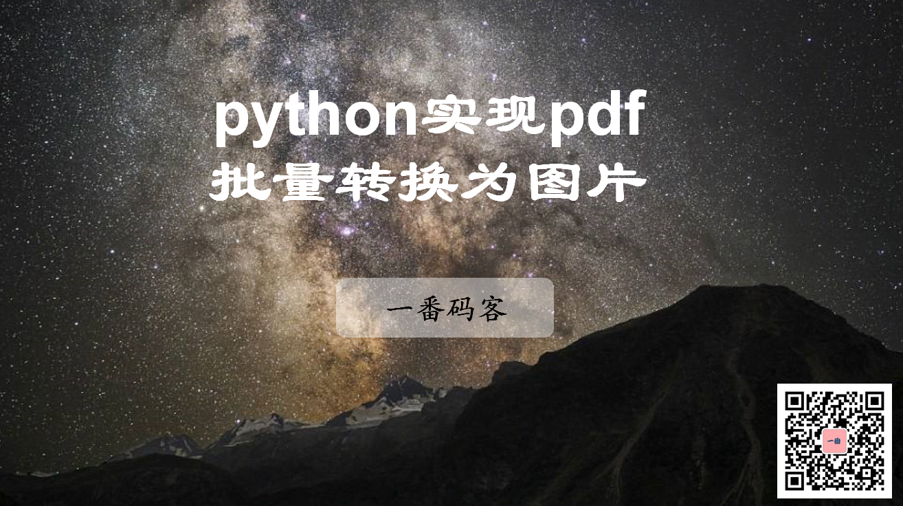
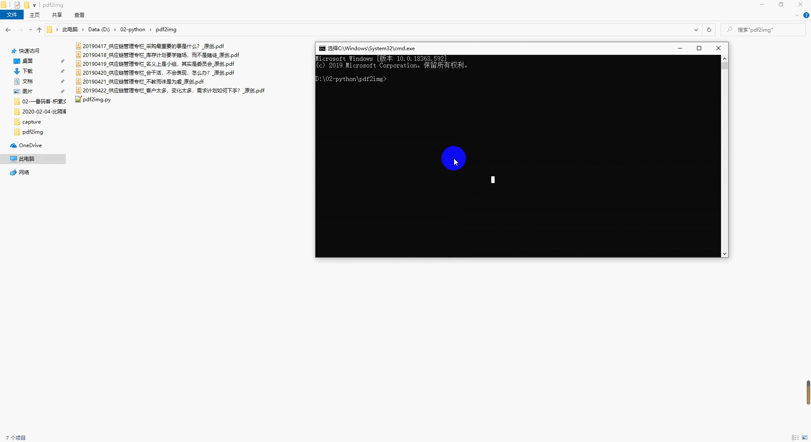
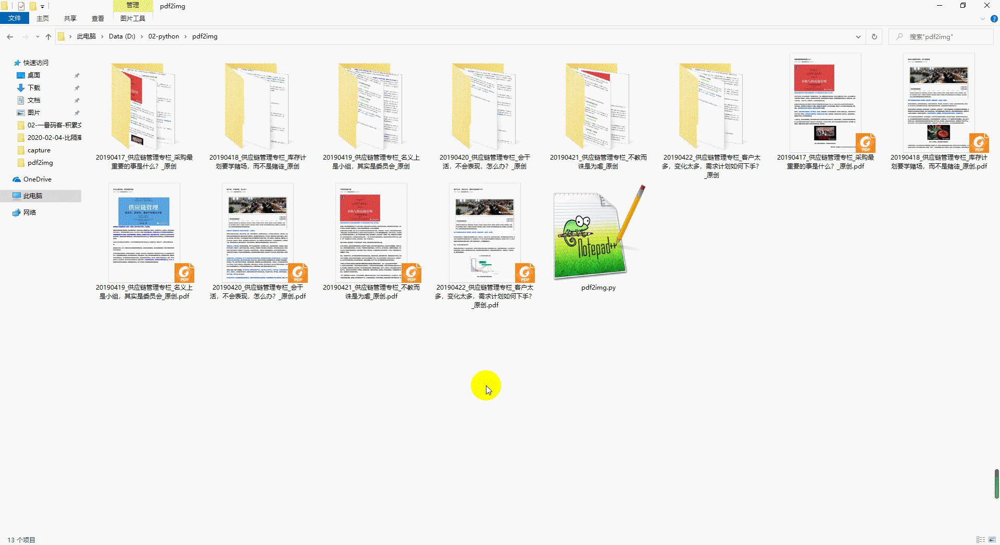

> **一番码客 : 挖掘你关心的亮点。**
> **http://www.efonmark.com**

本文目录：

[TOC]

<!-- more -->

## 前言

今天有一番码客的读者朋友让一番帮个小忙，需要把pdf转换为图片，而且是四十多个pdf。

本着力所能及的乐于助人的精神，一番免费为小伙伴写了个python程序来处理这个事情。

这里将这个思路和方法分享给更多的朋友。

## 环境准备

* win10 + python3.6

## 思路方法

* 遍历一个目录下的所有pdf文件，获取文件名；
* 创建对应pdf的同名目录，用户存放转换出来的图片；
* 安装fitz库，用于实现pdf转换操作

## 效果展示

* 转换过程：

* 转换效果：

## 代码获取

公众号后台回复『pdf2img』，即可获取实现代码。

> 一番雾语：力所能及的帮助他人。

<table>
<tr>
<td >

</td>
<td width="50%" align=left><b>
    免费知识星球：<a href="http://efonfighting.imwork.net/efonmark-blog/%E7%AE%80%E4%BB%8B/zhishixingqiu1.png">一番码客-积累交流</a> 
    微信公众号：<a href="http://efonfighting.imwork.net/efonmark-blog/%E7%AE%80%E4%BB%8B/guanzhu_1.jpg">一番码客</a> 
    微信：<a href="http://efonfighting.imwork.net/efonmark-blog/%E7%AE%80%E4%BB%8B/weixin.jpg">Efon-fighting</a> 
    网站：<a href="http://efonfighting.imwork.net">http://www.efonmark.com</a> </b></td>
</tr>
</table>