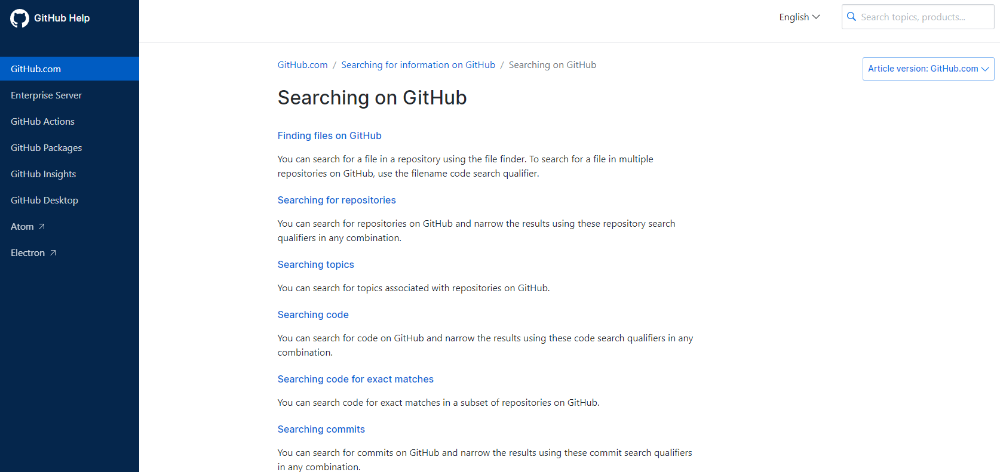
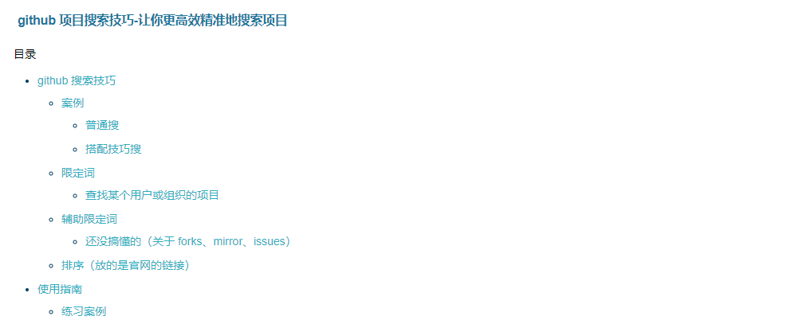
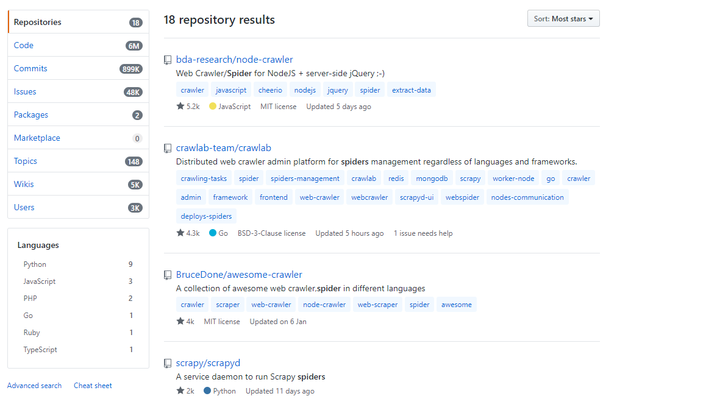

> **一番码客 : 挖掘你关心的亮点。**
> **http://www.efonmark.com**

本文目录：

[TOC]


<!-- more -->

## 前言

**即使我们都是程序员，但我们也并非都会修电脑，都会做酷炫的ppt，都会优化系统卡顿。其实程序员也是分行业、分专业的，就像医生也分内外科、呼吸科、神经科神的。**

作为非专业的python选手，或者非专业的爬虫选手，即使我们有一些编程基础，有时想通过代码从网上获取一些信息，也不能徒手就能做，需要借鉴一些成熟的方案、代码。

这就是为什么GitHub现在这么流行的原因。作为小白的一番，今天找到一个非常不错的爬虫收集项目，推荐给大家。

## GitHub搜索技巧

网上也有一些分享的再github上搜索项目的技巧，其实，很多都是从官方文档来的。所以，我们想真的精通Github搜索，那么就去给官网链接上查吧。

* GitHub帮助中心：『https://help.github.com/en/github/searching-for-information-on-github/searching-on-github』




如果觉得英文看着吃力，这里一番也找到一个部分翻译的文章：

* github 项目搜索技巧-让你更高效精准地搜索项目：『https://www.cnblogs.com/suwanbin/p/12113751.html』



比如，我们要搜爬虫相关的，2020年1月1日以后还有更新的，stars数超过100的，可以用这样的命令：

```
in:description spider pushed:>2020-01-01 stars:>100
```

再选择一下排序，会得到这样的结果：



## awesome-spider

* awesome-spider：『https://github.com/facert/awesome-spider』

这其实是一个整理收集爬虫项目的项目，对于一番开篇说的非专业爬虫小户来讲，可以发现很多实用的项目。

不得不说，资源整合的能力有时比创造资源更重要。

我们来看下它收集了哪些项目，有没有你感兴趣的？

点击“阅读原文”可以在原文里点击相关链接可以直接跳转。

### A

* [暗网爬虫(Go)](https://github.com/s-rah/onionscan)
* [爱丝APP图片爬虫](https://github.com/x-spiders/aiss-spider)

### B

* [Bilibili 用户](https://github.com/airingursb/bilibili-user)
* [Bilibili 视频](https://github.com/airingursb/bilibili-video)
* [Bilibili 小视频](https://github.com/AngelKitty/bilibili-smallvideo)
* [Bing美图爬虫](https://github.com/zhangzp9970/GnomeBingLockScreen)
* [B站760万视频信息爬虫](https://github.com/chenjiandongx/bili-spider)
* [博客园(node.js)](https://github.com/chokcoco/cnblogSpider)
* [百度百科(node.js)](https://github.com/nswbmw/micro-scraper)
* [北邮人水木清华招聘](https://github.com/Marcus-T/Crawler_Job)
* [百度云网盘](https://github.com/gudegg/yunSpider)
* [琉璃神社爬虫](https://github.com/Chion82/hello-old-driver)
* [Boss 直聘](https://github.com/xianyunyh/spider_job)
* [贝壳网找房爬虫](https://github.com/qzcool/Ke)

### C

* [cnblog](https://github.com/jackgitgz/CnblogsSpider)
* [caoliu 1024](https://github.com/LintBin/1024crawer)

### D

* [豆瓣读书](https://github.com/lanbing510/DouBanSpider)
* [豆瓣爬虫集](https://github.com/dontcontactme/doubanspiders)
* [豆瓣害羞组](https://github.com/rockdai/haixiu)
* [豆瓣图书广度爬取](https://github.com/CasterWx/java-Crawler/tree/master/src/爬虫/数据解析/豆瓣图书深度爬取)
* [DNS记录和子域名](https://github.com/TheRook/subbrute)
* [DHT网络磁力种子爬虫](https://github.com/chenjiandongx/magnet-dht)
* [抖音](https://github.com/Python3WebSpider/DouYin)
* [抖音推荐](https://github.com/cnbattle/douyin)

### E

* [E绅士](https://github.com/shuiqukeyou/E-HentaiCrawler)

### G

* [Girl-atlas](https://github.com/pein0119/girl-atlas-crawler)
* [girl13](https://github.com/xuelangcxy/girlCrawler)
* [github trending](https://github.com/bonfy/github-trending)
* [Github 仓库及用户分析爬虫](https://github.com/chenjiandongx/Github)
* [国家统计用区划代码和城乡划分代码爬虫](https://github.com/dta0502/NBSPRC-spider)

### H

* [HDOJ爬虫](https://github.com/stevenshuang/spider/tree/master/hdoj)

### I

* [Instagram](https://github.com/xTEddie/Scrapstagram)
* [INC500 世界5000强爬虫](https://github.com/XetRAHF/Scrapping-INC500)

### J

* [京东](https://github.com/taizilongxu/scrapy_jingdong)
* [京东搜索+评论](https://github.com/Chyroc/JDong)
* [京东商品+评论](https://github.com/samrayleung/jd_spider)
* [机票](https://github.com/fankcoder/findtrip)
* [煎蛋妹纸](https://github.com/kulovecc/jandan_spider)
* [煎蛋妹纸selenium版本](https://github.com/Tony-Chiong/jandan_spider)
* [今日头条，网易，腾讯等新闻](https://github.com/lzjqsdd/NewsSpider)
* [计算机书籍控图书](https://github.com/CasterWx/java-Crawler/tree/master/src/爬虫/数据解析/Book)
* [JK (制服写真) 爬虫](https://github.com/CourierKyn/jkcrawler)

### K

* [看知乎](https://github.com/atonasting/zhihuspider)
* [课程格子校花榜](https://github.com/xinqiu/kechenggezi-Spider)
* [konachan](https://github.com/wudaown/konachanDL)

### L

* [链家](https://github.com/lanbing510/LianJiaSpider)
* [链家成交在售在租房源](https://github.com/XuefengHuang/lianjia-scrawler)
* [拉勾](https://github.com/GuozhuHe/webspider)
* [炉石传说](https://github.com/youfou/hsdata)
* [leetcode](https://github.com/bonfy/leetcode)
* [领英销售导航器爬虫 LinkedInSalesNavigator](https://github.com/XetRAHF/Spider_LinkedInSalesNavigatorURL)

### M

* [马蜂窝 用户足迹](https://github.com/eternal-flame-AD/mafengwo)
* [MyCar](https://github.com/Thoxvi/MyCar_python)
* [漫画喵 一键下载漫画~](https://github.com/miaoerduo/cartoon-cat)
* [MM131性感美女写真图全爬取](https://github.com/qwertyuiop6/mm131)
* 美女写真套图爬虫 [（一）](https://github.com/chenjiandongx/mmjpg)[（二）](https://github.com/chenjiandongx/mzitu)[（三）](https://github.com/chenjiandongx/photo-gevent)
* [妹子图](https://github.com/3inchtime/mmjpg_spider)
* [猫眼网电影评分](https://github.com/CasterWx/python-maoyan-spider)

### N

* [新闻监控](https://github.com/NolanZhao/news_feed)
* [你好污啊](https://github.com/sy-records/speech_spiders/tree/master/nihaowu)

### O

* [ofo共享单车爬虫](https://github.com/SilverBooker/ofoSpider)

### P

* [Pixiv](https://github.com/littleVege/pixiv_crawl)
* [PornHub](https://github.com/xiyouMc/WebHubBot)
* [packtpub](https://github.com/niqdev/packtpub-crawler)
* [91porn](https://github.com/eqblog/91_porn_spider)

### Q

* [QQ空间](https://github.com/LiuXingMing/QQSpider)
* [QQ 群](https://github.com/caspartse/QQ-Groups-Spider)
* [清华大学网络学堂爬虫](https://github.com/kehao95/thu_learn)
* [去哪儿](https://github.com/lining0806/QunarSpider)
* [前程无忧Python招聘岗位信息爬取分析](https://github.com/chenjiandongx/51job)
* [qqzhpt美女写真爬虫/批量下载](https://github.com/Wildwizard404/qqzhpt-spider)

### R

* [人人影视](https://github.com/gnehsoah/yyets-spider)
* [RSS 爬虫](https://github.com/shanelau/rssSpider)
* [rosi 妹子图](https://github.com/evilcos/crawlers)
* [reddit 壁纸](https://github.com/tsarjak/WallpapersFromReddit)
* [reddit](https://github.com/dannyvai/reddit_crawlers)

### S

* [soundcloud](https://github.com/Cortexelus/dadabots)
* [Stackoverflow 100万问答爬虫](https://github.com/chenjiandongx/stackoverflow)
* [Shadowsocks 账号爬虫](https://github.com/chenjiandongx/soksaccounts)
* [spider163 网易云音乐爬虫](https://github.com/chengyumeng/spider163)
* [时光网电影数据和海报爬虫](https://github.com/Danielyan86/Movie-scrapy)

### T

* [tumblr](https://github.com/facert/tumblr_spider)
* [下载tumblr喜欢内容](https://github.com/cyang812/get_tumblr_likes)
* [TuShare](https://github.com/waditu/tushare)
* [天猫双12爬虫](https://github.com/LiuXingMing/Tmall1212)
* [Taobao mm](https://github.com/carlonelong/TaobaoMMCrawler)
* [Tmall 女性文胸尺码爬虫](https://github.com/chenjiandongx/cup-size)
* [淘宝直播弹幕爬虫(node)](https://github.com/xiaozhongliu/taobao-live-crawler)
* [天涯论坛文章](https://github.com/CasterWx/java-Crawler/tree/master/src/爬虫/数据解析/爬取论坛文章)
* [天眼查爬虫](https://github.com/qzcool/Tianyancha)

### V

* [Youtube字幕下载](https://github.com/qwertyuiop6/get_youtube_subtitle)
* [视频信息爬虫](https://github.com/billvsme/videoSpider)
* [电影网站](https://github.com/chenqing/spider)

### W

* [乌云公开漏洞](https://github.com/hanc00l/wooyun_public)
* [微信公众号](https://github.com/bowenpay/wechat-spider)
* [“代理”方式抓取微信公众号文章](https://github.com/lijinma/wechat_spider)
* [网易新闻](https://github.com/armysheng/tech163newsSpider)
* [网易精彩评论](https://github.com/dongweiming/commentbox)
* [微博主题搜索分析](https://github.com/luzhijun/weiboSA)
* [网易云音乐](https://github.com/RitterHou/music-163)
* [新.网易热评](https://github.com/CasterWx/java-Crawler/tree/master/src/爬虫/数据解析/网易云热评爬取)
* [唯品会商品](https://github.com/CasterWx/java-Crawler/tree/master/src/爬虫/数据解析/vip)

### X

* [雪球股票信息(java)](https://github.com/decaywood/XueQiuSuperSpider)
* [新浪微博](https://github.com/LiuXingMing/SinaSpider)
* [新浪微博分布式爬虫](https://github.com/ResolveWang/weibospider)
* [心灵毒鸡汤](https://github.com/sy-records/speech_spiders/tree/master/chicken-soup)
* [闲鱼最新商品爬取](https://github.com/DropsDevopsOrg/ECommerceCrawlers/tree/master/XianyuCrawler)

### Y

* [英美剧 TV (node.js)](https://github.com/pockry/tv-crawler)

### Z

* [ZOL 手机壁纸爬虫](https://github.com/chenjiandongx/wallpaper)
* [知乎(python)](https://github.com/LiuRoy/zhihu_spider)
* [知乎(php)](https://github.com/owner888/phpspider)
* [知网](https://github.com/yanzhou/CnkiSpider)
* [知乎妹子](https://github.com/yjm12321/zhihu-girl)
* [自如实时房源提醒](https://github.com/facert/ziroom_realtime_spider)
* [中国大陆高校列表爬虫](https://github.com/codeudan/crawler-china-mainland-universities.git)
* [站酷（zcool.com.cn）图片爬虫](https://github.com/lonsty/scraper)

### #

* [80s 影视资源爬虫 - JianSo_Movie](https://github.com/but0n/JianSo_Movie)

### 其他

* [各种爬虫](https://github.com/Nyloner/Nyspider)
* [DHT 爬虫](https://github.com/blueskyz/DHTCrawler)
* [SimDHT](https://github.com/dontcontactme/simDHT)
* [p2pspider](https://github.com/dontcontactme/p2pspider)


> 一番雾语：资源整合的能力有时比创造资源更重要。

<table>
<tr>
<td ><center></center></td>
<td width="50%" align=left><b>
    免费知识星球：<a href="http://www.efonmark.com/efonmark-blog/readme/zhishixingqiu1.png">一番码客-积累交流</a><br>
    微信公众号：<a href="http://www.efonmark.com/efonmark-blog/readme/guanzhu_1.jpg">一番码客</a><br>
    微信：<a href="http://www.efonmark.com/efonmark-blog/readme/weixin.jpg">Efon-fighting</a><br>
    网站：<a href="http://www.efonmark.com">http://www.efonmark.com</a><br></b></td>
</tr>
</table>