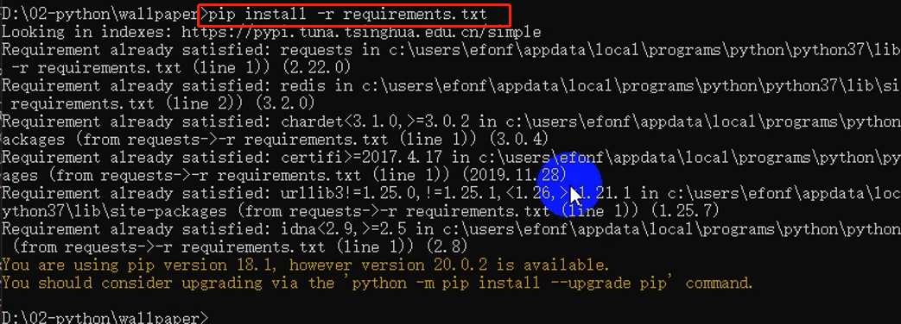
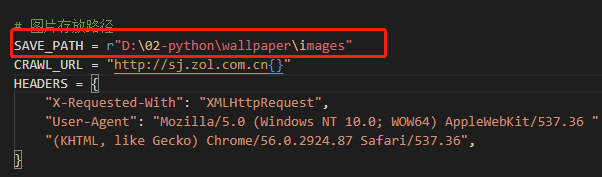
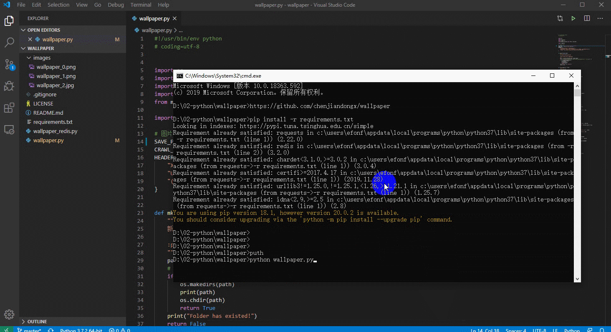
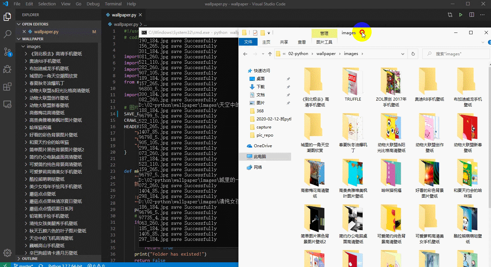

> **一番码客 : 挖掘你关心的亮点。**
> **http://www.efonmark.com**

本文目录：

[TOC]


<!-- more -->

## 前言

今天一番在22:30开始准备今日的日更，冒着极大的断更风险，研究了一个开源项目，批量下载手机壁纸。

因为一番每天都为文章开头的配图挠头，正向从网上批量抓取一些美图，以充实库存。

刚好，一番昨日的文章里有这么一个抓取手机背景图片的开源项目，于是一番今天尝试了下。

要知道，一般调试一段未知代码，一两个小时很可能啥也干不了。但今天一番还算顺利，虽然这个项目都是两年前的了，但因为抓取的这个网站看样子两年都没有变过排版了，所以这个项目里的代码仍然可以运行。

这感觉就像作为拾荒者的我从一堆被人废弃的工具里翻出了沾满灰尘的还能用的工具😂。

## 目标网站

* ZOL手机壁纸：http://sj.zol.com.cn/bizhi/


## 环境准备

* 操作系统：win10
* 代码运行：python3.7
* 项目地址：『https://github.com/chenjiandongx/wallpaper』

## 运行

### 依赖库安装

首先，用pip工具安装依赖：

```shell
pip install -r requriements.txt
```



因为一番这里已经装过了，所以打印是这样子的。

### 运行代码

这里一番修改了下文件保存路径，大家可以根据个人情况修改下。其他的代码一番就没动了。




直接`python wallpaper.py`运行就可以了，效果如下：




抓取效果：




## 扩展

这只是简单的将代码运行起来，爬虫主要是页面解析，可以在此基础上继续改造自己想要的功能。

## 壁纸获取

差不多下载了800M的手机壁纸，需要的同学可以在**一番微信（不是公众号）**回复关键字『**A0001**』，获取下载链接。


> 一番雾语：日更的题图素材有着落了~

<table>
<tr>
<td ><center></center></td>
<td width="50%" align=left><b>
    免费知识星球：<a href="http://www.efonmark.com/efonmark-blog/readme/zhishixingqiu1.png">一番码客-积累交流</a><br>
    微信公众号：<a href="http://www.efonmark.com/efonmark-blog/readme/guanzhu_1.jpg">一番码客</a><br>
    微信：<a href="http://www.efonmark.com/efonmark-blog/readme/weixin.jpg">Efon-fighting</a><br>
    网站：<a href="http://www.efonmark.com">http://www.efonmark.com</a><br></b></td>
</tr>
</table>